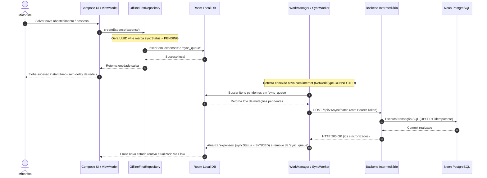
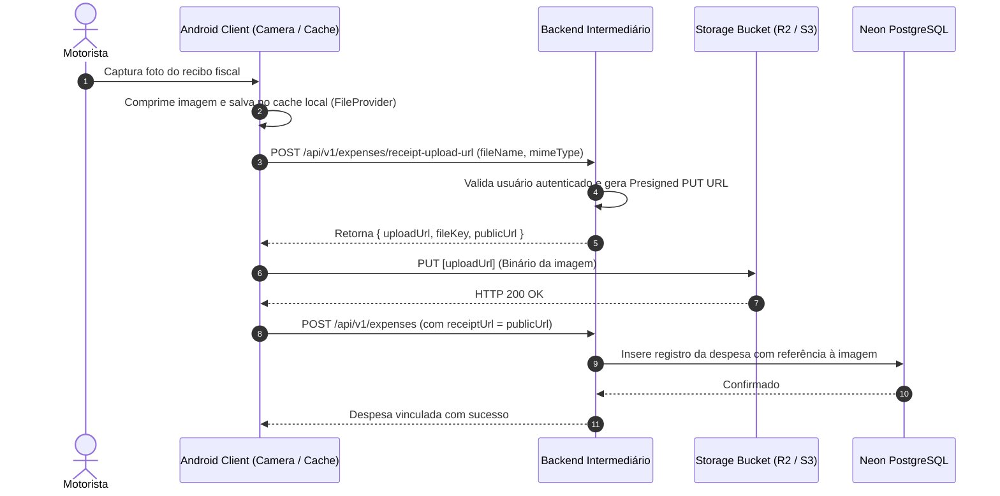
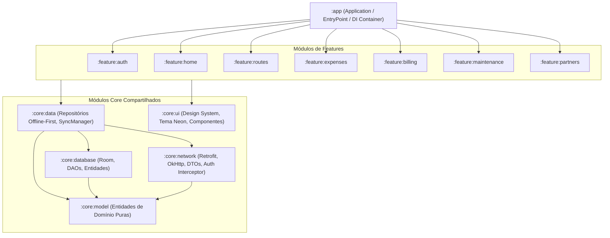

# ADR 001: Auditoria Arquitetural e Migração Segura para Neon PostgreSQL com Suporte Offline-First (Room)

| Metadado | Detalhe |
| :--- | :--- |
| **Status** | **Aprovado para Implementação** |
| **Data** | 25 de Setembro de 2026 |
| **Autor** | Agente Arquiteto (Central do Motorista - Pocket) |
| **Contexto** | Aplicativo Android Operacional para Motoristas e Entregadores |
| **Alvo** | Eliminação de Conexão Direta ao DB, Remoção de Credenciais Hardcoded, Offline-First (Room) e Modularização |

---

## 1. Sumário Executivo

Esta auditoria técnica avaliou a arquitetura do aplicativo **Central do Motorista (logistic-prime)**, inspecionando o arquivo de dependências [`app/build.gradle.kts`](file:///d:/Dev/logistic-prime/logistic-prime/app/build.gradle.kts), o version catalog [`gradle/libs.versions.toml`](file:///d:/Dev/logistic-prime/logistic-prime/gradle/libs.versions.toml), o pacote de rede [`data/remote/`](file:///d:/Dev/logistic-prime/logistic-prime/app/src/main/java/com/fernando/centraldomotorista/data/remote/) e a organização geral de pacotes e repositórios.

A auditoria identificou três vulnerabilidades e riscos críticos para a operação:
1. **Segurança Crítica:** Credenciais anon do Supabase e endpoints de banco de dados hardcoded em código-fonte, com o app mobile se comunicando diretamente com o banco de dados via PostgREST/Retrofit.
2. **Inviabilidade Operacional Offline:** Ausência total de banco de dados local estruturado (Room). Motoristas e entregadores atuam frequentemente em áreas de sombra de conectividade (galpões, garagens, subsolos, rodovias); sem persistência local, o aplicativo falha em lançar rotas, despesas e abastecimentos.
3. **Acoplamento e Ausência de Modularização:** O projeto é um monólito `:app`, com ViewModels instanciando repositórios diretamente, sem injeção de dependências e com dependência direta do SDK proprietário do Supabase.

Este ADR estabelece as diretrizes definitivas para desacoplar o app do banco **Neon (PostgreSQL)** por meio de um **Backend Intermediário Seguro (BFF)**, implementar a camada de persistência local **Offline-First com Room Database**, padronizar a autenticação via **JWT proprietário/OAuth** e estruturar o projeto em **arquitetura multi-módulos**.

---

## 2. Diagnóstico da Arquitetura Atual (As-Is)

### 2.1. Conexão Direta ao Supabase e Credenciais Expostas
No arquivo [`SupabaseClient.kt`](file:///d:/Dev/logistic-prime/logistic-prime/app/src/main/java/com/fernando/centraldomotorista/data/remote/SupabaseClient.kt):
```kotlin
const val SUPABASE_URL = "https://koocvhlprwtdympjwbco.supabase.co"
const val SUPABASE_ANON_KEY = "eyJhbGciOiJIUzI1NiIsInR5cCI6IkpXVCJ9..."
const val SUPABASE_REST_URL = "$SUPABASE_URL/rest/v1/"
```
- **Risco:** O APK em produção expõe a URL pública do PostgREST e a chave de acesso. Qualquer agente externo pode inspecionar o binário via descompilação (ex: JADX), obter essas credenciais e testar injeções de requisições diretamente contra o banco de dados.
- **Vulnerabilidade no Interceptor:** Em [`AuthInterceptor.kt`](file:///d:/Dev/logistic-prime/logistic-prime/app/src/main/java/com/fernando/centraldomotorista/data/remote/AuthInterceptor.kt), as requisições executam `runBlocking` para consultar o token no SDK do Supabase dentro da thread do OkHttp, gerando risco iminente de ANR (*Application Not Responding*) e overhead em conexões instáveis.
- **Sintaxe PostgREST vazando no domínio:** Interfaces Retrofit (como [`ExpenseApi.kt`](file:///d:/Dev/logistic-prime/logistic-prime/app/src/main/java/com/fernando/centraldomotorista/data/remote/api/ExpenseApi.kt) e [`RouteApi.kt`](file:///d:/Dev/logistic-prime/logistic-prime/app/src/main/java/com/fernando/centraldomotorista/data/remote/api/RouteApi.kt)) utilizam cabeçalhos específicos do Supabase (`Prefer: return=representation`) e filtros PostgREST (`eq.`, `order=occurred_at.desc`), acoplando regras da engine de banco à camada de apresentação móvel.

### 2.2. Inexistência de Persistência Local (Falha Operacional em Modo Offline)
- A única persistência existente no app é o [`AuthPreferences.kt`](file:///d:/Dev/logistic-prime/logistic-prime/app/src/main/java/com/fernando/centraldomotorista/data/preferences/AuthPreferences.kt), que salva apenas 4 chaves no `DataStore` (`remember_email`, `remember_me`, `biometric_enabled`, `biometric_prompted`).
- **Nenhum** dos dados de negócio (rotas, faturas, manutenções, despesas, postos, cartões, entregadores parceiros) possui cache local em SQLite/Room.
- Repositórios como [`ExpenseRepository.kt`](file:///d:/Dev/logistic-prime/logistic-prime/app/src/main/java/com/fernando/centraldomotorista/data/repository/ExpenseRepository.kt) e [`RouteRepository.kt`](file:///d:/Dev/logistic-prime/logistic-prime/app/src/main/java/com/fernando/centraldomotorista/data/repository/RouteRepository.kt) realizam chamadas diretas de rede. Em caso de falha de conexão ou timeout:
  - As listas retornam `emptyList()`.
  - Operações de escrita falham silenciosamente ou exibem mensagens de erro sem salvar o registro.
  - O motorista perde o registro de seu dia de trabalho ou abastecimento efetuado.
- Ineficiência de I/O de Rede: Em [`RouteRepository.getLastOdometerKm()`](file:///d:/Dev/logistic-prime/logistic-prime/app/src/main/java/com/fernando/centraldomotorista/data/repository/RouteRepository.kt#L65-L84), o app busca **todas** as rotas e **todas** as despesas via HTTP do servidor para calcular o último odômetro em memória no cliente móvel.

### 2.3. Armazenamento de Comprovantes e Recibos (Storage)
- O aplicativo já possui configuração de [`FileProvider`](file:///d:/Dev/logistic-prime/logistic-prime/app/src/main/AndroidManifest.xml#L41-L49) e captura de câmera (`CameraX` e `ML Kit`), além de campos de modelo como `receiptNumber`, `photoUrl` e `avatarUrl`.
- Contudo, não há suporte a upload estruturado de imagens. Conectar diretamente ao Supabase Storage no app exigiria embutir permissões de buckets em cliente, gerando novas vulnerabilidades.

### 2.4. Estrutura Monolítica e Ausência de DI
- Projeto concentrado no módulo `:app`.
- Repositórios são instanciados como `default parameters` nos ViewModels (ex: `FuelExpenseViewModel(private val expenseRepository: ExpenseRepository = ExpenseRepository())`), impedindo testes unitários com mocks e dificultando manutenções independentes.

---

## 3. Decisões Arquiteturais (To-Be Architecture)

```mermaid
flowchart TD
    subgraph MobileClient ["Aplicativo Android (Central do Motorista)"]
        UI["UI Layer (Jetpack Compose MVVM)"]
        Repo["Data Layer (Offline-First Repositories)"]
        RoomDB[("Room Local Database\n(Single Source of Truth)")]
        SyncWorker["WorkManager (Sync & Upload Queue)"]
        NetClient["Network Client (Retrofit + OkHttp Auth)"]
    end

    subgraph SecurityBoundary ["Perímetro Seguro de Rede (TLS 1.3 / mTLS)"]
        API["Backend Intermediário Seguro (BFF)\n(Ktor / Node.js TypeScript)"]
        AuthSvc["Auth & Session Manager\n(JWT Provider / OAuth Validator)"]
        StorageSvc["Object Storage Service\n(Presigned URLs S3 / R2)"]
    end

    subgraph CloudInfra ["Infraestrutura de Nuvem"]
        NeonDB[("Neon PostgreSQL Serverless\n(Connection Pooling PgBouncer)")]
        S3Bucket[("Bucket S3 / Cloudflare R2\n(Comprovantes e Recibos)")]
    end

    UI --> Repo
    Repo -->|1. Observa Fluxos Reativos (Flow)| RoomDB
    Repo -->|2. Enfileira Mutações Locais| RoomDB
    SyncWorker -->|3. Processa Fila Pendente| NetClient
    NetClient -->|4. Chamadas REST Seguras com JWT| API
    
    API --> AuthSvc
    API --> StorageSvc
    API -->|Pool Seguro (Backend-to-DB)| NeonDB
    StorageSvc -.->|Emite Presigned URL| NetClient
    NetClient -.->|Upload Direto de Binário Seguro| S3Bucket
```

### Decisão 1: Criação de Backend Intermediário (BFF) e Desconexão Client-to-DB
1. **Regra Inegociável:** O aplicativo Android **jamais** terá conexão direta com o banco de dados (JDBC, PostgREST com anon-key ou credenciais de banco).
2. O Backend Intermediário (recomendado em **Ktor Server (Kotlin)** ou **Node.js/Fastify (TypeScript)**) atuará como barreira de segurança e orquestrador de negócios:
   - Mantém as credenciais do banco Neon em variáveis de ambiente seguras (`DATABASE_URL` com SSL).
   - Utiliza connection pooling do Neon (PgBouncer) para lidar com conexões concorrentes.
   - Aplica validação estrita de schema (Zod / Kotlinx Serialization).
   - Garante isolamento de *tenant* baseado estritamente na identidade decodificada do token JWT (`req.user.id`).
   - Fornece endpoints REST limpos e semânticos (ex: `POST /api/v1/expenses`, `GET /api/v1/routes?since=...`, `POST /api/v1/sync/batch`), eliminando a sintaxe crua de PostgREST da aplicação mobile.

### Decisão 2: Arquitetura Offline-First com Room Database como Fonte Única da Verdade
1. **Single Source of Truth (SSOT):** A camada de UI nunca consome diretamente respostas de rede. Ela sempre observa o banco local via `Flow<T>`.
2. **UUIDs Gerados no Cliente:** Todas as entidades criadas pelo motorista (rotas, despesas, sessões, manutenções) utilizam UUID v4 gerado localmente no dispositivo. Isso permite que qualquer lançamento seja criado, persistido no Room e exibido na UI imediatamente, sem aguardar resposta de rede.
3. **Fila de Sincronização Local (`sync_queue`):**
   - Toda inserção, atualização ou exclusão feita offline recebe o status `PENDING_SYNC`.
   - Um `SyncWorker` gerenciado pelo `WorkManager` da Jetpack executa a sincronização assim que houver conectividade (`NetworkType.CONNECTED`).
   - Resolução de conflitos: Last-Write-Wins (LWW) baseado no carimbo de data/hora UTC (`updated_at`), com idempotência garantida pelo UUID único.

### Decisão 3: Transição de Serviços Supabase (Auth, Storage e Functions)

| Serviço Atual | Solução Alvo | Justificativa Técnica |
| :--- | :--- | :--- |
| **Supabase Auth SDK** | **JWT Próprio + Credential Manager (Google Sign-In)** | Remoção do SDK do Supabase (redução de 3MB no APK). O app envia o Google ID Token para o endpoint `/api/v1/auth/google` do BFF, que valida o token, emite Access Token JWT curto (15 min) + Refresh Token rotativo (30 dias) salvo de forma segura no Android (`EncryptedDataStore`). |
| **Supabase PostgREST** | **REST API no Backend Intermediário** | Encerra a dependência de PostgREST no cliente. O BFF implementa regras de negócio, como cálculo automático de odômetro, validação de faturas e integridade relacional. |
| **Supabase Storage** | **Presigned URLs S3 / Cloudflare R2** | O app solicita uma URL pré-assinada ao backend (`POST /api/v1/uploads/receipt-url`), faz o upload direto do binário (JPEG/PNG/PDF) para o bucket via OkHttp `PUT`, e armazena apenas a chave/URL no Room. Totalmente compatível com filas offline. |
| **Supabase Functions** | **Rotinas & Endpoints no BFF** | Cálculos de fechamento de faturas quinzenais/semanais migram para serviços de domínio no backend. |

### Decisão 4: Gerenciamento Moderno de Dependências
- Adição oficial do **Room 2.6.1** com processador de anotações **KSP (`com.google.devtools.ksp`)** já compatível com Kotlin 2.1.0.
- Adição do **WorkManager (`androidx.work:work-runtime-ktx`)** para sincronização robusta em background.
- Substituição de Gson por **Kotlinx Serialization** para maior performance e alinhamento nativo com o ecossistema Kotlin.
- Adoção de injeção de dependências via **Hilt** ou **Koin** para desacoplar repositórios de ViewModels.

---

## 4. Diagramas de Sequência e Fluxos Operacionais

### 4.1. Fluxo de Lançamento Offline-First com Sincronização em Background



### 4.2. Fluxo de Upload Seguro de Comprovante de Despesa



---

## 5. Especificação Técnica da Camada Local (Room DB)

### 5.1. Estrutura do Banco de Dados Local (`AppDatabase`)
O banco de dados Room consolidará todas as entidades do domínio operacional:

```
com.fernando.centraldomotorista.data.local/
├── AppDatabase.kt
├── converters/
│   ├── BigDecimalConverter.kt
│   ├── DateTimeConverter.kt
│   └── StringListConverter.kt
├── dao/
│   ├── RouteDao.kt
│   ├── ExpenseDao.kt
│   ├── DailyTotalDao.kt
│   ├── PlatformDao.kt
│   ├── BillingCycleDao.kt
│   ├── PartMaintenanceDao.kt
│   ├── GasStationDao.kt
│   ├── CreditCardDao.kt
│   ├── DeliveryPartnerDao.kt
│   ├── DeliveryPartnerSessionDao.kt
│   ├── ProfileDao.kt
│   └── SyncQueueDao.kt
└── entity/
    ├── RouteEntity.kt
    ├── ExpenseEntity.kt
    ├── DailyTotalEntity.kt
    ├── PlatformEntity.kt
    ├── BillingCycleEntity.kt
    ├── PartMaintenanceEntity.kt
    ├── GasStationEntity.kt
    ├── CreditCardEntity.kt
    ├── DeliveryPartnerEntity.kt
    ├── DeliveryPartnerSessionEntity.kt
    ├── ProfileEntity.kt
    └── SyncQueueEntity.kt
```

### 5.2. Definição da Tabela de Fila de Sincronização (`sync_queue`)
```kotlin
@Entity(tableName = "sync_queue")
data class SyncQueueEntity(
    @PrimaryKey(autoGenerate = true)
    val id: Long = 0,
    val entityType: String, // "ROUTE", "EXPENSE", "PART_MAINTENANCE", etc.
    val entityId: String,   // UUID v4 da entidade
    val operation: String,  // "INSERT", "UPDATE", "DELETE"
    val payloadJson: String,
    val attempts: Int = 0,
    val lastAttemptAt: Long? = null,
    val createdAt: Long = System.currentTimeMillis()
)
```

### 5.3. Exemplo de DAO Reativo com Suporte a Conexão Fluida
```kotlin
@Dao
interface ExpenseDao {
    @Query("SELECT * FROM expenses WHERE user_id = :userId ORDER BY occurred_at DESC")
    fun getExpensesFlow(userId: String): Flow<List<ExpenseEntity>>

    @Query("SELECT * FROM expenses WHERE id = :id LIMIT 1")
    suspend fun getExpenseById(id: String): ExpenseEntity?

    @Upsert
    suspend fun upsert(expense: ExpenseEntity)

    @Upsert
    suspend fun upsertAll(expenses: List<ExpenseEntity>)

    @Query("DELETE FROM expenses WHERE id = :id")
    suspend fun deleteById(id: String)

    @Query("SELECT MAX(odometer_km) FROM expenses WHERE user_id = :userId AND odometer_km IS NOT NULL")
    suspend fun getLastOdometerKm(userId: String): BigDecimal?
}
```
> [!TIP]
> O método `getLastOdometerKm()` no DAO substitui com 1 milissegundo de latência local a chamada de rede ineficiente que baixava centenas de registros do servidor em `RouteRepository`.

---

## 6. Proposta de Estrutura Multi-Módulos

Para garantir escalabilidade, testabilidade e separação estrita de responsabilidades, propõe-se a seguinte transição da estrutura modular:



### Responsabilidades dos Módulos:
1. `:core:model`: Modelos puros Kotlin sem referências ao framework Android.
2. `:core:database`: Schemas Room, migrações, DAOs e conversores.
3. `:core:network`: Configurações de cliente HTTP, renovação automática de tokens JWT e DTOs de transporte.
4. `:core:data`: Orquestração entre cache local e rede, implementando os repositórios e o `WorkManager` de sincronização.
5. `:core:ui`: Temas, tipografia, paleta Neon Orange/Dark, cards genéricos e componentes reutilizáveis.
6. `:feature:*`: Telas e ViewModels específicos de cada funcionalidade de negócio.
7. `:app`: Classe de Aplicação, navegação raiz e montagem das injeções de dependência.

---

## 7. Dependências Recomendadas e Alterações nos Gradle Files

### 7.1. Adições no `gradle/libs.versions.toml`
```toml
[versions]
# Versões existentes preservadas...
room = "2.6.1"
ksp = "2.1.0-1.0.29"
workmanager = "2.10.0"
hilt = "2.51.1"
hiltNavigationCompose = "1.2.0"
kotlinxSerialization = "1.7.3"

[libraries]
# Room Database
androidx-room-runtime = { group = "androidx.room", name = "room-runtime", version.ref = "room" }
androidx-room-ktx = { group = "androidx.room", name = "room-ktx", version.ref = "room" }
androidx-room-compiler = { group = "androidx.room", name = "room-compiler", version.ref = "room" }

# WorkManager
androidx-work-runtime-ktx = { group = "androidx.work", name = "work-runtime-ktx", version.ref = "workmanager" }

# Injeção de Dependências (Hilt)
hilt-android = { group = "com.google.dagger", name = "hilt-android", version.ref = "hilt" }
hilt-compiler = { group = "com.google.dagger", name = "hilt-compiler", version.ref = "hilt" }
androidx-hilt-navigation-compose = { group = "androidx.hilt", name = "hilt-navigation-compose", version.ref = "hiltNavigationCompose" }

# Serialização
kotlinx-serialization-json = { group = "org.jetbrains.kotlinx", name = "kotlinx-serialization-json", version.ref = "kotlinxSerialization" }
retrofit-converter-kotlinx-serialization = { group = "com.squareup.retrofit2", name = "converter-kotlinx-serialization", version.ref = "retrofit" }

[plugins]
# Plugins necessários
ksp = { id = "com.google.devtools.ksp", version.ref = "ksp" }
hilt = { id = "com.google.dagger.hilt.android", version.ref = "hilt" }
kotlin-serialization = { id = "org.jetbrains.kotlin.plugin.serialization", version.ref = "kotlin" }
```

### 7.2. Bibliotecas Marcadas para Depreciação e Remoção
- `io.github.jan-tennert.supabase:bom` -> **Remover** após migração do Auth para o BFF.
- `io.github.jan-tennert.supabase:auth-kt` -> **Remover**.
- `io.ktor:ktor-client-android` -> **Remover** do app móvel (usado apenas pelo SDK Supabase antigo; o app usará exclusivamente OkHttp/Retrofit).

---

## 8. Contratos de API do Backend Intermediário (BFF)

Para substituir o PostgREST direto, o backend intermediário deve expor os seguintes endpoints mínimos:

```markdown
### Autenticação & Sessão
POST /api/v1/auth/google           -> Troca Google ID Token por Access Token (JWT) e Refresh Token
POST /api/v1/auth/login            -> Autenticação com e-mail/senha
POST /api/v1/auth/refresh          -> Rotação de Refresh Token
POST /api/v1/auth/logout           -> Invalidação de sessão

### Sincronização em Lote (Offline Sync)
POST /api/v1/sync/pull             -> Recebe last_pulled_at e retorna alterações desde a data
POST /api/v1/sync/push             -> Recebe lote de mutações (inserções, updates e exclusões) em transação atômica

### Uploads de Comprovantes
POST /api/v1/uploads/presigned-url -> Gera URL segura de upload direto para S3/R2

### Recursos Operacionais
GET, POST, PUT, DELETE /api/v1/routes
GET, POST, PUT, DELETE /api/v1/expenses
GET, POST, PUT, DELETE /api/v1/daily-totals
GET, POST, PUT, DELETE /api/v1/part-maintenances
GET, POST, PUT, DELETE /api/v1/billing-cycles
GET, POST, PUT, DELETE /api/v1/delivery-partners
GET, POST, PUT, DELETE /api/v1/partner-sessions
```

---

## 9. Plano de Ação e Roadmap de Migração

Para não interromper o funcionamento atual do aplicativo, a migração será executada em 4 fases:

```
[Fase 1: Preparação de Infraestrutura & Room Local]
 ├── Adicionar Room e KSP ao projeto
 ├── Criar AppDatabase, Entidades e DAOs espelhando os modelos do Neon
 └── Adaptar Repositórios para salvar primeiro no Room (Cache Local Imediato)

[Fase 2: Construção do Backend Intermediário (BFF)]
 ├── Subir serviço intermediário seguro conectado ao Neon (PostgreSQL) com pool PgBouncer
 ├── Implementar rotas de autenticação (JWT / Google OAuth) e endpoints REST com Swagger
 └── Configurar geração de Presigned URLs para S3/R2

[Fase 3: Transição de Rede e Desativação do Supabase SDK]
 ├── Configurar novo RetrofitClient apontando para o BFF
 ├── Implementar TokenAuthenticator no OkHttp para auto-refresh transparente
 ├── Implementar WorkManager SyncWorker para sincronização em background
 └── Remover SupabaseClient.kt, AuthInterceptor legado e dependências do Supabase

[Fase 4: Modularização Multi-Módulos]
 ├── Extrair :core:model, :core:database e :core:network
 └── Isolar features em módulos independentes
```

---

## 10. Conclusão

A implementação deste ADR resolve de forma definitiva as fragilidades apontadas na auditoria:
- **Segurança Blindada:** As chaves e URLs do banco Neon permanecem 100% restritas ao servidor de backend intermediário. Nenhum segredo fica embutido no binário do aplicativo móvel.
- **Resiliência e Experiência do Usuário:** O motorista terá uma experiência instantânea e ininterrupta em qualquer lugar, podendo cadastrar rotas, abastecimentos e manutenções mesmo em modo avião ou sem sinal de operadora.
- **Manutenibilidade e Engenharia de Software Moderna:** A estrutura proposta alinha o projeto às diretrizes oficiais da Google para arquitetura Android (*Guide to app architecture*), preparando a base de código para crescer de maneira sustentável e testável.
