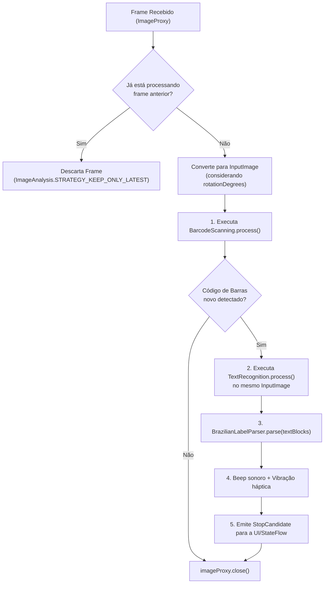
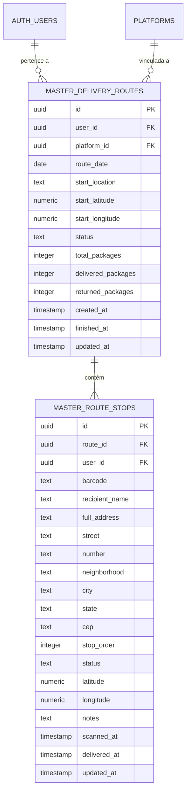
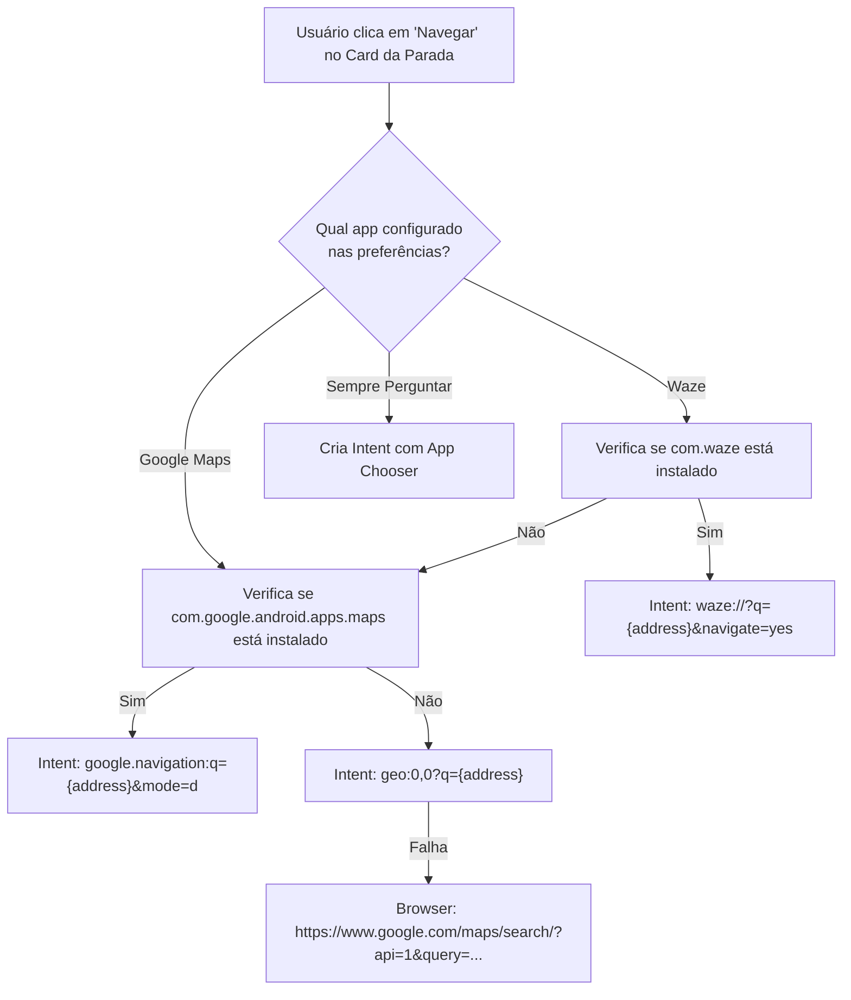
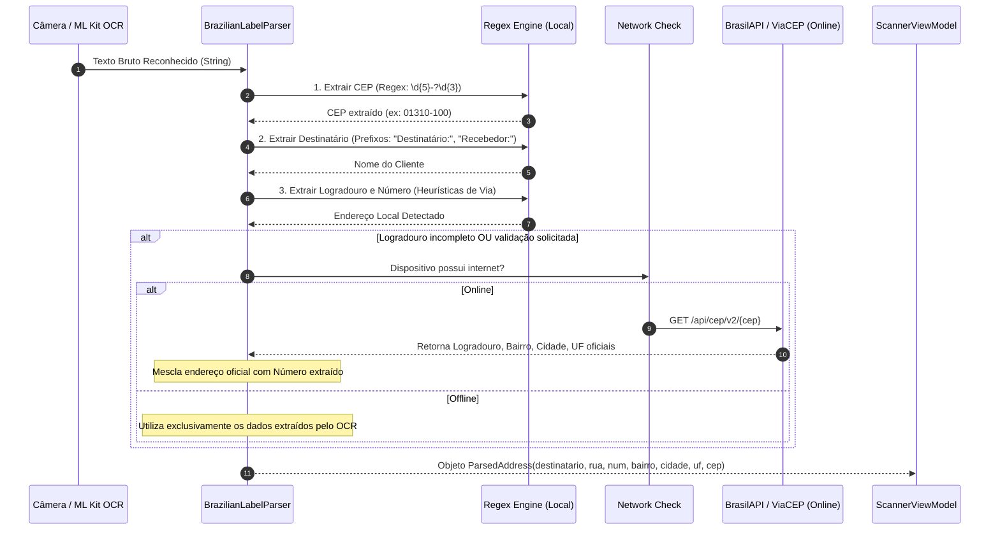
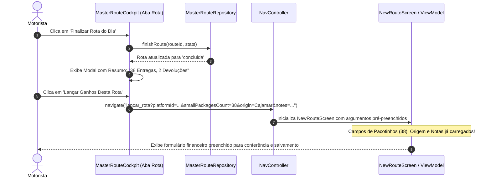

# ADR 002: Arquitetura da Bipagem com OCR, Rota Master e Deep Links de Navegação

| Metadado | Detalhe |
| :--- | :--- |
| **Status** | **Aprovado para Implementação** |
| **Data** | 28 de Setembro de 2026 |
| **Autor** | Agente Arquiteto (Central do Motorista - Pocket) |
| **Contexto** | Módulo Operacional de Bipagem de Carga, Roteirização Diária e Fechamento do Usuário Master |
| **Alvo** | Google ML Kit (Barcode + OCR v2), Modelagem Relacional Supabase, Deep Linking (Maps/Waze), Hand-off de Ganhos e Parsing de Etiquetas |

---

## 1. Contexto e Motivação do Negócio

No ecossistema de entregas rápidas e logística de última milha (*last mile*) no Brasil, o **Usuário Master** (o motorista proprietário da conta no aplicativo) enfrenta uma rotina diária matinal de alta pressão nos centros de distribuição (Mercado Livre, Shopee, Amazon, Loggi, Jadlog, Correios, entre outros).

### 1.1. O Desafio Operacional
1. **Inexistência de APIs Diretas:** As grandes plataformas não fornecem APIs abertas para motoristas autônomos integrarem suas ordens de serviço. Toda a informação sobre a entrega (código de rastreio, cliente, logradouro, número, bairro, cidade e CEP) existe **exclusivamente na etiqueta física colada no pacote**.
2. **Gargalo no Galpão:** O motorista dispõe de uma janela exígua (10 a 20 minutos) para conferir entre 30 e 100 pacotes físicos, organizá-los dentro do veículo e iniciar a rota.
3. **Fadiga de Redigitação e Custos:** Sem leitura automatizada de endereços, o motorista precisa ler repetidamente a etiqueta ao longo do dia e digitar manualmente cada endereço em aplicativos de GPS. APIs de roteirização em nuvem (ex: Google Directions API, Mapbox) impõem custos proibitivos por requisição, inviabilizando planos gratuitos.
4. **Desconexão com o Módulo Financeiro:** Ao final do dia, o motorista precisa reinscrever manualmente quantos pacotes entregou e devolveu na tela de lançamento de ganhos (`NewRouteScreen`).

### 1.2. Decisão Central
Este ADR estabelece a criação do módulo dedicado de **Bipagem e Rota do Dia do Usuário Master** na nova **5ª aba da barra inferior ("Rota")**, combinando:
- **Google ML Kit Text Recognition v2 + Barcode Scanning** rodando 100% *on-device* (custo zero, offline-first e latência < 100ms);
- **Modelagem Relacional no Supabase** (`master_delivery_routes` e `master_route_stops`) com RLS estrito;
- **Deep Linking Nativo para Waze e Google Maps** sem consumo de cotas de APIs pagas;
- **Motor de Parsing de Etiquetas Brasileiras** com suporte a Regex offline e fallback via BrasilAPI/ViaCEP quando conectado;
- **Hand-off Transparente** da rota concluída para a tela de fechamento financeiro de ganhos.

---

## 2. Visão Geral da Arquitetura do Sistema

```mermaid
flowchart TD
    subgraph DeviceCamera ["Hardware & Sensores"]
        Cam["Câmera do Smartphone (CameraX)"]
        Sensors["GPS Nativo / ToneGenerator / Vibrator"]
    end

    subgraph ClientLayer ["Camada Mobile (Android / Jetpack Compose)"]
        UI_Route["5ª Aba: Aba 'Rota' (Cockpit & Scanner)"]
        VM_Master["MasterRouteViewModel / ScannerViewModel"]
        Parser["BrazilianLabelParser (Regex + Heurísticas)"]
        NavHelper["NavigationIntentHelper (Deep Links Waze/Maps)"]
        Repo_Master["MasterRouteRepository (Flow + State)"]
        UI_Ganhos["Tela de Ganhos (NewRouteScreen)"]
    end

    subgraph OnDeviceML ["Inteligência On-Device (Google Play Services / ML Kit)"]
        ML_Barcode["ML Kit Barcode Scanning v17.3.0"]
        ML_OCR["ML Kit Text Recognition v2 v16.0.1"]
    end

    subgraph ExternalServices ["Serviços Externos Gratuitos (Opcional)"]
        BrasilAPI["BrasilAPI / ViaCEP (Lookup de CEP Online)"]
        AppWaze["App Waze (Nativo no Android)"]
        AppMaps["App Google Maps (Nativo no Android)"]
    end

    subgraph CloudBackend ["Backend & Persistência (Supabase)"]
        SupaClient["Supabase PostgREST / GoTrue Auth"]
        TableRoutes[("master_delivery_routes")]
        TableStops[("master_route_stops")]
    end

    Cam -->|Frames de Imagem (ImageAnalysis)| ML_Barcode
    Cam -->|Frames de Imagem (ImageAnalysis)| ML_OCR
    ML_Barcode -->|Código de Rastreio| VM_Master
    ML_OCR -->|Blocos de Texto| Parser
    Parser -->|Logradouro, Bairro, CEP| VM_Master
    Parser -.->|Fallback de Enriquecimento| BrasilAPI
    
    VM_Master --> UI_Route
    UI_Route -->|Ação 'Navegar'| NavHelper
    NavHelper -->|Intent google.navigation:q=...| AppMaps
    NavHelper -->|Intent waze://?q=...| AppWaze
    
    VM_Master --> Repo_Master
    Repo_Master --> SupaClient
    SupaClient --> TableRoutes
    SupaClient --> TableStops

    UI_Route -->|Ao Concluir Turno: Hand-off| UI_Ganhos
```

---

## 3. Decisão 1: Stack e Bibliotecas de Visão Computacional (ML Kit On-Device)

### 3.1. Por que ML Kit Text Recognition v2 e Barcode Scanning?
- **Custo Zero:** Executam localmente via modelo empacotado no dispositivo (*on-device*), sem emitir requisições para a Google Cloud Vision API ou serviços terceiros tarifados.
- **Operação 100% Offline:** Galpões logísticos frequentemente apresentam gaiolas de Faraday, subsolos ou zonas de sombra celular. O motorista consegue bipar e estruturar todos os pacotes sem nenhum pacote de dados ativo.
- **Baixa Latência:** Reconhecimento em menos de 80ms por frame, permitindo scanner contínuo ("apontou, bipou").
- **Pré-carregamento Automático:** Declarado no [`AndroidManifest.xml`](file:///d:/Dev/logistic-prime/logistic-prime/app/src/main/AndroidManifest.xml) via tag:
  ```xml
  <meta-data
      android:name="com.google.mlkit.vision.DEPENDENCIES"
      android:value="barcode,ocr" />
  ```
  O Google Play Services faz o download dos pesos neurais durante a instalação do app na Play Store.

### 3.2. Estratégia de Pipeline Híbrido no CameraX (`ImageAnalysis`)
Ao invés de processar frames indiscriminadamente, o `ImageAnalysis.Analyzer` adota um fluxo coordenado para evitar desperdício de CPU e queda de taxa de quadros (*FPS*):



```kotlin
// Exemplo canônico de processamento sequencial sem vazamento de memória
imageAnalysis.setAnalyzer(executor) { imageProxy ->
    val mediaImage = imageProxy.image
    if (mediaImage == null) {
        imageProxy.close()
        return@setAnalyzer
    }

    val inputImage = InputImage.fromMediaImage(mediaImage, imageProxy.imageInfo.rotationDegrees)

    barcodeScanner.process(inputImage)
        .addOnSuccessListener { barcodes ->
            val newBarcode = barcodes.firstOrNull { it.rawValue?.isNotBlank() == true }?.rawValue?.trim()
            if (newBarcode != null && !viewModel.isBarcodeAlreadyScanned(newBarcode)) {
                // Código novo encontrado! Executa OCR no mesmo frame para extrair o endereço
                textRecognizer.process(inputImage)
                    .addOnSuccessListener { visionText ->
                        val parsedAddress = BrazilianLabelParser.parse(visionText.text)
                        viewModel.onPackageScanned(
                            barcode = newBarcode,
                            parsedAddress = parsedAddress
                        )
                    }
                    .addOnCompleteListener {
                        imageProxy.close()
                    }
            } else {
                imageProxy.close()
            }
        }
        .addOnFailureListener {
            imageProxy.close()
        }
}
```

---

## 4. Decisão 2: Modelagem Relacional no Supabase (PostgreSQL)

Para garantir desacoplamento total entre as rotas de terceiros (entregadores parceiros) e as rotas operadas pelo próprio Fernando (Usuário Master), são criadas duas tabelas dedicadas: `master_delivery_routes` e `master_route_stops`.

### 4.1. Diagrama Entidade-Relacionamento (ERD)



### 4.2. Especificação DDL (SQL) & Políticas de Segurança (RLS)

```sql
-- 1. Criação da Tabela de Cabeçalho da Rota Master
CREATE TABLE IF NOT EXISTS public.master_delivery_routes (
    id UUID PRIMARY KEY DEFAULT gen_random_uuid(),
    user_id UUID NOT NULL REFERENCES auth.users(id) ON DELETE CASCADE,
    platform_id UUID REFERENCES public.platforms(id) ON DELETE SET NULL,
    route_date DATE NOT NULL DEFAULT CURRENT_DATE,
    start_location TEXT NOT NULL,
    start_latitude NUMERIC(10, 7),
    start_longitude NUMERIC(10, 7),
    status TEXT NOT NULL CHECK (status IN ('em_andamento', 'concluida', 'cancelada')) DEFAULT 'em_andamento',
    total_packages INTEGER NOT NULL DEFAULT 0,
    delivered_packages INTEGER NOT NULL DEFAULT 0,
    returned_packages INTEGER NOT NULL DEFAULT 0,
    created_at TIMESTAMPTZ NOT NULL DEFAULT timezone('utc', now()),
    finished_at TIMESTAMPTZ,
    updated_at TIMESTAMPTZ NOT NULL DEFAULT timezone('utc', now())
);

-- 2. Criação da Tabela de Paradas / Pacotes
CREATE TABLE IF NOT EXISTS public.master_route_stops (
    id UUID PRIMARY KEY DEFAULT gen_random_uuid(),
    route_id UUID NOT NULL REFERENCES public.master_delivery_routes(id) ON DELETE CASCADE,
    user_id UUID NOT NULL REFERENCES auth.users(id) ON DELETE CASCADE,
    barcode TEXT NOT NULL,
    recipient_name TEXT,
    full_address TEXT NOT NULL,
    street TEXT,
    number TEXT,
    neighborhood TEXT,
    city TEXT,
    state TEXT,
    cep TEXT,
    stop_order INTEGER NOT NULL DEFAULT 1,
    status TEXT NOT NULL CHECK (status IN ('pendente', 'entregue', 'ausente', 'devolvido')) DEFAULT 'pendente',
    latitude NUMERIC(10, 7),
    longitude NUMERIC(10, 7),
    notes TEXT,
    scanned_at TIMESTAMPTZ NOT NULL DEFAULT timezone('utc', now()),
    delivered_at TIMESTAMPTZ,
    updated_at TIMESTAMPTZ NOT NULL DEFAULT timezone('utc', now()),
    CONSTRAINT uq_master_route_stop_barcode UNIQUE (route_id, barcode)
);

-- 3. Índices de Alta Performance
CREATE INDEX IF NOT EXISTS idx_master_routes_user_status ON public.master_delivery_routes(user_id, status);
CREATE INDEX IF NOT EXISTS idx_master_routes_date ON public.master_delivery_routes(user_id, route_date DESC);
CREATE INDEX IF NOT EXISTS idx_master_stops_route_order ON public.master_route_stops(route_id, stop_order ASC);
CREATE INDEX IF NOT EXISTS idx_master_stops_barcode ON public.master_route_stops(route_id, barcode);

-- 4. Habilitação de RLS e Políticas Isoladas por Usuário
ALTER TABLE public.master_delivery_routes ENABLE ROW LEVEL SECURITY;
ALTER TABLE public.master_route_stops ENABLE ROW LEVEL SECURITY;

CREATE POLICY "master_delivery_routes_all"
    ON public.master_delivery_routes
    FOR ALL
    TO authenticated
    USING (auth.uid() = user_id)
    WITH CHECK (auth.uid() = user_id);

CREATE POLICY "master_route_stops_all"
    ON public.master_route_stops
    FOR ALL
    TO authenticated
    USING (auth.uid() = user_id)
    WITH CHECK (auth.uid() = user_id);
```

---

## 5. Decisão 3: Camada de Navegação Nativa via Intent Deep Linking

Para dispensar completamente custos de infraestrutura ou chaves de faturamento do Google Cloud / Mapbox, a navegação é despachada diretamente para os apps nativos instalados no smartphone do motorista.



### 5.1. Tabela de Padrões de Deep Link

| Canal Alvo | URI Scheme / URL | Exemplo Formatado | Comportamento |
| :--- | :--- | :--- | :--- |
| **Google Maps (Turn-by-turn)** | `google.navigation:q={address}&mode=d` | `google.navigation:q=Av.+Paulista,+1000,+Sao+Paulo&mode=d` | Inicia o modo de navegação direta em primeiro plano. |
| **Waze (Direto ao Destino)** | `waze://?q={address}&navigate=yes` | `waze://?q=Av.+Paulista,+1000&navigate=yes` | Abre o Waze já calculando a rota e iniciando rota. |
| **Geo Intent Genérico** | `geo:0,0?q={address}` | `geo:0,0?q=Av.+Paulista,+1000` | Abre o seletor do sistema operacional Android. |
| **Fallback Web Universal** | `https://www.google.com/maps/dir/?api=1&destination={address}` | `https://www.google.com/maps/dir/?api=1&destination=Av.+Paulista,+1000` | Abre no navegador caso nenhum app esteja instalado. |
| **Rota Completa (Waypoints)** | `https://www.google.com/maps/dir/?api=1&origin={origem}&destination={destino}&waypoints={w1}\|{w2}` | Múltiplos pontos | Plota a sequência inteira de até 9 paradas no Maps. |

### 5.2. Implementação do Utilitário `NavigationIntentHelper`

```kotlin
object NavigationIntentHelper {
    enum class NavAppPreference { GOOGLE_MAPS, WAZE, ALWAYS_ASK }

    fun launchNavigation(
        context: Context,
        address: String,
        preference: NavAppPreference = NavAppPreference.ALWAYS_ASK
    ) {
        val encodedAddress = Uri.encode(address)

        when (preference) {
            NavAppPreference.WAZE -> {
                val wazeIntent = Intent(Intent.ACTION_VIEW, Uri.parse("waze://?q=$encodedAddress&navigate=yes")).apply {
                    setPackage("com.waze")
                }
                if (canResolveIntent(context, wazeIntent)) {
                    context.startActivity(wazeIntent)
                    return
                }
            }
            NavAppPreference.GOOGLE_MAPS -> {
                val mapsIntent = Intent(Intent.ACTION_VIEW, Uri.parse("google.navigation:q=$encodedAddress&mode=d")).apply {
                    setPackage("com.google.android.apps.maps")
                }
                if (canResolveIntent(context, mapsIntent)) {
                    context.startActivity(mapsIntent)
                    return
                }
            }
            NavAppPreference.ALWAYS_ASK -> { /* Segue para o seletor geral */ }
        }

        // Seletor geral do Android via geo: intent
        val generalIntent = Intent(Intent.ACTION_VIEW, Uri.parse("geo:0,0?q=$encodedAddress"))
        val chooser = Intent.createChooser(generalIntent, "Navegar com:")
        
        try {
            context.startActivity(chooser)
        } catch (e: ActivityNotFoundException) {
            // Fallback absoluto via Web Browser
            val webIntent = Intent(
                Intent.ACTION_VIEW,
                Uri.parse("https://www.google.com/maps/search/?api=1&query=$encodedAddress")
            )
            context.startActivity(webIntent)
        }
    }

    private fun canResolveIntent(context: Context, intent: Intent): Boolean {
        return intent.resolveActivity(context.packageManager) != null
    }
}
```

---

## 6. Decisão 4: Estratégia de Parsing de Etiquetas Brasileiras (OCR Parser)

As etiquetas de frete dos principais e-commerces no Brasil (Mercado Livre, Shopee, Amazon, Correios) compartilham padrões tipográficos e estruturais previsíveis.



### 6.1. Especificação do Parser (`BrazilianLabelParser`)

```kotlin
data class ParsedAddress(
    val recipientName: String? = null,
    val street: String? = null,
    val number: String? = null,
    val neighborhood: String? = null,
    val city: String? = null,
    val state: String? = null,
    val cep: String? = null,
    val fullFormattedAddress: String
)

object BrazilianLabelParser {
    // Regex estrito para CEP brasileiro
    private val CEP_REGEX = Regex("""(?i)(?:CEP[:\s]*)?(\d{5})[-.\s]?(\d{3})""")

    // Prefixos comuns de destinatário
    private val RECIPIENT_REGEX = Regex(
        """(?i)(?:destinat[aá]rio|recebedor|cliente|entregar\s+para)[:\s]*([A-ZÀ-ÿ\s]{4,40})"""
    )

    // Prefixos de logradouro
    private val STREET_PREFIX_REGEX = Regex(
        """(?i)\b(Rua|R\.|Avenida|Av\.|Alameda|Al\.|Travessa|Trav\.|Estrada|Estr\.|Rodovia|Rod\.|Praça|Pça\.)\s+([A-ZÀ-ÿ0-9\s.,-]+)"""
    )

    fun parse(rawText: String): ParsedAddress {
        val lines = rawText.lines().map { it.trim() }.filter { it.isNotBlank() }

        // 1. Extração do CEP
        val cepMatch = CEP_REGEX.find(rawText)
        val rawCep = cepMatch?.let { "${it.groupValues[1]}-${it.groupValues[2]}" }

        // 2. Extração do Destinatário
        var recipientName: String? = null
        for (line in lines) {
            val recMatch = RECIPIENT_REGEX.find(line)
            if (recMatch != null) {
                recipientName = recMatch.groupValues[1].trim()
                break
            }
        }

        // 3. Extração do Logradouro e Número
        var street: String? = null
        var number: String? = null

        for (line in lines) {
            val streetMatch = STREET_PREFIX_REGEX.find(line)
            if (streetMatch != null) {
                street = streetMatch.value.trim()
                // Procura número após o logradouro
                val numberMatch = Regex("""[,º\s]+(\d{1,6}|S\/N|SN)\b""").find(line.substring(streetMatch.range.last))
                number = numberMatch?.groupValues?.get(1)?.trim()
                break
            }
        }

        val fullAddress = buildString {
            if (!street.isNullOrBlank()) append(street)
            if (!number.isNullOrBlank()) append(", ").append(number)
            if (!rawCep.isNullOrBlank()) append(" - CEP ").append(rawCep)
        }.ifBlank { rawText.take(120) }

        return ParsedAddress(
            recipientName = recipientName,
            street = street,
            number = number,
            cep = rawCep,
            fullFormattedAddress = fullAddress
        )
    }
}
```

---

## 7. Decisão 5: Hand-off Automático para Fechamento de Ganhos (`NewRouteScreen`)

Ao término do dia, o motorista não deve redigitar nenhuma informação de produção. A transição entre o módulo operacional e o módulo financeiro ocorre de forma contínua:



### 7.1. Contrato de Rota de Navegação (`NavGraph.kt`)

A rota `lancar_rota` no `NavGraph.kt` passa a aceitar os seguintes argumentos opcionais para receber a carga do hand-off:

```kotlin
composable(
    route = "${Screen.LancarRota.route}?itemId={itemId}&platformId={platformId}&deliveredPackages={deliveredPackages}&origin={origin}&destination={destination}&masterRouteId={masterRouteId}",
    arguments = listOf(
        navArgument("itemId") { type = NavType.StringType; nullable = true; defaultValue = null },
        navArgument("platformId") { type = NavType.StringType; nullable = true; defaultValue = null },
        navArgument("deliveredPackages") { type = NavType.IntType; defaultValue = 0 },
        navArgument("origin") { type = NavType.StringType; nullable = true; defaultValue = null },
        navArgument("destination") { type = NavType.StringType; nullable = true; defaultValue = null },
        navArgument("masterRouteId") { type = NavType.StringType; nullable = true; defaultValue = null }
    )
) { backStackEntry ->
    val itemId = backStackEntry.arguments?.getString("itemId")
    val platformId = backStackEntry.arguments?.getString("platformId")
    val deliveredPackages = backStackEntry.arguments?.getInt("deliveredPackages") ?: 0
    val origin = backStackEntry.arguments?.getString("origin")
    val destination = backStackEntry.arguments?.getString("destination")
    val masterRouteId = backStackEntry.arguments?.getString("masterRouteId")

    val routeViewModel: NewRouteViewModel = viewModel()
    
    LaunchedEffect(backStackEntry) {
        if (itemId == null && deliveredPackages > 0) {
            routeViewModel.applyMasterRouteHandOff(
                platformId = platformId,
                packagesCount = deliveredPackages,
                origin = origin,
                destination = destination,
                masterRouteId = masterRouteId
            )
        }
    }

    NewRouteScreen(
        itemId = itemId,
        viewModel = routeViewModel,
        onNavigateBack = { navController.popBackStack() },
        onRouteSaved = {
            homeViewModel.refresh()
            navController.popBackStack()
        }
    )
}
```

---

## 8. Diretrizes de Implementação para os Subagentes

### 8.1. Para o Subagente Designer (UI/UX)
1. **Posicionamento da 5ª Aba na `BottomNavigationBar`:**
   - Adicionar a aba `Rota` entre `Painel` e `Relatórios`. Ícone sugerido: `Icons.Default.AltRoute` ou `Icons.AutoMirrored.Filled.AltRoute`.
2. **Layout do Scanner de Câmera:**
   - Visor com duas áreas delimitadas: Mira superior horizontal para Barcode/QR Code e Mira inferior ampla para o bloco de texto/etiqueta.
   - Laser animado neon (`OrangeNeon`), botão de lanterna (Flash On/Off), contador superior de pacotes bipados e botão flutuante para pausar/finalizar leitura.
   - Mini-card inferior translúcido com feedback imediato do pacote detectado (Código, Destinatário, Endereço e botões Editar/Confirmar).
3. **Cockpit de Bordo (Lista de Paradas):**
   - Header com progresso (`Ex: 14/40 entregues - 35%`), status da rota e botão "Navegar para Próxima Parada".
   - Cards das paradas com botões de ação rápida: `[ Navegar (Maps/Waze) ]`, `[ Entregue ]`, `[ Ausente/Devolvido ]`.
4. **Modal de Conclusão de Rota:**
   - Resumo gráfico da rota com CTA de alta visibilidade: `[ Lançar Ganhos Desta Rota ]`.

### 8.2. Para o Subagente Backend
1. **Script de Migração SQL:**
   - Criar arquivo `docs/backend/migracao-fase-4-rotas-master-e-stops.sql` contendo o DDL completo (tabelas `master_delivery_routes` e `master_route_stops`), triggers de atualização do campo `updated_at`, índices e as políticas de RLS `auth.uid() = user_id`.
2. **Modelos DTO e Contratos:**
   - Implementar os data classes Kotlin com anotações `@SerializedName` para garantir compatibilidade com Retrofit/PostgREST.
3. **Repositório Supabase:**
   - Criar `MasterRouteRepository` com métodos atômicos para:
     - `createRoute(route: MasterDeliveryRoute)`
     - `addStopsBatch(stops: List<MasterRouteStop>)`
     - `updateStopStatus(stopId: String, status: String)`
     - `finishRoute(routeId: String, deliveredCount: Int, returnedCount: Int)`
     - `getActiveRoute(userId: String): Flow<MasterDeliveryRoute?>`

### 8.3. Para o Subagente Android/Kotlin
1. **Atualização da Navegação:**
   - Incluir `Screen.RotaMaster` na lista de rotas do `NavGraph.kt` e nas constantes da `BottomNavigationBar`.
2. **Câmera e Scanner com ML Kit:**
   - Implementar `MasterCameraScannerScreen` utilizando `CameraX` e `ProcessCameraProvider`.
   - Conectar o pipeline de `BarcodeScanning` e `TextRecognition` conforme a arquitetura de Analyzer descrita na Decisão 1.
   - Emitir som de beep via `ToneGenerator(AudioManager.STREAM_NOTIFICATION, 100)` e vibração háptica via `VibratorManager`.
3. **Integração de Deep Links:**
   - Implementar `NavigationIntentHelper` em `util/` com suporte a `google.navigation:` e `waze://`.
4. **Hand-off para `NewRouteViewModel`:**
   - Implementar a função `applyMasterRouteHandOff` em `NewRouteViewModel` para auto-preenchimento dos campos de ganhos.

---

## 9. Consequências e Trade-offs

### 9.1. Consequências Positivas
- **Velocidade Operacional Máxima:** O motorista reduz o tempo de conferência e separação de pacotes de 30 minutos para menos de 8 minutos no galpão.
- **Custo Operacional Zero:** Zero faturas ou consumo de cotas de APIs do Google Cloud Vision ou Google Maps Platform.
- **Resiliência a Áreas de Sombra:** Funciona em subsolos e galpões sem conexão de celular.
- **Eliminação de Erros de Digitação:** O endereço navegado é o endereço real impresso na etiqueta; os ganhos lançados refletem rigorosamente os pacotes entregues.

### 9.2. Trade-offs e Mitigações
- **Etiquetas Danificadas ou Rasgadas:** Se o código de barras ou endereço estiver ilegível, o motorista conta com um botão "Digitar Manualmente" para inserir o número do pacote e o endereço.
- **Variações de Layout de Etiquetas:** Novas transportadoras podem adotar etiquetas com formatos atípicos. O parser é extensível e baseado em regex configuráveis, permitindo ajustes ágeis.
- **Dependência do Google Play Services:** Em smartphones sem Google Play Services (ex: modelos Huawei sem GMS), o download on-device do modelo ML Kit requer empacotamento completo no binário (opção disponível se necessário).

---

## 10. Status de Aprovação e Próximos Passos

| Etapa | Responsável | Status |
| :--- | :--- | :--- |
| **ADR-002: Arquitetura da Bipagem e Rota Master** | **Arquiteto** | **Concluído** ✅ |
| **Especificação UI/UX Material 3** | Designer | Pronto para Início ⏳ |
| **Migration SQL e Repositórios Supabase** | Backend | Pronto para Início ⏳ |
| **Implementação CameraX, Scanner e Deep Links** | Android/Kotlin | Dependente de Backend e UI ⏳ |
| **Testes de Campo e Validação de QA** | QA | Dependente de Android/Kotlin ⏳ |
