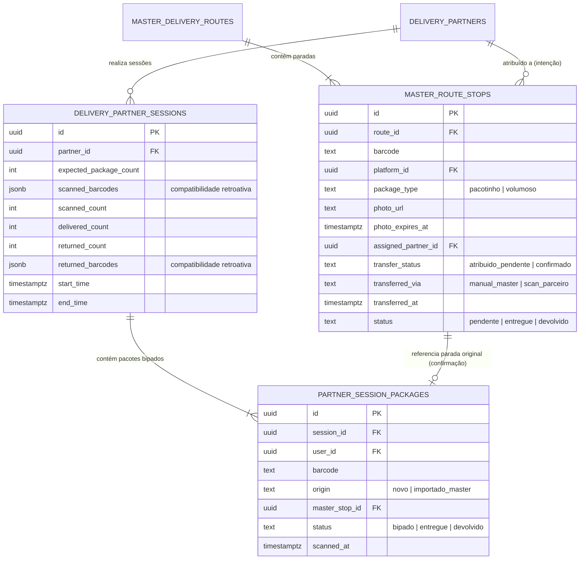
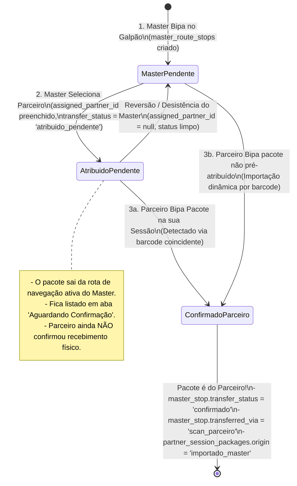
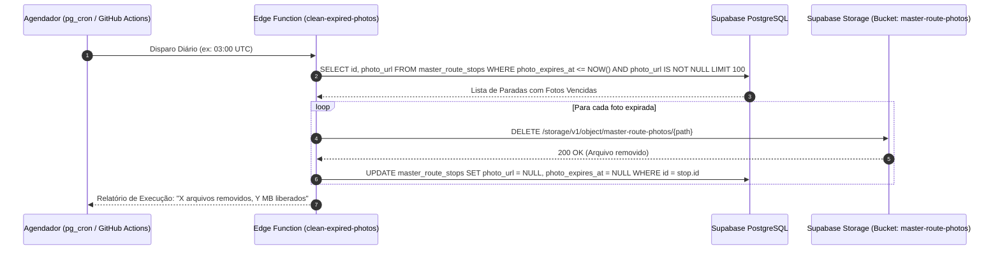

# ADR 003: Auditoria do Modelo de Bipagem de Parceiros, Decisão Técnica de `partner_session_packages` e Diretrizes para Extensões da Rota Master

| Metadado | Detalhe |
| :--- | :--- |
| **Status** | **Aprovado para Implementação** |
| **Data** | 28 de Setembro de 2026 |
| **Autor** | Agente Arquiteto (Central do Motorista - Pocket) |
| **Contexto** | Extensões da Rota Master, Bipagem Cruzada Master ↔ Parceiro e Ciclo de Vida de Fotos de Etiquetas |
| **Alvo** | Auditoria de `delivery_partner_sessions`, Criação de `partner_session_packages`, Diretrizes para Backend (Prompts 1 e 4) |

---

## 1. Sumário Executivo e Diagnóstico de Auditoria

Conforme determinado no **Prompt 0** do planejamento de extensões da Rota Master ([`docs/plano-final-extensoes-rota-master.md`](file:///d:/Dev/logistic-prime/logistic-prime/docs/plano-final-extensoes-rota-master.md)), foi realizada uma auditoria exaustiva e direta no código-fonte Android e nas especificações de banco de dados do Supabase para determinar como o aplicativo armazena as bipagens dos entregadores parceiros.

### 1.1. Veredito da Pergunta 1: Como `delivery_partner_sessions` guarda os pacotes hoje?
> **Constatação Factual:** A tabela `delivery_partner_sessions` e o modelo Kotlin `DeliveryPartnerSession` **NÃO possuem granularidade relacional por pacote**. Eles armazenam os pacotes exclusivamente como um **array plano de strings em colunas JSONB**:
> - Banco de Dados ([`docs/backend/auditoria-banco-e-apis.md`](file:///d:/Dev/logistic-prime/logistic-prime/docs/backend/auditoria-banco-e-apis.md#L517)):
>   ```sql
>   scanned_barcodes JSONB NOT NULL DEFAULT '[]'::jsonb,
>   scanned_count INT NOT NULL DEFAULT 0,
>   delivered_count INT NOT NULL DEFAULT 0,
>   returned_count INT NOT NULL DEFAULT 0,
>   returned_barcodes JSONB DEFAULT '[]'::jsonb
>   ```
> - App Android ([`DeliveryPartnerSessionDto.kt`](file:///d:/Dev/logistic-prime/logistic-prime/app/src/main/java/com/fernando/centraldomotorista/data/remote/dto/DeliveryPartnerSessionDto.kt#L23-L32)):
>   ```kotlin
>   @SerializedName("scanned_barcodes")
>   val scannedBarcodes: List<String> = emptyList(),
>   @SerializedName("returned_barcodes")
>   val returnedBarcodes: List<String> = emptyList()
>   ```

### 1.2. Limitações Críticas da Abordagem Atual (JSONB Monolítico)
1. **Ausência de Metadados Individuais:** Impossível registrar quando cada pacote individual foi bipado (`scanned_at`), o tipo de pacote (`PACOTINHO` vs `VOLUMOSO`), ou sua origem operacional (`ORIGEM = 'NOVO'` vs `'IMPORTADO_MASTER'`).
2. **Inviabilidade de Rastreabilidade Cruzada (Foreign Keys):** Um array JSONB de strings soltas (`["BR123", "BR456"]`) não aceita restrição de chave estrangeira (`FOREIGN KEY`) apontando para `master_route_stops(id)`.
3. **Ineficiência de Queries Cruzadas:** Para descobrir se o parceiro bipou um pacote que estava na rota do Master, o banco precisaria rodar buscas textuais por operador JSONB (`scanned_barcodes ? 'BR123'`) com *full table scans*, degradando a performance no galpão.
4. **Falta de Atomicidade na Transferência:** Não há como garantir concorrência ACID ao confirmar a entrega de um pacote transferido entre Master e Parceiro sem uma entidade física intermediária.

---

## 2. Decisão Arquitetural Formal: Criação de `partner_session_packages`

> [!IMPORTANT]
> **Decisão:** É **obrigatória e oficial** a criação da tabela relacional **`partner_session_packages`** no Supabase, vinculando cada bipagem individual a uma sessão de parceiro e, opcionalmente, à parada original da rota do Master (`master_route_stops`).

### 2.1. Estratégia de Não-Regressão e Coexistência Híbrida
Para assegurar que as telas existentes de parceiros ([`DeliveryPartnersScreen.kt`](file:///d:/Dev/logistic-prime/logistic-prime/app/src/main/java/com/fernando/centraldomotorista/ui/screens/deliverypartners/DeliveryPartnersScreen.kt), conciliação de faturas e ciclos de pagamento) continuem operando sem falhas:
1. A tabela `delivery_partner_sessions` **mantém** suas colunas existentes (`scanned_barcodes`, `returned_barcodes`, `scanned_count`, `delivered_count`, `returned_count`).
2. A nova tabela `partner_session_packages` passa a ser a **fonte da verdade granular**.
3. O repositório [`DeliveryPartnerSessionRepository`](file:///d:/Dev/logistic-prime/logistic-prime/app/src/main/java/com/fernando/centraldomotorista/data/repository/DeliveryPartnerSessionRepository.kt), ao persistir ou atualizar a sessão, sincroniza tanto a lista JSONB quanto as linhas individuais em `partner_session_packages`.

### 2.2. Diagrama de Relacionamento Master ↔ Parceiro



---

## 3. Máquina de Estados da Atribuição Cruzada (Master ↔ Parceiro)

A sincronização de um pacote entre o motorista Master e o entregador parceiro percorre duas etapas seguras:



---

## 4. Diretrizes Técnicas para o Backend: Prompt 1 (Migrations e Modelos)

O subagente **Backend** deve executar a seguinte especificação técnica para o Prompt 1:

### 4.1. Migration DDL: Extensões de `master_route_stops`
```sql
-- 1. Novas colunas em master_route_stops
ALTER TABLE public.master_route_stops
    ADD COLUMN IF NOT EXISTS platform_id UUID REFERENCES public.platforms(id) ON DELETE SET NULL,
    ADD COLUMN IF NOT EXISTS package_type TEXT NOT NULL DEFAULT 'pacotinho' CHECK (package_type IN ('pacotinho', 'volumoso')),
    ADD COLUMN IF NOT EXISTS photo_url TEXT,
    ADD COLUMN IF NOT EXISTS photo_expires_at TIMESTAMPTZ,
    ADD COLUMN IF NOT EXISTS assigned_partner_id UUID REFERENCES public.delivery_partners(id) ON DELETE SET NULL,
    ADD COLUMN IF NOT EXISTS transfer_status TEXT CHECK (transfer_status IN ('atribuido_pendente', 'confirmado')),
    ADD COLUMN IF NOT EXISTS transferred_via TEXT CHECK (transferred_via IN ('manual_master', 'scan_parceiro')),
    ADD COLUMN IF NOT EXISTS transferred_at TIMESTAMPTZ;

-- 2. Índice Parcial Crítico para Busca Ativa por Barcode (Prompt 6)
-- Evita full scan no momento da bipagem do parceiro:
CREATE INDEX IF NOT EXISTS idx_master_route_stops_barcode_active
    ON public.master_route_stops (barcode)
    WHERE transfer_status IS DISTINCT FROM 'confirmado' AND status <> 'devolvido';

-- 3. Índice para filtros por plataforma e parceiro atribuído
CREATE INDEX IF NOT EXISTS idx_master_route_stops_platform ON public.master_route_stops(platform_id);
CREATE INDEX IF NOT EXISTS idx_master_route_stops_assigned_partner ON public.master_route_stops(assigned_partner_id);
```

### 4.2. Migration DDL: Criação de `partner_session_packages`
```sql
CREATE TABLE IF NOT EXISTS public.partner_session_packages (
    id UUID PRIMARY KEY DEFAULT gen_random_uuid(),
    session_id UUID NOT NULL REFERENCES public.delivery_partner_sessions(id) ON DELETE CASCADE,
    user_id UUID NOT NULL REFERENCES auth.users(id) ON DELETE CASCADE,
    barcode TEXT NOT NULL,
    origin TEXT NOT NULL DEFAULT 'novo' CHECK (origin IN ('novo', 'importado_master')),
    master_stop_id UUID REFERENCES public.master_route_stops(id) ON DELETE SET NULL,
    status TEXT NOT NULL DEFAULT 'bipado' CHECK (status IN ('bipado', 'entregue', 'devolvido')),
    scanned_at TIMESTAMPTZ NOT NULL DEFAULT timezone('utc', now()),
    CONSTRAINT uq_partner_session_barcode UNIQUE (session_id, barcode)
);

CREATE INDEX IF NOT EXISTS idx_partner_session_packages_session ON public.partner_session_packages(session_id);
CREATE INDEX IF NOT EXISTS idx_partner_session_packages_barcode ON public.partner_session_packages(barcode);
CREATE INDEX IF NOT EXISTS idx_partner_session_packages_stop ON public.partner_session_packages(master_stop_id);

-- RLS de Segurança
ALTER TABLE public.partner_session_packages ENABLE ROW LEVEL SECURITY;

CREATE POLICY "partner_session_packages_all"
    ON public.partner_session_packages
    FOR ALL
    TO authenticated
    USING (auth.uid() = user_id)
    WITH CHECK (auth.uid() = user_id);
```

### 4.3. Atualização dos Contratos Kotlin
1. Em [`data/model/MasterRouteModels.kt`](file:///d:/Dev/logistic-prime/logistic-prime/app/src/main/java/com/fernando/centraldomotorista/data/model/MasterRouteModels.kt):
   - Adicionar os enums `PackageType` (`PACOTINHO`, `VOLUMOSO`) e `TransferStatus` (`ATRIBUIDO_PENDENTE`, `CONFIRMADO`).
   - Adicionar à classe de domínio `MasterRouteStop`:
     - `val platformId: String? = null`
     - `val packageType: PackageType = PackageType.PACOTINHO`
     - `val photoUrl: String? = null`
     - `val photoExpiresAt: OffsetDateTime? = null`
     - `val assignedPartnerId: String? = null`
     - `val transferStatus: TransferStatus? = null`
     - `val transferredVia: String? = null`
     - `val transferredAt: OffsetDateTime? = null`
2. Em [`data/remote/dto/MasterRouteDto.kt`](file:///d:/Dev/logistic-prime/logistic-prime/app/src/main/java/com/fernando/centraldomotorista/data/remote/dto/MasterRouteDto.kt):
   - Atualizar `MasterRouteStopDto` com `@SerializedName` em snake_case correspondente.
3. No [`MasterRouteRepository`](file:///d:/Dev/logistic-prime/logistic-prime/app/src/main/java/com/fernando/centraldomotorista/data/repository/MasterRouteRepository.kt):
   - Atualizar a assinatura de `addStop` com parâmetros opcionais e defaults retrocompatíveis:
     ```kotlin
     suspend fun addStop(
         routeId: String,
         barcode: String,
         recipientName: String?,
         fullAddress: String,
         cep: String?,
         latitude: Double? = null,
         longitude: Double? = null,
         notes: String? = null,
         platformId: String? = null,
         packageType: PackageType = PackageType.PACOTINHO,
         photoUrl: String? = null
     ): MasterRouteStop
     ```
   - Implementar a função `findActiveMasterStopByBarcode(barcode: String): MasterRouteStop?` utilizando o índice parcial para responder em menos de 10ms.

---

## 5. Diretrizes Técnicas para o Backend / DevOps: Prompt 4 (Job de Expiração de Fotos)

Para respeitar o limite gratuito de **1 GB de armazenamento no Supabase Storage** e evitar cobranças inesperadas:

### 5.1. Regra de Negócio de Retenção
- **Momento do Cálculo:** Quando a rota é concluída (`status = 'concluida'` via `finishRoute`), o sistema define:
  $$\text{photo\_expires\_at} = \text{finished\_at} + 15\text{ dias}$$
- **Proteção de Rotas Ativas:** Fotos pertencentes a rotas com status `'em_andamento'` **nunca** expiram enquanto a rota não for finalizada.

### 5.2. Arquitetura da Rotina de Limpeza
Recomenda-se implementar uma **Supabase Edge Function** (`clean-expired-photos`) disparada via cron diário (ou chamada manual via endpoint protegido por `SERVICE_ROLE_KEY`):



---

## 6. Matriz de Rastreabilidade dos Prompts

| Prompt | Componente Afetado | Dependência de `partner_session_packages` |
| :--- | :--- | :--- |
| **Prompt 0** | **Arquiteto** | **Concluído** (Este documento) ✅ |
| **Prompt 1** | Backend (Migrations & DTOs) | Implementa `partner_session_packages` e colunas estendidas ⏳ |
| **Prompt 2** | Android (Sticky Platform & PackageType) | Utiliza `platform_id` e `package_type` ⏳ |
| **Prompt 3** | Android (Gate Confiança OCR & Foto) | Utiliza `photo_url` e `photo_expires_at` ⏳ |
| **Prompt 4** | Backend (Job Limpeza de Fotos) | Limpa `photo_url` onde `photo_expires_at < now()` ⏳ |
| **Prompt 5** | Android (Cards Expansíveis Cockpit) | Independente (UI local) ⏳ |
| **Prompt 6** | Android (Atribuição Cruzada Master ↔ Parceiro) | Consome `partner_session_packages` e `findActiveMasterStopByBarcode` ⏳ |
| **Prompt 7** | Android (Ícone Origem na Sessão Parceiro) | Lê `partner_session_packages.origin == 'importado_master'` ⏳ |
| **Prompt 8** | Android (Handoff Financeiro Multi-Plataforma) | Agrupa paradas ativas do Master por `platform_id` ⏳ |

---

## 7. Conclusão e Próximo Passo

A auditoria confirma que a estrutura atual em JSONB não atende aos requisitos de atomicidade e integridade da atribuição cruzada. A criação de `partner_session_packages` é a solução arquitetural ideal, pois provê suporte relacional robusto sem causar regressão nas rotinas financeiras existentes de parceiros.

O **Subagente Backend** está formalmente autorizado e instruído para iniciar o **Prompt 1** com base nas especificações DDL e contratuais deste documento.
