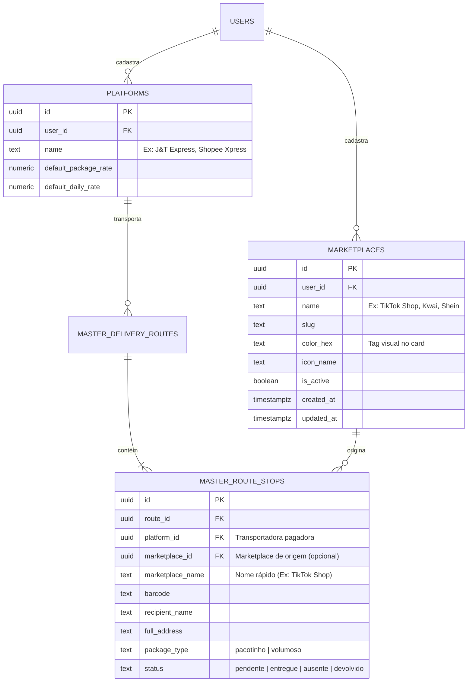
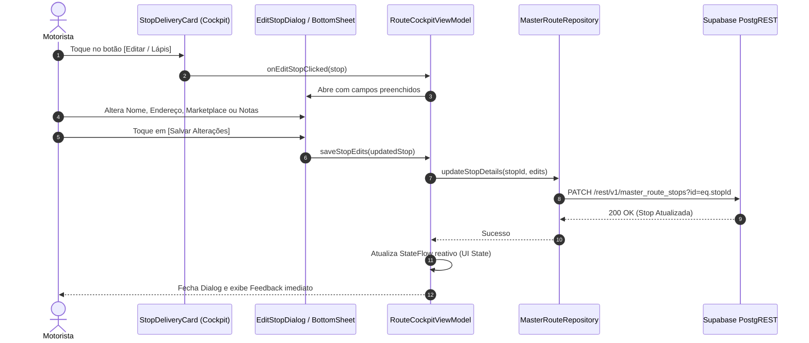
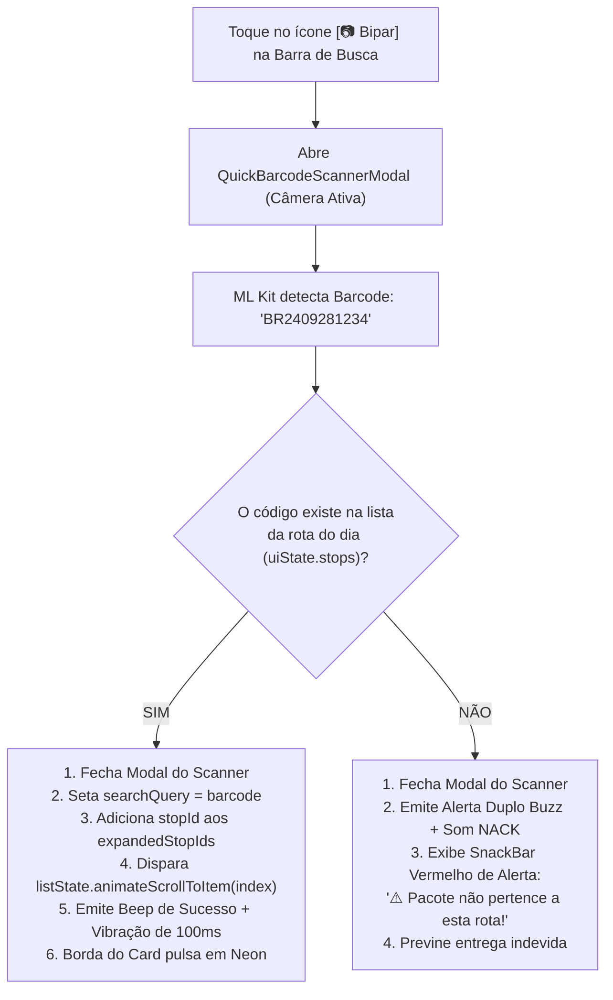
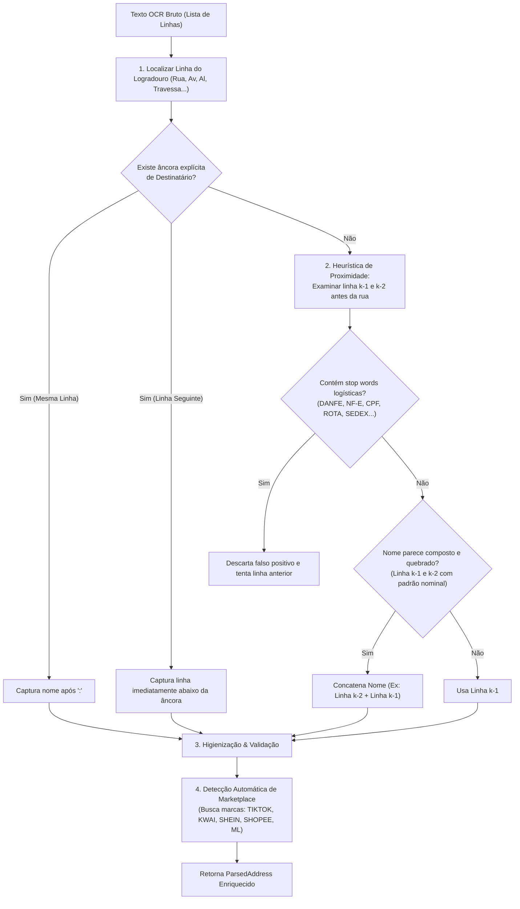

# ADR 004: Modelagem Transportadora vs Marketplace, Edição de Parada no Cockpit, Scanner de Busca Rápida e OCR Aprimorado de Destinatário

| Metadado | Detalhe |
| :--- | :--- |
| **Status** | **Aprovado para Implementação** |
| **Data** | 29 de Setembro de 2026 |
| **Autor** | Agente Arquiteto (Central do Motorista - Pocket) |
| **Contexto** | Operação Last-Mile Multi-Marketplace, Usabilidade do Cockpit de Bordo e Acurácia do Scanner OCR |
| **Alvo** | Distinção Plataforma vs Marketplace, Tabela `marketplaces`, `EditStopDialog`, Scanner de Busca Rápida, Heurística Multilinha no `BrazilianLabelParser` |

---

## 1. Contexto e Motivação do Negócio

Na logística moderna de última milha (*last mile*) no Brasil, existe uma distinção fundamental frequentemente negligenciada por sistemas genéricos, mas vital para o motorista autônomo:

```
┌────────────────────────────────────────────────────────────────────────┐
│                   ECOSSISTEMA LOGÍSTICO DO MOTORISTA                   │
├────────────────────────────────────────────────────────────────────────┤
│                                                                        │
│   PLATAFORMA / TRANSPORTADORA (Contratante & Pagador)                  │
│   Ex: J&T Express, Anjun Express, Shopee Xpress, Sequoia, Loggi       │
│   ↳ Quem emite a fatura, define o valor da diária/pacote e paga o frete │
│                                                                        │
│   ▼ atende / distribui pacotes de ▼                                    │
│                                                                        │
│   MARKETPLACES / TOMADORES DE SERVIÇO (Origem do Pacote)               │
│   Ex: TikTok Shop, Kwai, Shein, Mercado Livre, Shopee, C&A, Riachuelo │
│   ↳ De onde vem o pacote e o que o cliente final identifica no portão │
│                                                                        │
└────────────────────────────────────────────────────────────────────────┘
```

### 1.1. O Problema da Ambiguidade "Plataforma vs Marketplace"
- O motorista é contratado e pago pela transportadora **J&T Express** (entidade `platforms` no app, vinculada a faturas, despesas e ciclos financeiros).
- No entanto, no galpão da J&T Express, o motorista carrega pacotes provenientes de **TikTok Shop, Kwai, Shein e C&A** na mesma rota diária.
- Ao chegar no endereço, o cliente ou porteiro não sabe o que é "J&T Express"; eles perguntam: *"Essa encomenda é da Shein ou do TikTok?"*.
- Sem a identificação explícita do Marketplace, o motorista perde minutos preciosos procurando o pacote no porta-malas ou relendo etiquetas amassadas.

### 1.2. O Problema da Busca Rápida no Bairro e Erro de Carregamento
- Durante a rota, o motorista muitas vezes pega um pacote físico aleatório no baú e precisa localizar instantaneamente a parada correspondente no aplicativo.
- Digitar o código de rastreamento longo (ex: `BR240928123456X`) no teclado do smartphone enquanto dirige ou atende o portão é lento, perigoso e propenso a erros.
- Pior: se o motorista acidentalmente bipar um pacote que pertence a outro entregador ou outro dia, o app atual não emite alerta de pacote estranho.

### 1.3. O Problema da Edição e do OCR de Destinatário
- Etiquetas térmicas de e-commerce sofrem desgaste, cortes de guilhotina e falhas de impressão. Em muitas etiquetas (especialmente Mercado Livre e Shopee), o nome do cliente aparece:
  1. Na linha seguinte ao rótulo `"DESTINATÁRIO:"`;
  2. Quebrado em duas linhas (ex: `"FRANCISCO CARLOS"` \n `"DE SOUZA OLIVEIRA"`);
  3. Sem rótulo nenhum, posicionado diretamente acima da linha do endereço.
- O parser atual falha nesses casos e não havia formulário no Cockpit para corrigir dados parciais.

---

## 2. Decisão 1: Modelagem Relacional Transportadora vs Marketplace

### 2.1. Conceituação das Entidades
1. **Plataforma (`platforms`):** Representa o operador logístico / transportadora que contrata o motorista e efetua o pagamento financeiro (`platform_id` já existente no app e banco).
2. **Marketplace (`marketplaces`):** Representa a origem comercial do pacote (TikTok Shop, Kwai, Shein, Shopee, Mercado Livre, Amazon, etc.).
3. **Parada (`master_route_stops`):** Recebe o atributo `marketplace_name TEXT` (desnormalizado para digitação/leitura rápida via OCR) e, opcionalmente, `marketplace_id UUID REFERENCES marketplaces(id)`.

### 2.2. Diagrama Entidade-Relacionamento (ERD)



### 2.3. Especificação DDL (PostgreSQL / Supabase)

```sql
-- 1. Criação da Tabela de Marketplaces
CREATE TABLE IF NOT EXISTS public.marketplaces (
    id UUID PRIMARY KEY DEFAULT gen_random_uuid(),
    user_id UUID NOT NULL REFERENCES auth.users(id) ON DELETE CASCADE,
    name TEXT NOT NULL,
    slug TEXT,
    color_hex TEXT DEFAULT '#FF9800',
    icon_name TEXT DEFAULT 'storefront',
    is_active BOOLEAN NOT NULL DEFAULT true,
    created_at TIMESTAMPTZ NOT NULL DEFAULT timezone('utc', now()),
    updated_at TIMESTAMPTZ NOT NULL DEFAULT timezone('utc', now()),
    CONSTRAINT uq_marketplaces_user_name UNIQUE (user_id, name)
);

-- Índices e RLS
CREATE INDEX IF NOT EXISTS idx_marketplaces_user_active ON public.marketplaces(user_id, is_active);
ALTER TABLE public.marketplaces ENABLE ROW LEVEL SECURITY;

CREATE POLICY "marketplaces_user_all"
    ON public.marketplaces
    FOR ALL
    TO authenticated
    USING (auth.uid() = user_id)
    WITH CHECK (auth.uid() = user_id);

-- 2. Inclusão dos Campos em master_route_stops
ALTER TABLE public.master_route_stops
    ADD COLUMN IF NOT EXISTS marketplace_id UUID REFERENCES public.marketplaces(id) ON DELETE SET NULL,
    ADD COLUMN IF NOT EXISTS marketplace_name TEXT;

CREATE INDEX IF NOT EXISTS idx_master_route_stops_marketplace ON public.master_route_stops(marketplace_name);

-- 3. Marketplaces Padrão Sugeridos (Seed para novos usuários via trigger ou app)
-- TikTok Shop, Kwai, Shein, Mercado Livre, Shopee, Amazon, Magalu, C&A, Riachuelo, AliExpress
```

---

## 3. Decisão 2: Arquitetura da Edição de Parada no Cockpit (`EditStopDialog`)

### 3.1. Necessidade Operacional
No trânsito, o motorista precisa de flexibilidade para:
- Corrigir o número do imóvel (ex: `"12"` para `"12-A fundos"`);
- Corrigir ou adicionar o nome do recebedor informado pelo porteiro;
- Alterar o tipo de pacote (`PACOTINHO` ↔ `VOLUMOSO`);
- Associar ou corrigir o Marketplace;
- Registrar instruções de entrega nas anotações (`notes`), ex: *"Deixar na portaria 2 com vigilante Márcio"*.



### 3.2. Contrato de Dados para Edição de Parada
No arquivo [`MasterRouteRepository.kt`](file:///d:/Dev/logistic-prime/logistic-prime/app/src/main/java/com/fernando/centraldomotorista/data/repository/MasterRouteRepository.kt):

```kotlin
suspend fun updateStopDetails(
    stopId: String,
    recipientName: String?,
    fullAddress: String,
    street: String?,
    number: String?,
    neighborhood: String?,
    city: String?,
    state: String?,
    cep: String?,
    marketplaceName: String?,
    packageType: PackageType,
    notes: String?
): Boolean
```

DTO para envio ao Supabase via PATCH (`UpdateStopDetailsDto`):
```kotlin
data class UpdateStopDetailsDto(
    @SerializedName("recipient_name") val recipientName: String?,
    @SerializedName("full_address") val fullAddress: String,
    @SerializedName("street") val street: String?,
    @SerializedName("number") val number: String?,
    @SerializedName("neighborhood") val neighborhood: String?,
    @SerializedName("city") val city: String?,
    @SerializedName("state") val state: String?,
    @SerializedName("cep") val cep: String?,
    @SerializedName("marketplace_name") val marketplaceName: String?,
    @SerializedName("package_type") val packageType: String,
    @SerializedName("notes") val notes: String?,
    @SerializedName("updated_at") val updatedAt: String = OffsetDateTime.now().toString()
)
```

---

## 4. Decisão 3: Scanner de Código de Barras no Campo de Pesquisa do Cockpit

Para resolver a fricção de encontrar encomendas físicas sem digitar códigos longos, o campo de busca de paradas do Cockpit ganha um botão com acionamento de **Scanner de Busca Rápida**:

```
┌─────────────────────────────────────────────────────────────┐
│ 🔍 Buscar por endereço, cliente...            [📷 Bipar] [X]│
└─────────────────────────────────────────────────────────────┘
```



### 4.1. Comportamento e Feedback Sensorial
| Cenário | Feedback Sonoro | Feedback Háptico | Ação na UI |
| :--- | :--- | :--- | :--- |
| **Pacote Encontrado na Rota** | `TONE_PROP_BEEP` (120ms) | Vibração única de 100ms | Card é expandido automaticamente, scroll suave até o item e destaque visual neon. |
| **Pacote NÃO Encontrado (Outra Rota / Carro)** | `TONE_PROP_NACK` (280ms) | Vibração dupla de alerta (100ms, pausa 70ms, 150ms) | SnackBar persistente de advertência com cor `RedAlert`. |

### 4.2. Integração no `RouteCockpitViewModel`
```kotlin
fun onQuickBarcodeScanned(barcode: String, onMatchFound: (targetIndex: Int) -> Unit) {
    val cleanCode = barcode.trim()
    val allStops = _uiState.value.stops
    val matchedStop = allStops.firstOrNull { it.barcode.equals(cleanCode, ignoreCase = true) }

    if (matchedStop != null) {
        // Encontrado!
        _uiState.update { current ->
            current.copy(
                searchQuery = cleanCode,
                expandedStopIds = current.expandedStopIds + matchedStop.id
            )
        }
        val targetIndex = _uiState.value.filteredActiveStops.indexOfFirst { it.id == matchedStop.id }
        onMatchFound(if (targetIndex >= 0) targetIndex else 0)
        triggerSuccessFeedback()
    } else {
        // Alerta de pacote estranho à rota
        triggerNegativeFeedback()
        _uiState.update { it.copy(error = "⚠️ Pacote $cleanCode não pertence a esta rota!") }
    }
}
```

---

## 5. Decisão 4: Estratégia Aprimorada de OCR de Destinatário (`BrazilianLabelParser`)

### 5.1. Anatomia das Etiquetas de E-Commerce no Brasil
Nas etiquetas térmicas das principais transportadoras e marketplaces (Mercado Livre, Shopee, Shein, TikTok Shop, Amazon):
- O nome do destinatário encontra-se quase que invariavelmente **nas imediações superiores do endereço de entrega** (entre 1 e 2 linhas antes da linha de logradouro `"Rua..."` / `"Av..."`).
- Pode vir precedido por âncoras (`"DESTINATÁRIO:"`, `"RECEBEDOR:"`, `"CLIENTE:"`, `"NOME:"`, `"ENTREGAR PARA:"`, `"CONSIGNATÁRIO:"`), mas o valor real frequentemente está na linha de baixo devido a quebras de linha em formulários de impressão térmica.
- Em muitos casos de nomes longos (ex: `"MARIA APARECIDA DOS SANTOS OLIVEIRA"`), o nome é repartido em 2 linhas adjacentes.



### 5.2. Blacklist Rigorosa de Stop Words Logísticas e Tributárias
Linhas candidatas a nome que contenham quaisquer destes termos devem ser imediatamente descartadas como falsos positivos:

```kotlin
private val LOGISTIC_STOPWORDS = setOf(
    "danfe", "chave", "acesso", "nfe", "nf-e", "nota fiscal", "simplificada",
    "declaracao", "conteudo", "declaracao de conteudo", "remetente", "origem",
    "destinatario", "recebedor", "cliente", "endereco", "volumes", "volume",
    "peso", "peso bruto", "peso liquido", "kg", "dimensoes", "rota", "cluster",
    "postagem", "sedex", "pac", "standard", "express", "coleta", "entrega",
    "remessa", "consignatario", "cpf", "cnpj", "ie", "rg", "data", "hora",
    "pedido", "id pedido", "rastreio", "tracking", "plataforma", "transportadora",
    "crossdocking", "hub", "triagem", "devolucao", "tentativa", "assine",
    "assinatura", "documento", "recebido por", "grau parentesco", "canal"
)
```

### 5.3. Heurística de Proximidade e Nomes Compostos Multilinha
Implementação canônica para o [`BrazilianLabelParser.kt`](file:///d:/Dev/logistic-prime/logistic-prime/app/src/main/java/com/fernando/centraldomotorista/util/BrazilianLabelParser.kt):

```kotlin
// 1. Extração por Âncora Explícita (mesma linha ou linha imediatamente posterior)
for (i in lines.indices) {
    val line = lines[i]
    val anchorMatch = RECIPIENT_ANCHOR_REGEX.find(line)
    if (anchorMatch != null) {
        val inlineCandidate = anchorMatch.groupValues[1].trim()
        if (isValidNameCandidate(inlineCandidate)) {
            recipientName = inlineCandidate
            break
        } else if (i + 1 < lines.size) {
            // Se a âncora estava na linha mas o nome veio na linha seguinte
            val nextLineCandidate = lines[i + 1].trim()
            if (isValidNameCandidate(nextLineCandidate)) {
                recipientName = nextLineCandidate
                break
            }
        }
    }
}

// 2. Fallback por Proximidade ao Logradouro (se ainda não encontrou)
if (recipientName == null && streetLineIndex > 0) {
    val candidate1 = lines[streetLineIndex - 1].trim()
    if (isValidNameCandidate(candidate1)) {
        // Verifica se a linha anterior (k-2) é continuação de um nome composto
        if (streetLineIndex > 1) {
            val candidate2 = lines[streetLineIndex - 2].trim()
            if (isValidNameCandidate(candidate2) && !candidate2.contains(Regex("""\d"""))) {
                recipientName = "$candidate2 $candidate1"
            } else {
                recipientName = candidate1
            }
        } else {
            recipientName = candidate1
        }
    }
}

// 3. Detecção Automática do Marketplace na Etiqueta
var detectedMarketplace: String? = null
val textUpper = rawText.uppercase()
when {
    textUpper.contains("TIKTOK") -> detectedMarketplace = "TikTok Shop"
    textUpper.contains("KWAI") -> detectedMarketplace = "Kwai"
    textUpper.contains("SHEIN") -> detectedMarketplace = "Shein"
    textUpper.contains("SHOPEE") -> detectedMarketplace = "Shopee"
    textUpper.contains("MERCADO LIVRE") || textUpper.contains("MERCADOLIVRE") -> detectedMarketplace = "Mercado Livre"
    textUpper.contains("AMAZON") -> detectedMarketplace = "Amazon"
    textUpper.contains("MAGALU") || textUpper.contains("MAGAZINE LUIZA") -> detectedMarketplace = "Magazine Luiza"
    textUpper.contains("ALIEXPRESS") -> detectedMarketplace = "AliExpress"
    textUpper.contains("C&A") || textUpper.contains("CEA") -> detectedMarketplace = "C&A"
    textUpper.contains("RIACHUELO") -> detectedMarketplace = "Riachuelo"
}
```

---

## 6. Diretrizes Técnicas para os Subagentes

### 6.1. Subagente Backend
1. **Migration SQL:**
   - Criar arquivo `docs/backend/migracao-fase-5-marketplaces-e-stop-details.sql` com:
     - Tabela `marketplaces` (id, user_id, name, slug, color_hex, is_active, timestamps, RLS);
     - Colunas `marketplace_id` e `marketplace_name` em `master_route_stops`;
     - Índices de busca por marketplace.
2. **DTOs e API Retrofit:**
   - Criar `MarketplaceDto` e `UpdateStopDetailsDto` com anotações `@SerializedName`.
   - Adicionar em `MasterRouteApi`:
     ```kotlin
     @PATCH("master_route_stops")
     suspend fun updateStopDetails(
         @Query("id") idFilter: String,
         @Body body: UpdateStopDetailsDto
     ): List<MasterRouteStopDto>
     ```
3. **Repositório:**
   - Implementar `updateStopDetails` e `getMarketplaces` no `MasterRouteRepository` / `PlatformRepository`.

### 6.2. Subagente Android/Kotlin
1. **Modelos de Domínio:**
   - Adicionar `marketplaceName: String? = null` e `marketplaceId: String? = null` em `MasterRouteStop` ([`MasterRouteModels.kt`](file:///d:/Dev/logistic-prime/logistic-prime/app/src/main/java/com/fernando/centraldomotorista/data/model/MasterRouteModels.kt)).
   - Adicionar `marketplace: String? = null` em `ParsedAddress` ([`BrazilianLabelParser.kt`](file:///d:/Dev/logistic-prime/logistic-prime/app/src/main/java/com/fernando/centraldomotorista/util/BrazilianLabelParser.kt)).
2. **Atualização do `BrazilianLabelParser.kt`:**
   - Incorporar as heurísticas multilinha, blacklist de termos logísticos e detecção de marketplace conforme Seção 5.
3. **Componente Compose `EditStopDialog`:**
   - Diálogo com campos: Destinatário, Endereço Completo, Marketplace (Dropdown com sugestões + digitação livre), Tipo de Pacote (`PACOTINHO` / `VOLUMOSO`), Observações.
   - Botão de ação [Salvar] disparando `viewModel.updateStopDetails(...)`.
4. **Botão de Edição no `StopDeliveryCard`:**
   - Incluir ícone de edição (lápis) no card expandido e/ou no cabeçalho do card.
5. **Scanner de Busca Rápida no Cockpit:**
   - Botão de leitor de código de barras no campo de pesquisa (`OutlinedTextField`).
   - Modal rápido CameraX ativando `onQuickBarcodeScanned` com scroll automático e feedback sonoro/tátil.

---

## 7. Critérios de Aceitação e Testabilidade

1. **Separação de Conceitos:** O aplicativo permite cadastrar uma rota pela transportadora (ex: "J&T Express") e ter paradas individuais marcadas como "TikTok Shop", "Shein" ou "Kwai".
2. **Edição Concluída:** Alterações no `EditStopDialog` refletem imediatamente na UI do Cockpit e persistem no Supabase.
3. **Busca Rápida por Bipagem:** Bipar um pacote pertencente à rota rola a tela até o card correspondente e o abre expandido com tom positivo; bipar um pacote alheio dispara vibração dupla de erro, tom negativo e aviso visual.
4. **Parser Aprimorado:** O `BrazilianLabelParserTest` cobre casos de destinatário quebrado em duas linhas, destinatário após quebra de linha de âncora, e extração correta de marketplace.
