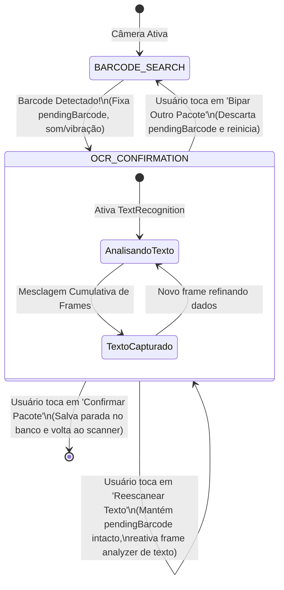
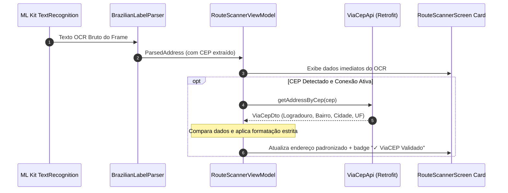
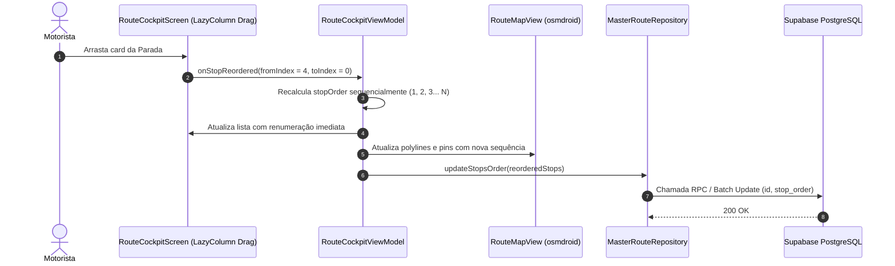

# ADR 005: Validação ViaCEP, Releitura OCR, Catálogo de Cargas, Reordenação de Rota e Correções Ergonômicas

| Metadado | Detalhe |
| :--- | :--- |
| **Status** | **Aprovado para Implementação** |
| **Data** | 04 de Outubro de 2026 |
| **Autor** | Agente Arquiteto (Central do Motorista - Pocket) |
| **Contexto** | Operação Last-Mile do Usuário Master: Acurácia de OCR, Ergonomia Veicular e Flexibilidade Operacional |
| **Alvo** | Integração ViaCEP, Releitura de OCR sem perda de Barcode, Catálogo de Cargas (5 tipos), Sticky Partner Alfabético, Reatribuição Master, Card Contraído Limpo, Title Case Brasileiro e Drag & Drop de Paradas |

---

## 1. Sumário Executivo e Diagnóstico Operacional

Durante os testes de campo e a utilização real do módulo de **Bipagem e Cockpit de Rota Master**, foram identificadas oportunidades críticas de melhoria na usabilidade, na assertividade dos dados capturados e na ergonomia em cabine:

1. **Perda Acidental de Dados no OCR:** Quando o motorista apontava a câmera para a etiqueta, variações de iluminação entre quadros consecutivos provocavam a perda do Nome do Cliente já identificado, porque cada frame sobrescrevia o anterior de forma destrutiva.
2. **Impossibilidade de Releitura Rápida de Texto:** Se o código de barras fosse lido com sucesso mas o endereço ficasse incompleto, o botão de "Bipar Novamente" descartava o código de barras, forçando o motorista a escanear ambos os elementos do zero.
3. **Endereços Despadronizados e Ruído no GPS:** Erros ópticos de fontes térmicas (ex: `"Av Pau1ista"` em vez de `"Avenida Paulista"`) e instruções de entrega misturadas com o logradouro confundem os aplicativos de GPS (Google Maps e Waze).
4. **Catálogo Restrito de Cargas:** A divisão binária entre apenas `"Pacotinho"` e `"Volumoso"` é insuficiente para motoristas que transportam medicamentos (farmácia), refeições/marmitas (comida) e envelopes contratuais (documentos).
5. **Atrito na Atribuição a Parceiros:** A lista de parceiros não respeitava ordem alfabética e perdia a seleção anterior a cada novo pacote, além de não permitir devolver facilmente um pacote para o próprio Master no Cockpit.
6. **Poluição Visual no Cockpit:** O card contraído exibia o código de barras longo em destaque, ocultando o endereço legível em tamanho adequado.
7. **Rigidez na Ordem de Entrega:** O motorista não conseguia reorganizar manualmente paradas para contornar obras, horários comerciais restritos ou feiras livres locais.

Este ADR formaliza a arquitetura dos **10 requisitos** para resolver definitivamente esses gargalos.

---

## 2. Decisão 1: Manutenção do Layout do Scanner e Arquitetura da Releitura OCR

### 2.1. Preservação do Layout Consolidado
O layout da tela [`RouteScannerScreen.kt`](file:///d:/Dev/logistic-prime/logistic-prime/app/src/main/java/com/fernando/centraldomotorista/ui/screens/routes/master/RouteScannerScreen.kt) (cabeçalho sticky com transportadora ativa, visor central CameraX e card inferior de confirmação) permanece **inalterado em sua disposição geométrica**. As adições ocorrem estritamente dentro dos controles de ação do card inferior.

### 2.2. Arquitetura da Releitura de OCR (Fixação do Barcode)
Ao detectar o código de barras, o sistema passa para o estado `ScannerStep.OCR_CONFIRMATION` e fixa a variável `pendingBarcode`.



**Diretrizes de Implementação:**
1. Criar a ação `reReadOcrText()` no ViewModel:
   - Mantém `pendingBarcode` estritamente inalterado;
   - Define `isOcrScanning = true`;
   - Reativa a captura de frames no `ImageAnalysis` para o `TextRecognition`;
   - Preserva o layout da câmera sem recarregar o `ProcessCameraProvider`.
2. O botão de ação secundária no card inferior passa a ser rotulado como **"Reescanear Texto (OCR)"** com ícone `Icons.Default.Refresh`.
3. Para abortar e escanear outro pacote, disponibilizar ação explícita **"Trocar Código / Bipar Outro"**.

---

## 3. Decisão 2: Integração com ViaCEP e Formatação Estrita de Endereço

### 3.1. Pipeline de Consulta e Validação
Quando o `BrazilianLabelParser` extrair um CEP válido no padrão `^\d{5}-\d{3}$`:
1. Uma coroutine assíncrona consulta o endpoint [`ViaCepApi.instance.getAddressByCep(cep)`](file:///d:/Dev/logistic-prime/logistic-prime/app/src/main/java/com/fernando/centraldomotorista/data/remote/api/ViaCepApi.kt#L10) (já existente no projeto).
2. Se `dto.erro == true` ou ocorrer timeout de rede, o aplicativo mantém os dados extraídos pelo OCR sem interromper o motorista.
3. Se o retorno for bem-sucedido:
   - O logradouro oficial dos Correios substitui eventuais distorções do OCR (ex: OCR leu `"R. Pau1o Eir0"` -> ViaCEP padroniza `"Rua Paulo Eiró"`);
   - O Bairro oficial e a Cidade/UF oficiais são unificados;
   - O Número predial da etiqueta física é preservado com exatidão;
   - Complementos da etiqueta (apto, bloco, torre, sala) são preservados.



### 3.2. Formatação Estrita do Endereço
O campo `fullAddress` passa a obedecer à seguinte regra canônica:
$$\text{[Rua]},\;\text{[Número]},\;\text{[Complemento]},\;\text{[Bairro]},\;\text{[Cidade]},\;\text{[Estado]},\;\text{[CEP]}$$

Exemplo:
`Avenida Paulista, 1000, Apto 42, Bela Vista, São Paulo, SP, 01310-100`

### 3.3. Segregação de Dados Não-Endereço -> Campo "Referência" (`notes`)
Instruções operacionais encontradas na etiqueta (ex: *"Ao lado da padaria"*, *"Portão verde fundos"*, *"Deixar na portaria com Seu Jorge"*, *"Lote 14 QD 02"*) não devem poluir o endereço de navegação veicular.
- O parser identifica essas frases e as transfere automaticamente para a propriedade `notes` (campo **Referência**);
- O `fullAddress` fica 100% limpo para ser despachado diretamente via Deep Link para Waze ou Google Maps sem gerar rotas imprecisas.

---

## 4. Decisão 3: Expansão do Catálogo de Cargas (`PackageType`)

O ecossistema logístico de última milha abrange múltiplos tipos de encomendas. O modelo `PackageType` em [`MasterRouteModels.kt`](file:///d:/Dev/logistic-prime/logistic-prime/app/src/main/java/com/fernando/centraldomotorista/data/model/MasterRouteModels.kt#L39) é expandido de 2 para 5 categorias:

| Enum | Valor Banco | Nome Exibição | Ícone | Caso de Uso |
| :--- | :--- | :--- | :--- | :--- |
| `PACOTE` | `'pacote'` | **Pacote** *(Padrão)* | 📦 | Caixas e pacotes convencionais de e-commerce (até 5kg) |
| `VOLUMOSO` | `'volumoso'` | **Volumoso** | 🛋️ | Caixas grandes, pneus, eletrodomésticos, sacas pesadas |
| `DOCUMENTO` | `'documento'` | **Documento** | 📄 | Envelopes, contratos, cartões bancários, notificações |
| `COMIDA` | `'comida'` | **Comida** | 🍔 | Marmitas, alimentos perecíveis, caixas térmicas, doces |
| `FARMACIA` | `'farmacia'` | **Farmácia** | 💊 | Medicamentos, itens de higiene, cosméticos de urgência |

```kotlin
enum class PackageType(val value: String, val displayName: String, val icon: String) {
    PACOTE("pacote", "Pacote", "📦"),
    VOLUMOSO("volumoso", "Volumoso", "🛋️"),
    DOCUMENTO("documento", "Documento", "📄"),
    COMIDA("comida", "Comida", "🍔"),
    FARMACIA("farmacia", "Farmácia", "💊");

    companion object {
        fun fromValue(value: String?): PackageType = when (value?.lowercase()?.trim()) {
            "volumoso" -> VOLUMOSO
            "documento" -> DOCUMENTO
            "comida" -> COMIDA
            "farmacia", "farmácia" -> FARMACIA
            "pacotinho", "pacote" -> PACOTE
            else -> PACOTE
        }
    }
}
```

### Migration SQL para Suporte aos Novos Tipos
```sql
-- Atualização da restrição de tipos de carga em master_route_stops
ALTER TABLE public.master_route_stops 
    DROP CONSTRAINT IF EXISTS master_route_stops_package_type_check;

ALTER TABLE public.master_route_stops
    ADD CONSTRAINT master_route_stops_package_type_check 
    CHECK (package_type IN ('pacotinho', 'pacote', 'volumoso', 'documento', 'comida', 'farmacia'));

-- Atualização de registros legados para padronização
UPDATE public.master_route_stops 
SET package_type = 'pacote' 
WHERE package_type = 'pacotinho';
```

---

## 5. Decisão 4: Combobox de Entregadores Parceiros (Ordem Alfabética e Memória)

Para otimizar o repasse de cargas matinal no centro de distribuição:

1. **Ordenação Alfabética Estrita:**
   A lista de parceiros ativos carregada do repositório deve ser ordenada alfabeticamente pelo nome:
   ```kotlin
   val sortedPartners = partners
       .filter { it.isActive }
       .sortedBy { it.name.trim().lowercase() }
   ```
2. **Opção Padrão no Topo:** A primeira opção da lista deve ser sempre explicitamente `"👤 Eu mesmo (Master)"` (`assignedPartnerId = null`).
3. **Memória de Seleção ("Sticky Partner"):**
   Ao bipar sucessivamente pacotes de um lote destinado ao entregador parceiro "Lucas", o seletor mantém "Lucas" selecionado para os próximos pacotes até que o motorista altere manualmente.
4. **Armazenamento de Preferência:**
   Salvar o último `partnerId` selecionado em memória de sessão no `RouteScannerViewModel` e opcionalmente em `RoutePreferences`.

---

## 6. Decisão 5: Resolução da Perda do Nome do Cliente (Mesclagem Cumulativa de Frames)

### 6.1. Diagnóstico da Causa Raiz
No código atual de [`RouteScannerViewModel.kt`](file:///d:/Dev/logistic-prime/logistic-prime/app/src/main/java/com/fernando/centraldomotorista/ui/screens/routes/master/RouteScannerViewModel.kt#L230-L246), a chegada de um novo frame de OCR substitui integralmente a variável `pendingParsedAddress`. Se a câmera capturou o Nome no Frame 1, mas tremeu e leu apenas o CEP no Frame 2, o Frame 2 apagava o Nome do Frame 1.

### 6.2. Algoritmo de Mesclagem Cumulativa (`CumulativeFrameMerge`)
Cada frame processado alimenta um acumulador de melhor evidência:

```kotlin
fun mergeCumulativeParsedAddress(
    current: ParsedAddress?,
    incoming: ParsedAddress
): ParsedAddress {
    if (current == null) return incoming

    // 1. Preservação e enriquecimento do Nome do Cliente
    val mergedName = when {
        incoming.recipientName.isNullOrBlank() -> current.recipientName
        current.recipientName.isNullOrBlank() -> incoming.recipientName
        // Se ambos têm nome, prioriza o que tiver maior quantidade de caracteres/completude
        incoming.recipientName.length > current.recipientName.length -> incoming.recipientName
        else -> current.recipientName
    }

    // 2. Preservação de campos geográficos
    val mergedCep = incoming.cep?.ifBlank { null } ?: current.cep
    val mergedStreet = incoming.street?.ifBlank { null } ?: current.street
    val mergedNumber = incoming.number?.ifBlank { null } ?: current.number
    val mergedNeighborhood = incoming.neighborhood?.ifBlank { null } ?: current.neighborhood
    val mergedCity = incoming.city?.ifBlank { null } ?: current.city
    val mergedState = incoming.state?.ifBlank { null } ?: current.state

    return ParsedAddress(
        recipientName = mergedName,
        street = mergedStreet,
        number = mergedNumber,
        neighborhood = mergedNeighborhood,
        city = mergedCity,
        state = mergedState,
        cep = mergedCep,
        fullFormattedAddress = formatStrictAddress(
            street = mergedStreet,
            number = mergedNumber,
            neighborhood = mergedNeighborhood,
            city = mergedCity,
            state = mergedState,
            cep = mergedCep
        )
    )
}
```

---

## 7. Decisão 6: Reatribuição de Pacote de Volta para o Master no Cockpit

No componente [`StopDeliveryCard.kt`](file:///d:/Dev/logistic-prime/logistic-prime/app/src/main/java/com/fernando/centraldomotorista/ui/screens/routes/master/components/StopDeliveryCard.kt#L80), o menu dropdown de parceiros passa a conter uma opção explícita de reversão:

```
┌────────────────────────────────────────────────────────┐
│ 👤 Fica comigo (Master) / Cancelar Atribuição           │
├────────────────────────────────────────────────────────┤
│ 🛵 Repassar para Bruno Santos                          │
│ 🛵 Repassar para Carlos Eduardo                        │
│ 🛵 Repassar para Marcos Vinicius                       │
└────────────────────────────────────────────────────────┘
```

Quando o motorista escolhe `"Fica comigo (Master)"`:
- `assignedPartnerId = null`
- `transferStatus = null`
- `transferredVia = null`
- `transferredAt = null`
- O pacote é removido imediatamente da lista de "Aguardando Confirmação" e retorna para a lista ativa de navegação (`activeStops`).

---

## 8. Decisão 7: Novo Layout do Card Contraído no Cockpit

### 8.1. Comparativo de Layout

```
LAYOUT ANTERIOR (Contraído):
┌────────────────────────────────────────────────────────┐
│ #1  MARIA APARECIDA                      [ Pendente ]  │
│ 📦 BR240928123456X   • 🏬 TikTok Shop                  │
└────────────────────────────────────────────────────────┘

NOVO LAYOUT APROVADO (Contraído):
┌────────────────────────────────────────────────────────┐
│ #1  MARIA APARECIDA                      [ Pendente ]  │
│ 📍  Avenida Paulista, 1000 - Bela Vista                │
│     🏬 TikTok Shop  •  📦 Pacote                       │
└────────────────────────────────────────────────────────┘
```

### 8.2. Regras de Exibição
1. **Nome do Destinatário:** Sempre na linha 1, em **MAIÚSCULAS**, negrito, destaque visual.
2. **Endereço Formatado:** Na linha 2, formatado em **Title Case Brasileiro** (13.sp, cor contrastante suave).
3. **Código de Barras:** **REMOVIDO DO CARD CONTRAÍDO**. O código de rastreamento longo passa a aparecer exclusivamente no **card expandido** ou na tela de busca por scanner, limpando o ruído visual no trânsito.

---

## 9. Decisão 8: Algoritmo Title Case Brasileiro para Endereços

### 9.1. Regras do Idioma
1. Todas as palavras iniciam com letra maiúscula, exceto preposições, conjunções e artigos curtos da língua portuguesa.
2. **Blacklist de Preposições em Minúsculas:**
   `de, da, do, das, dos, e, em, na, no, nas, nos, por, com, a, o, as, os, para`.
3. **Whitelist de Siglas em MAIÚSCULAS:**
   - Todas as 27 UFs: `AC, AL, AP, AM, BA, CE, DF, ES, GO, MA, MT, MS, MG, PA, PB, PR, PE, PI, RJ, RN, RS, RO, RR, SC, SP, SE, TO`.
   - Abreviações prediais: `APTO, BL, QD, LT, KM, CJ`.
4. A primeira palavra de cada segmento (após vírgula, traço ou ponto) sempre inicia com maiúscula.

### 9.2. Implementação Canônica
```kotlin
fun String.toBrazilianTitleCase(): String {
    if (this.isBlank()) return this

    val lowerPrepositions = setOf(
        "de", "da", "do", "das", "dos", "e", "em", "na", "no", "nas", "nos", "por", "com", "a", "o", "as", "os", "para"
    )

    val upperAcronyms = setOf(
        "AC", "AL", "AP", "AM", "BA", "CE", "DF", "ES", "GO", "MA",
        "MT", "MS", "MG", "PA", "PB", "PR", "PE", "PI", "RJ", "RN",
        "RS", "RO", "RR", "SC", "SP", "SE", "TO", "APTO", "BL", "QD", "LT", "KM", "CJ"
    )

    return this.split(Regex("""(?<=[-\s,/•])|(?=[-\s,/•])"""))
        .joinToString("") { token ->
            val clean = token.trim()
            if (clean.isEmpty()) return@joinToString token

            val upper = clean.uppercase()
            if (upperAcronyms.contains(upper)) {
                upper
            } else {
                val lower = clean.lowercase()
                if (lowerPrepositions.contains(lower)) {
                    lower
                } else {
                    lower.replaceFirstChar { it.uppercase() }
                }
            }
        }
}
```

---

## 10. Decisão 9: Reordenação Manual de Paradas por Arrasto (Drag & Drop)

### 10.1. Cenário Operacional
O motorista precisa adaptar o roteiro no meio do dia (ex: fechar entregas comerciais antes do horário de almoço ou evitar congestionamento pontual).



### 10.2. Persistência de Reordenação no Supabase
Criar função no repositório [`MasterRouteRepository.kt`](file:///d:/Dev/logistic-prime/logistic-prime/app/src/main/java/com/fernando/centraldomotorista/data/repository/MasterRouteRepository.kt):

```kotlin
suspend fun updateStopsOrder(reorderedStops: List<MasterRouteStop>): Boolean = withContext(Dispatchers.IO) {
    try {
        val dtos = reorderedStops.mapIndexed { index, stop ->
            UpdateStopOrderDto(
                id = stop.id,
                stopOrder = index + 1
            )
        }
        val success = masterRouteApi.updateStopsOrderBatch(dtos)
        if (success) {
            AppDataSync.notifyDataChanged()
        }
        success
    } catch (e: Exception) {
        Log.e(tag, "Erro ao persistir nova ordenação de paradas: ${e.message}", e)
        false
    }
}
```

---

## 11. Diretrizes Técnicas para os Subagentes

### 11.1. Subagente Backend
1. **Migration SQL:**
   - Criar arquivo `docs/backend/migracao-fase-6-viacep-cargas-e-reordenacao.sql` contendo:
     - Atualização do check constraint de `package_type` em `master_route_stops` para suportar `'pacote'`, `'volumoso'`, `'documento'`, `'comida'`, `'farmacia'`;
     - Índices de ordenação otimizada `idx_master_route_stops_order ON master_route_stops(route_id, stop_order ASC)`.
2. **DTO e API Retrofit:**
   - Criar `UpdateStopOrderDto` contendo `id` e `stop_order`.
   - Adicionar método de batch update em `MasterRouteApi`.

### 11.2. Subagente Android/Kotlin
1. **`BrazilianLabelParser.kt`:**
   - Implementar `toBrazilianTitleCase()`.
   - Implementar segregação de dados não-endereço para o campo `notes` (Referência).
   - Implementar `mergeCumulativeParsedAddress()` para evitar perda de dados entre frames.
2. **`RouteScannerViewModel.kt` e `RouteScannerScreen.kt`:**
   - Adicionar integração com `ViaCepApi` para enriquecimento do endereço em tempo de escaneamento.
   - Adicionar método `reReadOcrText()` que reativa a leitura de OCR sem descartar o `pendingBarcode`.
   - Atualizar enum `PackageType` com as 5 opções e refletir no Combobox.
   - Ordenar entregadores parceiros alfabeticamente e persistir o último selecionado na sessão.
3. **`RouteCockpitScreen.kt` e `StopDeliveryCard.kt`:**
   - Atualizar layout do card contraído: Nome em MAIÚSCULAS, endereço em Title Case, ocultar barcode no contraído.
   - Adicionar opção de "Fica comigo (Master) / Cancelar Atribuição" no menu de parceiros.
   - Implementar reordenação por arrasto (Drag & Drop) com feedback instantâneo no mapa `osmdroid` e persistência via `updateStopsOrder()`.

---

## 12. Critérios de Aceitação e Testabilidade

1. **Releitura OCR Sem Perda:** Ao tocar em "Reescanear Texto", o código de barras lido permanece na tela e apenas o texto é lido novamente.
2. **Resiliência do Nome:** Segurar a câmera sobre a etiqueta nunca apaga o nome do cliente lido em frames anteriores.
3. **ViaCEP Ativo:** CEPs válidos complementam e padronizam o endereço no formato estrito, e referências operacionais são movidas para `notes`.
4. **Catálogo de Cargas:** Os 5 tipos de carga estão disponíveis em Combobox e persistem no Supabase.
5. **Card Contraído Limpo:** No Cockpit, a lista de paradas exibe Nome em maiúsculas e endereço em Title Case, sem exibir a string do barcode no card contraído.
6. **Arrasto & Ordem:** O motorista pode reordenar cards via drag-and-drop, com as numerações e a rota do mapa sendo recalculadas imediatamente.
