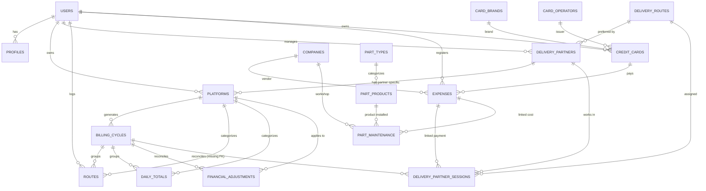
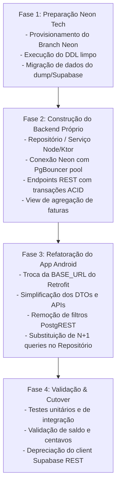

# Relatório Técnico de Auditoria de Banco de Dados, APIs e Migração para Neon.tech

**Projeto:** Central do Motorista (Pocket Logistics)  
**Autor:** Agente Backend  
**Data:** 25 de Setembro de 2026  
**Status:** Concluído / Aprovado para Migração  
**Documento de Destino:** `docs/backend/auditoria-banco-e-apis.md`  

---

## 1. Sumário Executivo e Diagnóstico de Arquitetura

O aplicativo Android nativo **Central do Motorista** opera atualmente conectando-se diretamente aos serviços REST do **Supabase** (`https://koocvhlprwtdympjwbco.supabase.co/rest/v1/`) através de interfaces Retrofit e interceptor JWT manual (`AuthInterceptor.kt`).

Embora funcional para o estágio inicial de prototipação, a auditoria detalhada revelou graves gargalos de integridade, acoplamento desnecessário à sintaxe do PostgREST, riscos severos de concorrência em transações financeiras e overhead extremo de tráfego de rede (N+1 queries executadas no client Android).

### Principais Diagnósticos:
1. **Falta de Atomicidade Transacional no Cliente:** Operações que envolvem múltiplas tabelas (ex.: lançar uma sessão de entregador parceiro gerando automaticamente uma despesa na categoria `equipe`, ou cadastrar despesa de manutenção de peça vinculada à tabela `expenses` e `part_maintenance`) são disparadas em requisições HTTP isoladas pelo app. Caso a segunda chamada falhe, o banco fica em estado inconsistente com registros órfãos.
2. **N+1 Queries e Computação Pesada no Dispositivo Móvel:** Para renderizar a tela de Faturas/Ciclos de Faturamento, o app baixa todas as rotas, todos os fechamentos diários, todas as sessões de parceiros e todos os ajustes financeiros em 6 requisições paralelas, realizando loops de agregação em memória no dispositivo. Isso deve ser consolidado no banco de dados através de agregações nativas (`SUM`, `COUNT`) servidas por endpoint único.
3. **Inconsistência de Tipagem do `user_id`:** Metade das tabelas possui `user_id` definido como `TEXT` (herança de autenticações antigas/Firebase), enquanto tabelas recentes (`companies`, `delivery_routes`, `delivery_partners`, `delivery_partner_sessions`, `part_types`, `part_products`) utilizam `UUID`. Isso impede chaves estrangeiras rígidas para a tabela de usuários e exige conversões de tipo.
4. **Descompasso entre DTOs Kotlin e o Banco de Dados Real:** 
   - A tabela `delivery_partner_sessions` **não possui** a coluna `billing_cycle_id`, embora o DTO `DeliveryPartnerSessionDto` a declare.
   - A tabela `financial_adjustments` **não possui** a coluna `subtype` no banco de dados, embora declarada no DTO e nos Enums de negócio.
   - O enum de ciclo em `platforms` no Postgres suporta apenas `'semanal'`, `'quinzenal'`, `'mensal'`, `'misto'`, porém o domínio do app já opera com ciclos `'variavel'`.
   - A tabela `billing_cycles` armazena apenas metadados de período, enquanto o DTO espera campos consolidados (`gross_routes_amount`, `total_tips_amount`, `net_total_amount`, etc.).
5. **Decimais e Precisão Monetária:** Foi verificado que o app utiliza corretamente `java.math.BigDecimal` em todos os modelos de domínio e DTOs, e o PostgreSQL utiliza o tipo `numeric`. Contudo, é fundamental fixar a precisão no PostgreSQL (`NUMERIC(12, 2)` para valores monetários, `NUMERIC(10, 3)` para litros de combustível e preços unitários, e `NUMERIC(10, 7)` para geolocalização) evitando `numeric` ilimitado que pode consumir armazenamento desnecessário e causar variações de arredondamento.

---

## 2. Inventário do Banco de Dados e Mapeamento de Entidades

A auditoria inspecionou as 22 tabelas públicas presentes no ambiente:

| # | Tabela | Registros | Tipo user_id | PK | Descrição / Papel no Sistema |
|---|---|---|---|---|---|
| 1 | `profiles` | 1 | `text` | `id` | Perfil do motorista, metas diárias/semanais/mensais, dados do veículo e consumo. |
| 2 | `platforms` | 8 | `text` | `id (uuid)` | Plataformas/Apps de entrega (ex: Mercado Livre, Shopee, iFood) do motorista ou de parceiros. |
| 3 | `routes` | 127 | `text` | `id (uuid)` | Rotas individuais lançadas (valores, km, pacotes pequenos/volumosos, gorjeta, bônus). |
| 4 | `daily_totals` | 1 | `text` | `id (uuid)` | Fechamento diário por plataforma (produção em valor bruto ou km). |
| 5 | `expenses` | 74 | `text` | `id (uuid)` | Despesas financeiras (combustível, manutenção, alimentação, equipe/parceiros). |
| 6 | `billing_cycles` | 11 | `text` | `id (uuid)` | Ciclos de faturamento / repasse financeiro vinculados às plataformas. |
| 7 | `financial_adjustments` | 0 | `text` | `id (uuid)` | Ajustes manuais de faturas (créditos/bônus ou débitos/extravios/taxas). |
| 8 | `delivery_partners` | 2 | `uuid` | `id (uuid)` | Cadastro de motoristas terceiros/parceiros contratados pelo operador master. |
| 9 | `delivery_routes` | 7 | `uuid` | `id (uuid)` | Cadastro de rotas padrão atribuíveis aos entregadores parceiros. |
| 10 | `delivery_partner_sessions`| 12 | `uuid` | `id (uuid)` | Sessões operacionais de parceiros com bipagem de pacotes e conciliação de pagamento. |
| 11 | `credit_cards` | 2 | `text` | `id (uuid)` | Cartões de crédito cadastrados para despesas e parcelamentos. |
| 12 | `card_brands` | 5 | `text` | `id (uuid)` | Bandeiras de cartão (Visa, Mastercard, Elo, etc.). |
| 13 | `card_operators` | 6 | `text` | `id (uuid)` | Emissores / Instituições financeiras de cartões (Nubank, Itaú, Bradesco, etc.). |
| 14 | `companies` | 16 | `uuid` | `id (uuid)` | Prestadores de serviço, oficinas, postos, restaurantes (CNPJ, endereço, WhatsApp). |
| 15 | `gas_stations` | 2 | `text` | `id (uuid)` | Postos de abastecimento com geolocalização e tipos de combustível. |
| 16 | `gas_station_brands` | 0 | `text` | `id (uuid)` | Marcas/bandeiras de postos de combustível (Ipiranga, Shell, Petrobras). |
| 17 | `part_types` | 6 | `uuid` | `id (uuid)` | Categorias de peças veiculares (Pneu, Óleo, Relação, Pastilha de Freio). |
| 18 | `part_products` | 6 | `uuid` | `id (uuid)` | Produtos específicos de peças por marca/modelo e vida útil padrão em km. |
| 19 | `part_maintenance` | 5 | `text` | `id (uuid)` | Monitoramento ativo de vida útil de peças instaladas no veículo. |
| 20 | `oil_changes` | 3 | `text` | `id (uuid)` | Histórico rápido de trocas de óleo do veículo. |
| 21 | `notifications` | 2 | `text` | `id (uuid)` | Notificações do sistema (vencimento de fatura, alertas). |
| 22 | `parts_catalog` | 0 | `uuid` | `id (uuid)` | **Tabela obsoleta** (substituída por `part_types` e `part_products`). |

---

## 3. Auditoria de Relacionamentos e Integridade Referencial



### Relacionamentos Críticos sob Auditoria:
1. **`platforms` $\leftrightarrow$ `delivery_partners`:**
   - Coluna `platforms.partner_id REFERENCES delivery_partners(id) ON DELETE CASCADE`.
   - Se `partner_id IS NULL`, a plataforma pertence à conta master do motorista. Se preenchido, é um app isolado daquele parceiro.
   - **Regra de Integridade:** No PostgREST fazia-se `@Query("partner_id") String partnerId = "is.null"`. No backend Neon, deve ser um parâmetro semântico `GET /api/v1/platforms?scope=master` ou `GET /api/v1/delivery-partners/{id}/platforms`.
2. **`delivery_partner_sessions` $\leftrightarrow$ `expenses`:**
   - Chave `delivery_partner_sessions.expense_id REFERENCES expenses(id) ON DELETE SET NULL`.
   - No fluxo do app, ao finalizar ou alterar uma sessão de entregador com valor pago maior que zero, é gerada uma despesa da categoria `'equipe'`.
   - **Necessidade Neon:** Criar transação atômica (`BEGIN; ... COMMIT;`) para inserção/atualização sincronizada de sessão e despesa.
3. **`part_maintenance` $\leftrightarrow$ `expenses` e `companies`:**
   - Chave `part_maintenance.expense_id REFERENCES expenses(id) ON DELETE SET NULL`.
   - Chave `part_maintenance.company_id REFERENCES companies(id) ON DELETE SET NULL`.
   - Chave `part_maintenance.part_product_id REFERENCES part_products(id) ON DELETE RESTRICT`.
4. **`credit_cards` $\leftrightarrow$ `card_brands` e `card_operators`:**
   - `credit_cards.brand_id REFERENCES card_brands(id) ON DELETE SET NULL`.
   - `credit_cards.issuer_id REFERENCES card_operators(id) ON DELETE SET NULL`.
   - No DTO `ExpenseDto`, ainda existem campos redundantes desnormalizados `card_brand` e `card_operator` tipo `String`. Deve-se priorizar o uso estrito de `card_id` com JOIN na consulta.

---

## 4. Auditoria de Decimais, Moeda e Tipos Numéricos

A garantia de precisão monetária é um requisito inegociável para evitar erros de centavos cumulativos. A tabela abaixo especifica a tipagem recomendada para o Neon Postgres e a validação de correspondência com o Kotlin:

| Tabela | Coluna | Tipo Postgres Atual | Tipo Recomendado (Neon) | Tipo Kotlin | Justificativa Técnica |
|---|---|---|---|---|---|
| `profiles` | `daily_goal` | `numeric` | `NUMERIC(12, 2)` | `BigDecimal` | Metas financeiras diárias em moeda BRL. |
| `profiles` | `weekly_goal` | `numeric` | `NUMERIC(12, 2)` | `BigDecimal` | Metas financeiras semanais em moeda BRL. |
| `profiles` | `monthly_goal` | `numeric` | `NUMERIC(12, 2)` | `BigDecimal` | Metas financeiras mensais em moeda BRL. |
| `profiles` | `tank_size_l` | `numeric` | `NUMERIC(8, 2)` | `BigDecimal` | Capacidade do tanque em litros (ex: 15.50 L). |
| `profiles` | `avg_consumption_kml` | `numeric` | `NUMERIC(8, 2)` | `BigDecimal` | Média de consumo km/l. |
| `profiles` | `oil_change_km` | `numeric` | `NUMERIC(10, 2)` | `BigDecimal` | Intervalo em km para troca de óleo. |
| `routes` | `amount` | `numeric` | `NUMERIC(12, 2)` | `BigDecimal` | Valor bruto da corrida/entrega. |
| `routes` | `tip` | `numeric` | `NUMERIC(12, 2)` | `BigDecimal` | Valor de gorjeta recebido. |
| `routes` | `bonus` | `numeric` | `NUMERIC(12, 2)` | `BigDecimal` | Valor de bônus adicional da rota. |
| `routes` | `package_unit_price`| `numeric` | `NUMERIC(10, 2)` | `BigDecimal` | Valor unitário pago por pacote padrão. |
| `routes` | `distance_km` | `numeric` | `NUMERIC(10, 2)` | `BigDecimal` | Distância percorrida em km. |
| `routes` | `start_km`, `end_km`| `numeric` | `NUMERIC(10, 2)` | `BigDecimal` | Marcadores de odômetro da rota. |
| `daily_totals`| `amount` | `numeric` | `NUMERIC(12, 2)` | `BigDecimal` | Valor total consolidado do dia. |
| `daily_totals`| `distance_km` | `numeric` | `NUMERIC(10, 2)` | `BigDecimal` | Km diário informado. |
| `expenses` | `amount` | `numeric` | `NUMERIC(12, 2)` | `BigDecimal` | Valor total da despesa. |
| `expenses` | `liters` | `numeric` | `NUMERIC(10, 3)` | `BigDecimal` | Litragem abastecida (bombas operam com 3 decimais). |
| `expenses` | `price_per_liter` | `numeric` | `NUMERIC(10, 3)` | `BigDecimal` | Preço do combustível por litro (ex: R$ 5,899). |
| `expenses` | `odometer_km` | `numeric` | `NUMERIC(10, 2)` | `BigDecimal` | Odômetro no momento do lançamento. |
| `part_products`| `default_life_km`| `numeric` | `NUMERIC(10, 2)` | `BigDecimal` | Vida útil estimada da peça. |
| `part_maintenance`| `life_km`, `last_change_km`| `numeric` | `NUMERIC(10, 2)` | `BigDecimal` | Km de vida útil e odômetro da troca. |
| `delivery_partners`| `package_rate`| `numeric` | `NUMERIC(10, 2)` | `BigDecimal` | Taxa fixa acordada por pacote entregue. |
| `delivery_partners`| `default_bonus`| `numeric` | `NUMERIC(10, 2)` | `BigDecimal` | Bônus padrão atribuído ao parceiro. |
| `delivery_partner_sessions`| `amount_paid`| `numeric`| `NUMERIC(12, 2)`| `BigDecimal` | Total pago ao parceiro na sessão. |
| `delivery_partner_sessions`| `package_rate`, `default_bonus`| `numeric`| `NUMERIC(10, 2)`| `BigDecimal` | Valores congelados para a sessão. |
| `financial_adjustments`| `amount`| `numeric` | `NUMERIC(12, 2)` | `BigDecimal` | Valor de crédito ou débito do ajuste. |
| `gas_stations`| `latitude`, `longitude`| `numeric`| `NUMERIC(10, 7)`| `BigDecimal` | Precisão geodésica submétrica. |

> [!IMPORTANT]
> **Proibição de Tipos de Ponto Flutuante:** Em nenhuma circunstância deve ser utilizado `REAL`, `FLOAT`, `DOUBLE PRECISION` no Postgres, nem `Float` ou `Double` no Kotlin para dados de valor, km ou litragem. A perda de precisão em operações de arredondamento de float é inaceitável em módulos contábeis.

---

## 5. Auditoria de Lacunas no Schema Atual vs. DTOs

Comparando cada campo declarado nos arquivos Kotlin de `data/remote/dto/` com os metadados do PostgreSQL obtidos via inspeção ao vivo, detectamos as seguintes divergências estruturais:

### Lacuna 1: `delivery_partner_sessions.billing_cycle_id` Faltante
- **No Kotlin (`DeliveryPartnerSessionDto.kt` e `DeliveryPartnerSession`):** Possui o campo `@SerializedName("billing_cycle_id") val billingCycleId: String? = null`.
- **No Banco de Dados:** A coluna simplesmente **não existe** em `public.delivery_partner_sessions`.
- **Impacto:** Qualquer valor passado pelo app é descartado silenciosamente ou gerava erro caso o PostgREST tentasse persistir campo inexistente. O vínculo de sessões de parceiros a faturas ficava impedido estruturalmente.
- **Ação:** Executar `ALTER TABLE delivery_partner_sessions ADD COLUMN billing_cycle_id UUID REFERENCES billing_cycles(id) ON DELETE SET NULL;`.

### Lacuna 2: `financial_adjustments.subtype` Faltante
- **No Kotlin (`FinancialAdjustmentDto.kt` e `FinancialAdjustmentSubtype`):** O app implementou classificação rica de débitos e créditos (`produto_extraviado`, `desconto_previdenciario`, `desconto_multa`, `outros_descontos`, `bonus`, `gratificacao`, etc.).
- **No Banco de Dados:** A tabela `financial_adjustments` só contém as colunas `id`, `user_id`, `platform_id`, `billing_cycle_id`, `type`, `amount`, `description`, `occurred_at`, `created_at`. A coluna `subtype` inexiste.
- **Ação:** Executar `ALTER TABLE financial_adjustments ADD COLUMN subtype VARCHAR(50);`.

### Lacuna 3: Enum `payment_cycle` Incompatível com Ciclos Variáveis
- **No Banco de Dados:** O tipo enum `payment_cycle` possui apenas: `('semanal', 'quinzenal', 'mensal', 'misto')`.
- **No Kotlin (`PlatformDto.kt`, `Models.kt`):** A lógica já contempla plataformas com `cycle = "variavel"`.
- **Impacto:** O cadastro de uma plataforma configurada com ciclos de corte variáveis falha com erro de violação de enum (`22P02 invalid input value for enum`).
- **Ação:** Converter a coluna para `VARCHAR(20)` com check constraint extensível ou adicionar `'variavel'` ao enum.

### Lacuna 4: Campos Calculados de `billing_cycles` Ausentes no Banco
- **No Kotlin (`BillingCycleDto.kt`):** Espera `gross_routes_amount`, `total_tips_amount`, `total_bonus_amount`, `gross_daily_amount`, `total_adjustments_credit`, `total_adjustments_debit`, `net_total_amount`, `routes_count`, `packages_count`, `daily_totals_count`, `include_end_date`, `payment_received_date`.
- **No Banco de Dados:** A tabela armazena apenas metadados básicos (`period_start`, `period_end`, `expected_payment_date`, `status`).
- **Ação:** No Neon Postgres, adicionar colunas de snapshot para fechamento de ciclo e criar a View agregada `v_billing_cycles_summary` para cálculo em tempo real de ciclos abertos.

### Lacuna 5: `user_id` Híbrido (`TEXT` vs `UUID`)
- **Tabelas com `user_id TEXT`:** `profiles`, `platforms`, `routes`, `daily_totals`, `expenses`, `billing_cycles`, `financial_adjustments`, `credit_cards`, `card_brands`, `card_operators`, `gas_stations`, `gas_station_brands`, `part_maintenance`, `oil_changes`, `notifications`.
- **Tabelas com `user_id UUID`:** `companies`, `delivery_routes`, `delivery_partners`, `delivery_partner_sessions`, `part_types`, `part_products`, `parts_catalog`.
- **Ação:** Migrar todas as colunas `user_id` para `UUID NOT NULL REFERENCES users(id) ON DELETE CASCADE`.

---

## 6. Arquitetura da Nova API REST (Backend Intermediário)

Abaixo está o mapeamento dos novos endpoints do backend intermediário conectado ao Neon Tech. O aplicativo deixará de usar sintaxe de filtros PostgREST (`eq.`, `is.null`, `order=occurred_at.desc`, `Prefer: return=representation`).

O cabeçalho de autorização será sempre `Authorization: Bearer <jwt>`, e o `userId` será extraído no servidor a partir do token autenticado.

### 6.1. Endpoints de Rotas (`/api/v1/routes`)
- `GET /api/v1/routes`: Lista rotas do usuário autenticado. Suporta query params limpos: `?platform_id=UUID&from=YYYY-MM-DD&to=YYYY-MM-DD&limit=50&offset=0`.
- `GET /api/v1/routes/{id}`: Detalhes de uma rota.
- `POST /api/v1/routes`: Criação de rota. Valida integridade e calcula subtotal no servidor.
- `PUT /api/v1/routes/{id}`: Atualização completa da rota.
- `DELETE /api/v1/routes/{id}`: Exclusão com desvinculação limpa de ciclo de faturamento.

### 6.2. Endpoints de Despesas (`/api/v1/expenses`)
- `GET /api/v1/expenses`: Lista despesas com filtros opcionais: `?category=combustivel&card_id=UUID&from=...&to=...`.
- `POST /api/v1/expenses`: Criação de despesa única.
- `POST /api/v1/expenses/installment`: Criação transacional atômica de despesa parcelada (cria o grupo de parcelamento e insere as N parcelas de forma consistente em uma única transação SQL).
- `PUT /api/v1/expenses/{id}`: Atualização de despesa.
- `DELETE /api/v1/expenses/{id}`: Exclusão. Se vinculada a sessão de parceiro ou manutenção, remove a referência via `ON DELETE SET NULL`.

### 6.3. Endpoints de Faturas e Ciclos (`/api/v1/billing-cycles`)
- `GET /api/v1/billing-cycles`: Lista ciclos básicos.
- `GET /api/v1/billing-cycles/with-totals`: **Endpoint Chave de Alta Performance.** Retorna a lista de ciclos com todos os totais calculados no Postgres (rotas vinculadas, fechamentos diários, ajustes financeiros, sessões e valores líquidos consolidados), eliminando 100% das N+1 queries no Android.
- `POST /api/v1/billing-cycles`: Criação de ciclo manual ou fechamento de período.
- `POST /api/v1/billing-cycles/{id}/close`: Fecha o ciclo, congela o snapshot dos totais calculados e marca status como `'a_vencer'`.
- `POST /api/v1/billing-cycles/{id}/pay`: Registra recebimento do ciclo (`payment_received_date = NOW()`, `status = 'pago'`).

### 6.4. Endpoints de Parceiros e Sessões (`/api/v1/delivery-partners`)
- `GET /api/v1/delivery-partners`: Lista parceiros cadastrados.
- `POST /api/v1/delivery-partners`: Cadastro de novo parceiro.
- `PUT /api/v1/delivery-partners/{id}`: Atualização cadastral.
- `GET /api/v1/delivery-partners/sessions`: Lista sessões de trabalho de parceiros.
- `POST /api/v1/delivery-partners/sessions`: **Endpoint Transacional.** Cria a sessão com os códigos de barras bipados e, se `amount_paid > 0`, cria a respectiva despesa na categoria `'equipe'` vinculada a `session.expense_id` dentro do mesmo bloco de transação `BEGIN ... COMMIT`.
- `PUT /api/v1/delivery-partners/sessions/{id}`: Atualiza sessão e sincroniza automaticamente o valor na despesa vinculada.
- `DELETE /api/v1/delivery-partners/sessions/{id}`: Exclui a sessão e limpa/remove a despesa vinculada.

### 6.5. Endpoints de Manutenção e Peças (`/api/v1/maintenance`)
- `GET /api/v1/maintenance/parts`: Lista peças monitoradas com percentual de vida útil calculada com base no odômetro atual.
- `POST /api/v1/maintenance/parts`: Cadastra nova peça monitorada.
- `POST /api/v1/maintenance/parts/{id}/replace`: Registra a troca da peça (atualiza `last_change_km = atual`, `last_change_at = NOW()`) e gera a despesa na categoria `'manutencao'` de forma atômica.

---

## 7. Script DDL de Migração para Neon Tech (PostgreSQL 16)

Abaixo está o script SQL completo e idempotente para inicialização ou migração da base no Neon Postgres, com resolução de todas as inconsistências identificadas, padronização de `UUID` e restrições monetárias:

```sql
-- =============================================================================
-- LOGISTIC PRIME / CENTRAL DO MOTORISTA
-- Script DDL de Migração para Neon Tech (PostgreSQL 16)
-- Data: 25/09/2026
-- =============================================================================

CREATE EXTENSION IF NOT EXISTS "uuid-ossp";
CREATE EXTENSION IF NOT EXISTS "pgcrypto";

-- -----------------------------------------------------------------------------
-- 1. TABELA DE USUÁRIOS CENTRALIZADA (Caso o auth seja integrado ao Neon)
-- -----------------------------------------------------------------------------
CREATE TABLE IF NOT EXISTS users (
    id UUID PRIMARY KEY DEFAULT gen_random_uuid(),
    email TEXT UNIQUE NOT NULL,
    password_hash TEXT,
    full_name TEXT,
    created_at TIMESTAMPTZ NOT NULL DEFAULT NOW(),
    updated_at TIMESTAMPTZ NOT NULL DEFAULT NOW()
);

-- -----------------------------------------------------------------------------
-- 2. PERFIS E CONFIGURAÇÕES DO MOTORISTA
-- -----------------------------------------------------------------------------
CREATE TABLE IF NOT EXISTS profiles (
    id UUID PRIMARY KEY REFERENCES users(id) ON DELETE CASCADE,
    full_name TEXT,
    email TEXT,
    phone TEXT,
    social_handle TEXT,
    vehicle VARCHAR(20) DEFAULT 'moto' CHECK (vehicle IN ('moto', 'carro', 'bike', 'patinete')),
    plate TEXT,
    avatar_url TEXT,
    daily_goal NUMERIC(12, 2) DEFAULT 200.00,
    weekly_goal NUMERIC(12, 2) DEFAULT 1000.00,
    monthly_goal NUMERIC(12, 2) DEFAULT 3450.00,
    gender TEXT,
    vehicle_brand TEXT,
    vehicle_model TEXT,
    vehicle_year INT,
    tank_size_l NUMERIC(8, 2),
    avg_consumption_kml NUMERIC(8, 2),
    oil_change_km NUMERIC(10, 2),
    tire_size_front TEXT,
    tire_size_rear TEXT,
    has_bag BOOLEAN DEFAULT FALSE,
    last_oil_change_at TIMESTAMPTZ,
    created_at TIMESTAMPTZ NOT NULL DEFAULT NOW(),
    updated_at TIMESTAMPTZ NOT NULL DEFAULT NOW()
);

-- -----------------------------------------------------------------------------
-- 3. EMPRESAS E FORNECEDORES (OFICINAS, RESTAURANTES, POSTOS)
-- -----------------------------------------------------------------------------
CREATE TABLE IF NOT EXISTS companies (
    id UUID PRIMARY KEY DEFAULT gen_random_uuid(),
    user_id UUID NOT NULL REFERENCES users(id) ON DELETE CASCADE,
    name TEXT NOT NULL,
    cep VARCHAR(10),
    street TEXT,
    number TEXT,
    complement TEXT,
    neighborhood TEXT,
    city TEXT,
    state VARCHAR(2),
    cnpj VARCHAR(18),
    phone VARCHAR(20),
    is_whatsapp BOOLEAN DEFAULT FALSE,
    social_media TEXT,
    website TEXT,
    created_at TIMESTAMPTZ NOT NULL DEFAULT NOW()
);

-- -----------------------------------------------------------------------------
-- 4. ROTAS DE ENTREGA PADRÃO
-- -----------------------------------------------------------------------------
CREATE TABLE IF NOT EXISTS delivery_routes (
    id UUID PRIMARY KEY DEFAULT gen_random_uuid(),
    user_id UUID NOT NULL REFERENCES users(id) ON DELETE CASCADE,
    name TEXT NOT NULL,
    created_at TIMESTAMPTZ NOT NULL DEFAULT NOW()
);

-- -----------------------------------------------------------------------------
-- 5. ENTREGADORES PARCEIROS
-- -----------------------------------------------------------------------------
CREATE TABLE IF NOT EXISTS delivery_partners (
    id UUID PRIMARY KEY DEFAULT gen_random_uuid(),
    user_id UUID NOT NULL REFERENCES users(id) ON DELETE CASCADE,
    full_name TEXT NOT NULL,
    cep VARCHAR(10),
    street TEXT,
    number TEXT,
    neighborhood TEXT,
    city TEXT,
    state VARCHAR(2),
    phone VARCHAR(20),
    is_whatsapp BOOLEAN DEFAULT FALSE,
    social_media TEXT,
    pix_key TEXT,
    pix_bank TEXT,
    cpf VARCHAR(14),
    preferred_route_id UUID REFERENCES delivery_routes(id) ON DELETE SET NULL,
    package_rate NUMERIC(10, 2) NOT NULL DEFAULT 0.00,
    default_bonus NUMERIC(10, 2) NOT NULL DEFAULT 0.00,
    delivery_type VARCHAR(20) NOT NULL DEFAULT 'moto' CHECK (delivery_type IN ('a_pe', 'bike', 'moto', 'carro', 'utilitario')),
    rating SMALLINT NOT NULL DEFAULT 3 CHECK (rating >= 1 AND rating <= 5),
    payment_cycle_type VARCHAR(20) NOT NULL DEFAULT 'fixed' CHECK (payment_cycle_type IN ('fixed', 'variable')),
    payment_cycle_fixed VARCHAR(20) CHECK (payment_cycle_fixed IN ('semanal', 'quinzenal', 'mensal')),
    payment_cycle_variable_days INTEGER[],
    cycle_start_date DATE,
    cycle_end_date DATE,
    include_end_date BOOLEAN DEFAULT TRUE,
    payment_delay_days INT DEFAULT 7,
    payment_date DATE,
    variable_cycles JSONB DEFAULT '[]'::jsonb,
    active BOOLEAN NOT NULL DEFAULT TRUE,
    photo_url TEXT,
    created_at TIMESTAMPTZ NOT NULL DEFAULT NOW()
);

-- -----------------------------------------------------------------------------
-- 6. PLATAFORMAS / APPS
-- -----------------------------------------------------------------------------
CREATE TABLE IF NOT EXISTS platforms (
    id UUID PRIMARY KEY DEFAULT gen_random_uuid(),
    user_id UUID NOT NULL REFERENCES users(id) ON DELETE CASCADE,
    partner_id UUID REFERENCES delivery_partners(id) ON DELETE CASCADE,
    name TEXT NOT NULL,
    cycle VARCHAR(20) NOT NULL DEFAULT 'semanal' CHECK (cycle IN ('semanal', 'quinzenal', 'mensal', 'misto', 'variavel')),
    payment_day TEXT,
    active BOOLEAN NOT NULL DEFAULT TRUE,
    segment VARCHAR(50) NOT NULL DEFAULT 'logistica',
    payment_model VARCHAR(50) NOT NULL DEFAULT 'producao',
    rules JSONB NOT NULL DEFAULT '{}'::jsonb,
    bank_name TEXT,
    bank_agency TEXT,
    bank_account TEXT,
    pix_key_type TEXT,
    pix_key TEXT,
    pix_bank TEXT,
    created_at TIMESTAMPTZ NOT NULL DEFAULT NOW()
);

-- -----------------------------------------------------------------------------
-- 7. CICLOS DE FATURAMENTO (BILLING CYCLES)
-- -----------------------------------------------------------------------------
CREATE TABLE IF NOT EXISTS billing_cycles (
    id UUID PRIMARY KEY DEFAULT gen_random_uuid(),
    user_id UUID NOT NULL REFERENCES users(id) ON DELETE CASCADE,
    platform_id UUID NOT NULL REFERENCES platforms(id) ON DELETE CASCADE,
    period_start DATE NOT NULL,
    period_end DATE NOT NULL,
    expected_payment_date DATE NOT NULL,
    include_end_date BOOLEAN NOT NULL DEFAULT TRUE,
    payment_received_date DATE,
    status VARCHAR(20) NOT NULL DEFAULT 'em_aberto' CHECK (status IN ('em_aberto', 'a_vencer', 'pago', 'cancelado', 'atrasado')),
    gross_routes_amount NUMERIC(12, 2) DEFAULT 0.00,
    total_tips_amount NUMERIC(12, 2) DEFAULT 0.00,
    total_bonus_amount NUMERIC(12, 2) DEFAULT 0.00,
    gross_daily_amount NUMERIC(12, 2) DEFAULT 0.00,
    total_adjustments_credit NUMERIC(12, 2) DEFAULT 0.00,
    total_adjustments_debit NUMERIC(12, 2) DEFAULT 0.00,
    net_total_amount NUMERIC(12, 2) DEFAULT 0.00,
    routes_count INT DEFAULT 0,
    packages_count INT DEFAULT 0,
    daily_totals_count INT DEFAULT 0,
    created_at TIMESTAMPTZ NOT NULL DEFAULT NOW()
);

-- -----------------------------------------------------------------------------
-- 8. CARTÕES DE CRÉDITO, BANDEIRAS E EMISSORES
-- -----------------------------------------------------------------------------
CREATE TABLE IF NOT EXISTS card_brands (
    id UUID PRIMARY KEY DEFAULT gen_random_uuid(),
    user_id UUID NOT NULL REFERENCES users(id) ON DELETE CASCADE,
    name TEXT NOT NULL,
    created_at TIMESTAMPTZ NOT NULL DEFAULT NOW()
);

CREATE TABLE IF NOT EXISTS card_operators (
    id UUID PRIMARY KEY DEFAULT gen_random_uuid(),
    user_id UUID NOT NULL REFERENCES users(id) ON DELETE CASCADE,
    name TEXT NOT NULL,
    created_at TIMESTAMPTZ NOT NULL DEFAULT NOW()
);

CREATE TABLE IF NOT EXISTS credit_cards (
    id UUID PRIMARY KEY DEFAULT gen_random_uuid(),
    user_id UUID NOT NULL REFERENCES users(id) ON DELETE CASCADE,
    holder_name TEXT NOT NULL,
    nickname TEXT NOT NULL,
    first_four VARCHAR(4),
    last_four VARCHAR(4) NOT NULL,
    brand_id UUID REFERENCES card_brands(id) ON DELETE SET NULL,
    issuer_id UUID REFERENCES card_operators(id) ON DELETE SET NULL,
    due_day INT NOT NULL CHECK (due_day >= 1 AND due_day <= 31),
    closing_day INT NOT NULL CHECK (closing_day >= 1 AND closing_day <= 31),
    card_type VARCHAR(20) NOT NULL DEFAULT 'credito' CHECK (card_type IN ('credito', 'debito', 'multiplo', 'voucher')),
    active BOOLEAN NOT NULL DEFAULT TRUE,
    created_at TIMESTAMPTZ NOT NULL DEFAULT NOW()
);

-- -----------------------------------------------------------------------------
-- 9. POSTOS DE COMBUSTÍVEL
-- -----------------------------------------------------------------------------
CREATE TABLE IF NOT EXISTS gas_station_brands (
    id UUID PRIMARY KEY DEFAULT gen_random_uuid(),
    user_id UUID NOT NULL REFERENCES users(id) ON DELETE CASCADE,
    name TEXT NOT NULL,
    created_at TIMESTAMPTZ NOT NULL DEFAULT NOW()
);

CREATE TABLE IF NOT EXISTS gas_stations (
    id UUID PRIMARY KEY DEFAULT gen_random_uuid(),
    user_id UUID NOT NULL REFERENCES users(id) ON DELETE CASCADE,
    name TEXT NOT NULL,
    nickname TEXT,
    brand TEXT NOT NULL,
    address TEXT,
    cep VARCHAR(10),
    street TEXT,
    number TEXT,
    neighborhood TEXT,
    city TEXT,
    state VARCHAR(2),
    latitude NUMERIC(10, 7),
    longitude NUMERIC(10, 7),
    fuel_types JSONB DEFAULT '[]'::jsonb,
    created_at TIMESTAMPTZ NOT NULL DEFAULT NOW()
);

-- -----------------------------------------------------------------------------
-- 10. DESPESAS GERAIS
-- -----------------------------------------------------------------------------
CREATE TABLE IF NOT EXISTS expenses (
    id UUID PRIMARY KEY DEFAULT gen_random_uuid(),
    user_id UUID NOT NULL REFERENCES users(id) ON DELETE CASCADE,
    category VARCHAR(30) NOT NULL CHECK (category IN ('combustivel', 'manutencao', 'alimentacao', 'equipe', 'outros')),
    title TEXT NOT NULL,
    vendor TEXT,
    amount NUMERIC(12, 2) NOT NULL,
    liters NUMERIC(10, 3),
    fuel_type VARCHAR(30),
    price_per_liter NUMERIC(10, 3),
    odometer_km NUMERIC(10, 2),
    description TEXT,
    payment_method VARCHAR(20) DEFAULT 'pix' CHECK (payment_method IN ('dinheiro', 'pix', 'cartao', 'carteira')),
    is_full_tank BOOLEAN DEFAULT TRUE,
    receipt_number TEXT,
    invoice_number TEXT,
    part_brand TEXT,
    part_model TEXT,
    card_brand TEXT,
    card_operator TEXT,
    installment_group_id UUID,
    installment_number INT,
    installment_total INT,
    card_due_day INT,
    gas_station_id UUID REFERENCES gas_stations(id) ON DELETE SET NULL,
    card_id UUID REFERENCES credit_cards(id) ON DELETE SET NULL,
    company_id UUID REFERENCES companies(id) ON DELETE SET NULL,
    meal_type TEXT,
    occurred_at TIMESTAMPTZ NOT NULL DEFAULT NOW(),
    created_at TIMESTAMPTZ NOT NULL DEFAULT NOW()
);

-- -----------------------------------------------------------------------------
-- 11. SESSÕES DE TRABALHO DE ENTREGADORES PARCEIROS
-- -----------------------------------------------------------------------------
CREATE TABLE IF NOT EXISTS delivery_partner_sessions (
    id UUID PRIMARY KEY DEFAULT gen_random_uuid(),
    user_id UUID NOT NULL REFERENCES users(id) ON DELETE CASCADE,
    partner_id UUID NOT NULL REFERENCES delivery_partners(id) ON DELETE CASCADE,
    route_id UUID REFERENCES delivery_routes(id) ON DELETE SET NULL,
    platform_id UUID REFERENCES platforms(id) ON DELETE SET NULL,
    billing_cycle_id UUID REFERENCES billing_cycles(id) ON DELETE SET NULL, -- LACUNA 1 CORRIGIDA
    expected_package_count INT NOT NULL DEFAULT 0,
    scanned_barcodes JSONB NOT NULL DEFAULT '[]'::jsonb,
    scanned_count INT NOT NULL DEFAULT 0,
    delivered_count INT NOT NULL DEFAULT 0,
    returned_count INT NOT NULL DEFAULT 0,
    returned_barcodes JSONB DEFAULT '[]'::jsonb,
    start_time TIMESTAMPTZ,
    end_time TIMESTAMPTZ,
    amount_paid NUMERIC(12, 2) NOT NULL DEFAULT 0.00,
    package_rate NUMERIC(10, 2) DEFAULT 0.00,
    default_bonus NUMERIC(10, 2) DEFAULT 0.00,
    expense_id UUID REFERENCES expenses(id) ON DELETE SET NULL,
    created_at TIMESTAMPTZ NOT NULL DEFAULT NOW()
);

-- -----------------------------------------------------------------------------
-- 12. ROTAS LANÇADAS
-- -----------------------------------------------------------------------------
CREATE TABLE IF NOT EXISTS routes (
    id UUID PRIMARY KEY DEFAULT gen_random_uuid(),
    user_id UUID NOT NULL REFERENCES users(id) ON DELETE CASCADE,
    platform_id UUID REFERENCES platforms(id) ON DELETE SET NULL,
    billing_cycle_id UUID REFERENCES billing_cycles(id) ON DELETE SET NULL,
    origin TEXT,
    destination TEXT,
    distance_km NUMERIC(10, 2) NOT NULL DEFAULT 0.00,
    amount NUMERIC(12, 2) NOT NULL DEFAULT 0.00,
    tip NUMERIC(12, 2) NOT NULL DEFAULT 0.00,
    bonus NUMERIC(12, 2) NOT NULL DEFAULT 0.00,
    product_type VARCHAR(30) NOT NULL DEFAULT 'alimento' CHECK (product_type IN ('alimento', 'pacote', 'documento', 'outro', 'farmacia', 'mercado', 'logistico')),
    notes TEXT,
    package_count INT NOT NULL DEFAULT 1,
    package_unit_price NUMERIC(10, 2) NOT NULL DEFAULT 0.00,
    small_packages_count INT DEFAULT 0,
    large_packages_count INT DEFAULT 0,
    large_packages_prices JSONB DEFAULT '[]'::jsonb,
    started_at TIMESTAMPTZ,
    ended_at TIMESTAMPTZ,
    break_minutes INT NOT NULL DEFAULT 0,
    start_km NUMERIC(10, 2) NOT NULL DEFAULT 0.00,
    end_km NUMERIC(10, 2) NOT NULL DEFAULT 0.00,
    occurred_at TIMESTAMPTZ NOT NULL DEFAULT NOW(),
    created_at TIMESTAMPTZ NOT NULL DEFAULT NOW()
);

-- -----------------------------------------------------------------------------
-- 13. TOTAIS DIÁRIOS
-- -----------------------------------------------------------------------------
CREATE TABLE IF NOT EXISTS daily_totals (
    id UUID PRIMARY KEY DEFAULT gen_random_uuid(),
    user_id UUID NOT NULL REFERENCES users(id) ON DELETE CASCADE,
    platform_id UUID REFERENCES platforms(id) ON DELETE SET NULL,
    billing_cycle_id UUID REFERENCES billing_cycles(id) ON DELETE SET NULL,
    amount NUMERIC(12, 2) NOT NULL,
    distance_km NUMERIC(10, 2) DEFAULT 0.00,
    product_type VARCHAR(30) DEFAULT 'alimento',
    subtract_routes BOOLEAN DEFAULT FALSE,
    notes TEXT,
    occurred_at TIMESTAMPTZ NOT NULL DEFAULT NOW(),
    created_at TIMESTAMPTZ NOT NULL DEFAULT NOW()
);

-- -----------------------------------------------------------------------------
-- 14. AJUSTES FINANCEIROS DE FATURA
-- -----------------------------------------------------------------------------
CREATE TABLE IF NOT EXISTS financial_adjustments (
    id UUID PRIMARY KEY DEFAULT gen_random_uuid(),
    user_id UUID NOT NULL REFERENCES users(id) ON DELETE CASCADE,
    platform_id UUID NOT NULL REFERENCES platforms(id) ON DELETE CASCADE,
    billing_cycle_id UUID REFERENCES billing_cycles(id) ON DELETE SET NULL,
    type VARCHAR(30) NOT NULL, -- 'credito', 'debito', 'bonus', 'desconto'
    subtype VARCHAR(50),       -- LACUNA 2 CORRIGIDA ('produto_extraviado', 'inss', etc.)
    amount NUMERIC(12, 2) NOT NULL,
    description TEXT,
    notes TEXT,
    occurred_at DATE NOT NULL DEFAULT CURRENT_DATE,
    created_at TIMESTAMPTZ NOT NULL DEFAULT NOW()
);

-- -----------------------------------------------------------------------------
-- 15. GESTÃO DE PEÇAS E MANUTENÇÃO
-- -----------------------------------------------------------------------------
CREATE TABLE IF NOT EXISTS part_types (
    id UUID PRIMARY KEY DEFAULT gen_random_uuid(),
    user_id UUID NOT NULL REFERENCES users(id) ON DELETE CASCADE,
    name TEXT NOT NULL,
    created_at TIMESTAMPTZ NOT NULL DEFAULT NOW()
);

CREATE TABLE IF NOT EXISTS part_products (
    id UUID PRIMARY KEY DEFAULT gen_random_uuid(),
    user_id UUID NOT NULL REFERENCES users(id) ON DELETE CASCADE,
    part_type_id UUID NOT NULL REFERENCES part_types(id) ON DELETE RESTRICT,
    brand TEXT NOT NULL,
    model TEXT,
    default_life_km NUMERIC(10, 2) NOT NULL DEFAULT 0.00,
    created_at TIMESTAMPTZ NOT NULL DEFAULT NOW()
);

CREATE TABLE IF NOT EXISTS part_maintenance (
    id UUID PRIMARY KEY DEFAULT gen_random_uuid(),
    user_id UUID NOT NULL REFERENCES users(id) ON DELETE CASCADE,
    part_name TEXT NOT NULL,
    life_km NUMERIC(10, 2) NOT NULL DEFAULT 0.00,
    last_change_km NUMERIC(10, 2) NOT NULL DEFAULT 0.00,
    last_change_at TIMESTAMPTZ NOT NULL DEFAULT NOW(),
    company_id UUID REFERENCES companies(id) ON DELETE SET NULL,
    part_product_id UUID REFERENCES part_products(id) ON DELETE SET NULL,
    expense_id UUID REFERENCES expenses(id) ON DELETE SET NULL,
    created_at TIMESTAMPTZ NOT NULL DEFAULT NOW()
);

CREATE TABLE IF NOT EXISTS oil_changes (
    id UUID PRIMARY KEY DEFAULT gen_random_uuid(),
    user_id UUID NOT NULL REFERENCES users(id) ON DELETE CASCADE,
    changed_at TIMESTAMPTZ NOT NULL DEFAULT NOW(),
    km_at_change NUMERIC(10, 2) NOT NULL DEFAULT 0.00,
    notes TEXT,
    created_at TIMESTAMPTZ NOT NULL DEFAULT NOW()
);

-- -----------------------------------------------------------------------------
-- 16. NOTIFICAÇÕES
-- -----------------------------------------------------------------------------
CREATE TABLE IF NOT EXISTS notifications (
    id UUID PRIMARY KEY DEFAULT gen_random_uuid(),
    user_id UUID NOT NULL REFERENCES users(id) ON DELETE CASCADE,
    type VARCHAR(50) NOT NULL,
    billing_cycle_id UUID REFERENCES billing_cycles(id) ON DELETE CASCADE,
    read BOOLEAN NOT NULL DEFAULT FALSE,
    created_at TIMESTAMPTZ NOT NULL DEFAULT NOW()
);

-- -----------------------------------------------------------------------------
-- 17. ÍNDICES DE ALTA PERFORMANCE PARA O NEON POSTGRES
-- -----------------------------------------------------------------------------
CREATE INDEX IF NOT EXISTS idx_routes_user_occurred ON routes(user_id, occurred_at DESC);
CREATE INDEX IF NOT EXISTS idx_routes_billing_cycle ON routes(billing_cycle_id);
CREATE INDEX IF NOT EXISTS idx_expenses_user_occurred ON expenses(user_id, occurred_at DESC);
CREATE INDEX IF NOT EXISTS idx_expenses_category ON expenses(category);
CREATE INDEX IF NOT EXISTS idx_daily_totals_user_occurred ON daily_totals(user_id, occurred_at DESC);
CREATE INDEX IF NOT EXISTS idx_billing_cycles_user_status ON billing_cycles(user_id, status);
CREATE INDEX IF NOT EXISTS idx_delivery_partner_sessions_partner ON delivery_partner_sessions(partner_id, start_time DESC);
CREATE INDEX IF NOT EXISTS idx_platforms_user_partner ON platforms(user_id, partner_id);

-- -----------------------------------------------------------------------------
-- 18. VIEW DE AGREGAÇÃO DE CICLOS (ELIMINAÇÃO DO N+1 DO CLIENTE ANDROID)
-- -----------------------------------------------------------------------------
CREATE OR REPLACE VIEW v_billing_cycles_summary AS
SELECT 
    bc.id,
    bc.user_id,
    bc.platform_id,
    p.name AS platform_name,
    bc.period_start,
    bc.period_end,
    bc.expected_payment_date,
    bc.include_end_date,
    bc.payment_received_date,
    bc.status,
    COALESCE(r.gross_routes, 0.00) AS gross_routes_amount,
    COALESCE(r.total_tips, 0.00) AS total_tips_amount,
    COALESCE(r.total_bonus, 0.00) AS total_bonus_amount,
    COALESCE(r.routes_count, 0) AS routes_count,
    COALESCE(r.packages_count, 0) AS packages_count,
    COALESCE(dt.gross_daily, 0.00) AS gross_daily_amount,
    COALESCE(dt.daily_count, 0) AS daily_totals_count,
    COALESCE(adj.total_credit, 0.00) AS total_adjustments_credit,
    COALESCE(adj.total_debit, 0.00) AS total_adjustments_debit,
    (
        COALESCE(r.gross_routes, 0.00) + 
        COALESCE(r.total_tips, 0.00) + 
        COALESCE(r.total_bonus, 0.00) + 
        COALESCE(dt.gross_daily, 0.00) + 
        COALESCE(adj.total_credit, 0.00) - 
        COALESCE(adj.total_debit, 0.00)
    ) AS net_total_amount
FROM billing_cycles bc
JOIN platforms p ON p.id = bc.platform_id
LEFT JOIN (
    SELECT 
        billing_cycle_id,
        SUM(amount) AS gross_routes,
        SUM(tip) AS total_tips,
        SUM(bonus) AS total_bonus,
        COUNT(id) AS routes_count,
        SUM(package_count) AS packages_count
    FROM routes
    GROUP BY billing_cycle_id
) r ON r.billing_cycle_id = bc.id
LEFT JOIN (
    SELECT 
        billing_cycle_id,
        SUM(amount) AS gross_daily,
        COUNT(id) AS daily_count
    FROM daily_totals
    GROUP BY billing_cycle_id
) dt ON dt.billing_cycle_id = bc.id
LEFT JOIN (
    SELECT 
        billing_cycle_id,
        SUM(CASE WHEN type IN ('credito', 'bonus') THEN amount ELSE 0 END) AS total_credit,
        SUM(CASE WHEN type IN ('debito', 'desconto') THEN amount ELSE 0 END) AS total_debit
    FROM financial_adjustments
    GROUP BY billing_cycle_id
) adj ON adj.billing_cycle_id = bc.id;
```

---

## 8. Plano de Ação para a Migração em Fases

Para garantir zero downtime e integridade total dos dados, a migração para o Neon Tech e implantação do backend intermediário deve seguir as 4 fases abaixo:



### Detalhamento das Etapas:

1. **Fase 1: Neon Tech & Importação dos Dados**
   - Configuração do projeto no Neon Tech com pooling ativado.
   - Aplicação do schema DDL saneado.
   - Script de extração e carga: converter `user_id` de string para UUID gerando o mapeamento correspondente para `users(id)`.
   - Adição das colunas faltantes `billing_cycle_id` e `subtype`.

2. **Fase 2: Implantação da Camada de API Intermediária**
   - Backend intermediário com validação de JWT, garantindo que o `user_id` venha exclusivamente do token verificado.
   - Criação de serviços transacionais para:
     - `POST /sessions` $\rightarrow$ Insere sessão + cria despesa com rollback em caso de falha.
     - `POST /expenses/installment` $\rightarrow$ Cria N parcelas em lote.
     - `GET /billing-cycles/with-totals` $\rightarrow$ Consulta direta à view `v_billing_cycles_summary`.

3. **Fase 3: Atualização do Cliente Android**
   - No `RetrofitClient.kt`: apontar para `https://api.seudominio.com/api/v1/`.
   - No `BillingCycleRepository.kt`: substituir o método complexo com 6 corrotinas assíncronas por uma única chamada a `billingCycleApi.getCyclesWithTotals()`.
   - Remover `@Query("user_id")` de todas as interfaces Retrofit em `data/remote/api/`.

4. **Fase 4: Homologação e Encerramento**
   - Testes de concorrência e consistência de valores monetários.
   - Desativação do Supabase REST API anon key.
