# Especificação Técnica de UI/UX — Notificação de Manutenção Preventiva na HomeScreen vs Edição no Monitoramento de Peças

**Documento:** Especificação de Interface e Interação — Segregação de Fluxos entre Nova Troca Preventiva (HomeScreen) e Edição Cadastral (Monitoramento de Peças)  
**Código da Tarefa:** TASK-DES-07  
**Agente Responsável:** Agente Designer UX/UI — Time Pocket (Central do Motorista)  
**Destinatário:** Subagente Android/Kotlin & Desenvolvedor Master (Fernando)  
**Data:** 29 de Setembro de 2026  
**Status:** Pronto para Implementação (Ready for Dev)  

---

## 1. Visão Geral e Contexto Operacional

### 1.1 O Problema Identificado no Fluxo Atual
No aplicativo **Central do Motorista**, a tela inicial (`HomeScreen.kt`) exibe **Banners Proativos de Alerta de Manutenção** quando uma peça atinge 75% ou mais de sua vida útil estimada em quilômetros rodados.

Atualmente, ao tocar nesse card de alerta na `HomeScreen`, o sistema dispara `onNavigateToEditMaintenance(alerta)`, que executa `partMaintenanceViewModel.startEditing(alerta)` e abre a tela `LancarManutencaoScreen` em **modo de edição direta** (`editingPartId = part.id`). 

Esse comportamento gera duas falhas críticas de experiência e integridade de dados:
1. **Sobrescrita do Registro Anterior:** Ao editar o registro existente, o motorista substitui os dados históricos da troca passada (KM anterior, data anterior, valor anterior) em vez de registrar um **novo ciclo / nova troca preventiva**.
2. **Risco de Exclusão Acidental:** A tela abre exibindo o botão de exclusão (lixeira vermelha) na barra superior, permitindo que o usuário apague inadvertidamente o cadastro da peça em vez de registrar a troca realizada.

### 1.2 A Solução Projetada
Segregar de forma clara e intuitiva os dois propósitos operacionais do motorista:

| Ponto de Entrada | Ação do Motorista | Intenção Real | Modo da Tela `LancarManutencaoScreen` |
| :--- | :--- | :--- | :--- |
| **Card de Alerta na HomeScreen** | Toque no card de aviso (75%-94%) ou alerta crítico (95%+) | Realizar uma **nova troca** ou manutenção da peça que está vencendo | **Modo CRIAÇÃO (Pré-preenchido)**<br>• Título: `"LANÇAR MANUTENÇÃO"`<br>• Sem botão de exclusão<br>• Dados herdados da peça + KM atual |
| **Menu Lateral > Monitoramento Peças** | Toque explícito no **ícone de lápis** (`IconButton` 48dp) | Corrigir um dado cadastral (ex: corrigir nome, alterar vida útil de 10.000 para 12.000 KM) | **Modo EDIÇÃO**<br>• Título: `"EDITAR MANUTENÇÃO"`<br>• Com botão de exclusão (lixeira)<br>• Altera o registro existente no banco |

---

## 2. Diagrama de Fluxos e Máquina de Estados

```mermaid
flowchart TD
    subgraph HomeScreenFlow["1. Fluxo HomeScreen (Alerta Proativo)"]
        AlertCard["Card de Alerta Proativo\n(75%-94% Amarelo | 95%+ Vermelho)"]
        AlertText["Rodapé: 'Toque para lançar nova troca / manutenção ➔'"]
        AlertCard --- AlertText
        AlertCard -->|Toque no Card| PrepareNew["ViewModel.prepareNewMaintenanceFromPart(part)"]
        PrepareNew --> OpenCreateMode["Abre LancarManutencaoScreen\n[MODO CRIAÇÃO PRÉ-PREENCHIDO]"]
        OpenCreateMode --> CreateSpecs["- Título: 'LANÇAR MANUTENÇÃO'\n- SEM botão de exclusão\n- Hodômetro: KM Atual do Odômetro\n- Peça: Nome e Produto herdados\n- Oficina: Última utilizada pré-selecionada\n- Data/Hora: Agora"]
        CreateSpecs --> SaveNew["Salva: Cria nova Despesa e\natualiza ciclo da peça no banco!"]
    end

    subgraph MonitoringFlow["2. Fluxo Menu Lateral (Gestão de Peças)"]
        Drawer["Menu Lateral > CADASTRO > Monitoramento Peças"] --> PartList["PartMaintenanceScreen"]
        PartList --> ItemCard["Card da Peça Monitorada"]
        ItemCard --> PencilBtn["Botão Lápis (IconButton 48x48dp)\n'Editar cadastro da peça'"]
        PencilBtn --> StartEdit["ViewModel.startEditing(part)"]
        StartEdit --> OpenEditMode["Abre LancarManutencaoScreen\n[MODO EDIÇÃO CADASTRAL]"]
        OpenEditMode --> EditSpecs["- Título: 'EDITAR MANUTENÇÃO'\n- COM botão de exclusão (Lixeira Vermelha)\n- Dados originais carregados para ajuste"]
        EditSpecs --> UpdateOrDelete["Atualiza ou Exclui Cadastro"]
    end
```



---

## 3. Especificação Detalhada 1 — Card de Alerta na HomeScreen

### 3.1 Níveis de Severidade, Cores e Microinterações

O card deve comunicar visualmente a urgência sem assustar o motorista quando preventivo, e com destaque inequívoco quando crítico ou vencido:

| Faixa de Uso | Status Semântico | Cor Principal | Cor do Fundo (Alpha) | Borda do Card | Ícone |
| :--- | :--- | :--- | :--- | :--- | :--- |
| **75% a 94%** | **AVISO PREVENTIVO** | `Color(0xFFFFB300)` *(Amarelo Alerta)* | `Color(0xFFFFD600).copy(0.12f)` | `Color(0xFFFFB300).copy(0.5f)` | `Icons.Default.WarningAmber` |
| **95% a 99%** | **TROCA IMINENTE** | `RedAlert` (`#D32F2F`) *(Vermelho)* | `RedAlert.copy(0.15f)` | `RedAlert.copy(0.55f)` | `Icons.Default.Warning` |
| **100%+** | **MANUTENÇÃO VENCIDA**| `RedAlert` (`#D32F2F`) *(Vermelho Forte)* | `RedAlert.copy(0.20f)` | `RedAlert.copy(0.70f)` | `Icons.Default.Error` |

### 3.2 Wireframe Textual — Card de Alerta na HomeScreen

```
┌─────────────────────────────────────────────────────────────┐
│ ┌─────────────────────────────────────────────────────────┐ │
│ │ ┌───┐  AVISO PREVENTIVO: ÓLEO MOTOR 5W30         [82%]  │ │ ◄── Amarelo (#FFB300)
│ │ │ ⚠️│  Faltam 1.800 KM para a troca preventiva         │ │
│ │ └───┘  (vida útil de 10.000 KM).                        │ │
│ │                                                         │ │
│ │        Toque para lançar nova troca / manutenção ➔      │ │ ◄── Laranja Neon (#FF5500)
│ └─────────────────────────────────────────────────────────┘ │
│                                                             │
│ ┌─────────────────────────────────────────────────────────┐ │
│ │ ┌───┐  ALERTA: PASTILHA DE FREIO DIANTEIRA       [98%]  │ │ ◄── Vermelho (#D32F2F)
│ │ │ 🚨│  Faltam apenas 200 KM para a troca                │ │
│ │ └───┘  (vida útil de 20.000 KM).                        │ │
│ │                                                         │ │
│ │        Toque para lançar nova troca / manutenção ➔      │ │ ◄── Laranja Neon (#FF5500)
│ └─────────────────────────────────────────────────────────┘ │
└─────────────────────────────────────────────────────────────┘
```

### 3.3 Especificação Compose do Card de Alerta

```kotlin
Card(
    modifier = Modifier
        .fillMaxWidth()
        .clip(RoundedCornerShape(16.dp))
        .clickable(
            interactionSource = remember { MutableInteractionSource() },
            indication = ripple(color = alertColor),
            onClick = { onNavigateToCreateMaintenanceFromAlert(alerta) }
        ),
    shape = RoundedCornerShape(16.dp),
    colors = CardDefaults.cardColors(containerColor = alertBgColor),
    border = BorderStroke(1.dp, alertBorderColor)
) {
    Row(
        modifier = Modifier
            .fillMaxWidth()
            .padding(16.dp),
        verticalAlignment = Alignment.CenterVertically,
        horizontalArrangement = Arrangement.spacedBy(12.dp)
    ) {
        // Badge circular do ícone de status
        Box(
            modifier = Modifier
                .size(42.dp)
                .background(alertColor.copy(alpha = 0.20f), CircleShape),
            contentAlignment = Alignment.Center
        ) {
            Icon(
                imageVector = if (isCritico) Icons.Default.Warning else Icons.Default.WarningAmber,
                contentDescription = if (isCritico) "Alerta Crítico de Manutenção" else "Aviso Preventivo de Manutenção",
                tint = alertColor,
                modifier = Modifier.size(24.dp)
            )
        }

        // Bloco de informações e texto de ação
        Column(modifier = Modifier.weight(1f)) {
            Row(
                verticalAlignment = Alignment.CenterVertically,
                horizontalArrangement = Arrangement.spacedBy(6.dp)
            ) {
                Text(
                    text = if (isCritico) "ALERTA: ${alerta.partName.uppercase()}" else "AVISO PREVENTIVO: ${alerta.partName.uppercase()}",
                    color = alertColor,
                    fontWeight = FontWeight.Bold,
                    fontSize = 13.sp,
                    maxLines = 1,
                    overflow = TextOverflow.Ellipsis,
                    modifier = Modifier.weight(1f, fill = false)
                )
                if (itemAlerta.percentage > 0) {
                    Surface(
                        color = alertColor.copy(alpha = 0.2f),
                        shape = RoundedCornerShape(4.dp)
                    ) {
                        Text(
                            text = "${itemAlerta.percentage}%",
                            color = alertColor,
                            fontWeight = FontWeight.Black,
                            fontSize = 11.sp,
                            modifier = Modifier.padding(horizontal = 6.dp, vertical = 2.dp)
                        )
                    }
                }
            }

            Text(
                text = when {
                    itemAlerta.isOverdue ->
                        "Você ultrapassou em ${itemAlerta.kmOverdue.toPlainString()} KM a vida útil de ${alerta.lifeKm.toPlainString()} KM."
                    isCritico ->
                        "Faltam apenas ${itemAlerta.kmRemaining.toPlainString()} KM para a troca (vida útil de ${alerta.lifeKm.toPlainString()} KM)."
                    else ->
                        "Faltam ${itemAlerta.kmRemaining.toPlainString()} KM para a troca preventiva (vida útil de ${alerta.lifeKm.toPlainString()} KM)."
                },
                color = MaterialTheme.colorScheme.onSurface,
                fontSize = 12.sp,
                lineHeight = 16.sp,
                modifier = Modifier.padding(top = 2.dp)
            )

            // NOVO TEXTO DE RODAPÉ INDICATIVO (Objetivo claro: Lançar Nova Troca)
            Text(
                text = "Toque para lançar nova troca / manutenção ➔",
                color = OrangeNeon,
                fontSize = 11.sp,
                fontWeight = FontWeight.Bold,
                modifier = Modifier.padding(top = 6.dp)
            )
        }

        // Seta de affordance indicativa de avanço para novo lançamento
        Icon(
            imageVector = Icons.AutoMirrored.Filled.KeyboardArrowRight,
            contentDescription = "Lançar Nova Troca / Manutenção",
            tint = OrangeNeon,
            modifier = Modifier.size(24.dp)
        )
    }
}
```

---

## 4. Especificação Detalhada 2 — Card de Peça em `PartMaintenanceScreen`

### 4.1 Desacoplamento da Ação de Edição (Touch Target Ergonômico de 48dp)

No documento de auditoria e no código atual, o card inteiro possui `.clickable { onEdit() }`, o que provoca edições acidentais quando o motorista está apenas visualizando os dados ou tentando rolar a lista.

**Diretrizes de UX:**
1. **O corpo do card NÃO deve disparar edição:** O clique no card pode ser neutro ou expandir informações de histórico.
2. **Botão de Edição Dedicado (`IconButton`):**
   - Deve ser posicionado no canto superior direito do card.
   - Deve possuir uma área de toque acessível (Touch Target) de no mínimo **48.dp x 48.dp**, em conformidade com as diretrizes WCAG 2.1 e Android Material 3.
   - Ícone: `Icons.Default.Edit` (tamanho visual de 20.dp, centralizado na área de 48.dp).
   - Tooltip / Acessibilidade: `contentDescription = "Editar cadastro da peça ${part.partName}"`.
   - Feedback visual: Ripple circular discreto ao toque.

### 4.2 Wireframe Textual — Card com Botão de Edição no Monitoramento

```
┌─────────────────────────────────────────────────────────────┐
│ ┌─────────────────────────────────────────────────────────┐ │
│ │ ┌───┐  Óleo Motor 5W30 Sintético              ┌───────┐ │ │
│ │ │ 🔧│  Produto: Mobil • Super 3000            │  [✏️]  │ │ │ ◄── IconButton 48x48dp
│ │ └───┘  Vida útil total: 10.000 KM             │ Editar│ │ │     Área de toque
│ │                                               └───────┘ │ │     independente!
│ │ ┌─────────────────────────────────────────────────────┐ │ │
│ │ │ ÚLTIMA TROCA: 45.000 KM   │ PRÓXIMA: 55.000 KM      │ │ │
│ │ └─────────────────────────────────────────────────────┘ │ │
│ │ Progresso de Vida Útil:                                 │ │
│ │ ▓▓▓▓▓▓▓▓▓▓▓▓▓▓▓▓▓▓▓▓▓▓▓▓▓▓░░░░░░░░░░░░░░░  (62% em dia) │ │
│ │                                                         │ │
│ │ 📍 Oficina: Auto Mecânica Central                       │ │
│ │ [ 📞 Ligar ]         [ 💬 WhatsApp ]        [ 🗺️ Ver ] │ │
│ └─────────────────────────────────────────────────────────┘ │
└─────────────────────────────────────────────────────────────┘
```

### 4.3 Especificação Compose do Header do Card

```kotlin
// Header do Card de Peça em PartMaintenanceScreen.kt
Row(
    modifier = Modifier.fillMaxWidth(),
    verticalAlignment = Alignment.CenterVertically,
    horizontalArrangement = Arrangement.spacedBy(12.dp)
) {
    // Ícone da Categoria / Peça
    Box(
        modifier = Modifier
            .size(42.dp)
            .background(OrangeNeon.copy(alpha = 0.15f), RoundedCornerShape(10.dp))
            .border(1.dp, OrangeNeon.copy(alpha = 0.25f), RoundedCornerShape(10.dp)),
        contentAlignment = Alignment.Center
    ) {
        Icon(
            imageVector = Icons.Default.Build,
            contentDescription = null,
            tint = OrangeNeon,
            modifier = Modifier.size(22.dp)
        )
    }

    // Detalhes cadastrais
    Column(modifier = Modifier.weight(1f)) {
        Text(
            text = part.partName,
            fontWeight = FontWeight.Bold,
            fontSize = 15.sp,
            color = MaterialTheme.colorScheme.onSurface
        )

        if (product != null) {
            val modelText = if (!product.model.isNullOrBlank()) " • ${product.model}" else ""
            Text(
                text = "Produto: ${product.brand}$modelText",
                fontSize = 12.sp,
                color = OrangeNeon
            )
        }

        Text(
            text = "Vida útil total: ${part.lifeKm} KM",
            fontSize = 12.sp,
            color = MaterialTheme.colorScheme.onSurfaceVariant
        )
    }

    // BOTÃO DE EDIÇÃO CADASTRAL ISOLADO (TOUCH TARGET WCAG 48x48dp)
    IconButton(
        onClick = { onEditPart(part) },
        modifier = Modifier
            .size(48.dp)
            .padding(2.dp)
    ) {
        Icon(
            imageVector = Icons.Default.Edit,
            contentDescription = "Editar cadastro da peça ${part.partName}",
            tint = OrangeNeon,
            modifier = Modifier.size(20.dp)
        )
    }
}
```

---

## 5. Especificação Detalhada 3 — `LancarManutencaoScreen` (Modo Criação vs Modo Edição)

A tela `LancarManutencaoScreen` deve assumir dois modos visuais e funcionais completamente distintos para evitar confusão entre **criar nova troca** e **editar cadastro**:

```
                  ┌──────────────────────────────────────────────┐
                  │          LancarManutencaoScreen              │
                  └──────────────────────┬───────────────────────┘
                                         │
                 ┌───────────────────────┴───────────────────────┐
                 ▼                                               ▼
    [ MODO CRIAÇÃO PRÉ-PREENCHIDO ]                 [ MODO EDIÇÃO CADASTRAL ]
    • Origem: Card Alerta HomeScreen               • Origem: Botão Lápis em Peças
    • Título: "LANÇAR MANUTENÇÃO"                   • Título: "EDITAR MANUTENÇÃO"
    • Ação TopBar: NENHUMA (Sem Lixeira)           • Ação TopBar: [🗑️] Excluir (Vermelho)
    • KM Troca: Hodômetro Atual Sugerido           • KM Troca: KM registrado original
    • Peça: Nome da Peça travado/sugerido          • Peça: Nome editável
    • Data/Hora: Agora (LocalDateTime.now())       • Data/Hora: Data salva original
    • Botão Principal: "SALVAR MANUTENÇÃO"         • Botão Principal: "ATUALIZAR CADASTRO"
```

### 5.1 Wireframe Comparativo Lado a Lado

```
    MODO CRIAÇÃO (Via Alerta HomeScreen)           MODO EDIÇÃO (Via Lápis em Peças)
┌─────────────────────────────────────────────┐ ┌─────────────────────────────────────────────┐
│ [⬅️] LANÇAR MANUTENÇÃO                      │ │ [⬅️] EDITAR MANUTENÇÃO                 [🗑️] │ ◄── Lixeira Vermelha
├─────────────────────────────────────────────┤ ├─────────────────────────────────────────────┤
│ 💡 Registrando nova troca para:             │ │ ⚠️ Editando cadastro existente:             │
│    ÓLEO MOTOR 5W30                          │ │    ÓLEO MOTOR 5W30                          │
│                                             │ │                                             │
│ Nome da Peça:                               │ │ Nome da Peça:                               │
│ [ Óleo Motor 5W30                 ]         │ │ [ Óleo Motor 5W30                 ]         │
│                                             │ │                                             │
│ Produto / Marca Vinculado:                  │ │ Produto / Marca Vinculado:                  │
│ [ Mobil Super 3000 (10.000 KM)    ] [▼]     │ │ [ Mobil Super 3000 (10.000 KM)    ] [▼]     │
│                                             │ │                                             │
│ KM da Nova Troca:                           │ │ KM Registrado da Troca:                     │
│ [ 46.850                      ] KM  ◄── KM  │ │ [ 45.000                      ] KM          │
│ (Odômetro atual sugerido automaticamente)   │ │                                             │
│                                             │ │                                             │
│ Oficina / Local da Troca:                   │ │ Oficina / Local da Troca:                   │
│ [ Auto Mecânica Central           ] [▼]     │ │ [ Auto Mecânica Central           ] [▼]     │
│                                             │ │                                             │
│ Data e Hora do Lançamento:                  │ │ Data e Hora:                                │
│ [ 29/09/2026 16:30            ] 📅 ⏰       │ │ [ 15/07/2026 10:15            ] 📅 ⏰       │
│                                             │ │                                             │
│ Valor Total Pago:                           │ │ Valor Total Pago:                           │
│ [ R$ 180,00                   ]             │ │ [ R$ 180,00                   ]             │
│                                             │ │                                             │
│ Forma de Pagamento:                         │ │ Forma de Pagamento:                         │
│ [ Dinheiro ]  [ Cartão ]  [ PIX ]           │ │ [ Dinheiro ]  [ Cartão ]  [ PIX ]           │
│                                             │ │                                             │
│ ┌─────────────────────────────────────────┐ │ │ ┌─────────────────────────────────────────┐ │
│ │       💾 SALVAR NOVA MANUTENÇÃO         │ │ │ │       🔄 ATUALIZAR CADASTRO DA PEÇA     │ │
│ └─────────────────────────────────────────┘ │ │ └─────────────────────────────────────────┘ │
└─────────────────────────────────────────────┘ └─────────────────────────────────────────────┘
```

### 5.2 Regras de Pré-preenchimento no Modo Criação

Quando o usuário toca no card de alerta da `HomeScreen`, o ViewModel inicializa o estado através de uma nova função:

```kotlin
/**
 * Inicializa o formulário no MODO CRIAÇÃO para registrar uma NOVA troca preventiva
 * herdando os dados cadastrais da peça, mas garantindo que um novo ciclo seja aberto.
 */
fun prepareNewMaintenanceFromPart(part: PartMaintenance) {
    val linkedProduct = _uiState.value.partProducts.firstOrNull { it.id == part.partProductId }
    val currentOdometer = _uiState.value.currentOdometerKm

    _uiState.update {
        it.copy(
            isFormOpen = true,
            editingPartId = null,      // IMPORTANTE: null indica que NÃO é edição cadastral!
            editingExpenseId = null,   // IMPORTANTE: null indica que será gerada uma NOVA despesa!
            targetPartIdForNewCycle = part.id, // Referência para renovar o ciclo da peça existente
            partName = part.partName,
            lifeKm = part.lifeKm.toPlainString(),
            // Sugere o odômetro atual se for maior que zero; senão utiliza a quilometragem da peça
            lastChangeKm = if (currentOdometer > BigDecimal.ZERO) currentOdometer.toPlainString() else part.lastChangeKm.toPlainString(),
            selectedCompanyId = part.companyId, // Mantém a oficina habitual
            selectedPartProductId = part.partProductId,
            partBrand = linkedProduct?.brand ?: "",
            partModel = linkedProduct?.model ?: "",
            lastChangeDateTime = LocalDateTime.now(), // Momento atual
            totalAmountText = "",
            receiptNumber = "",
            notes = "Nova troca preventiva lançada via Alerta da HomeScreen.",
            paymentMethod = "dinheiro",
            cardPaymentData = null,
            error = null
        )
    }
}
```

### 5.3 Lógica de Persistência no Banco (Criar Nova Troca vs Sobrescrever)

1. **Se `editingPartId != null` (Modo Edição):**
   - Atualiza diretamente as colunas cadastrais da tabela `part_maintenances` e da `expenses` vinculada via `UPDATE`.
2. **Se `targetPartIdForNewCycle != null` (Modo Nova Troca / Alerta HomeScreen):**
   - Cria um **novo registro financeiro** em `expenses` com a data e valor da nova troca (`occurred_at = now()`, `amount = totalAmount`).
   - Atualiza a peça em `part_maintenances` com o **novo odômetro inicial de ciclo** (`last_change_km = novo KM`, `last_change_at = now()`, `expense_id = newExpense.id`).
   - **Resultado:** O alerta na `HomeScreen` desaparece imediatamente (pois o hodômetro da nova troca passa a ter 0 KM rodados), o histórico financeiro registra a despesa do dia, e o histórico anterior não é perdido!

---

## 6. Mapeamento de Tokens Material 3

| Elemento Visual | Token Compose | Hexadecimal | Descrição de Uso |
| :--- | :--- | :--- | :--- |
| **Fundo da Tela** | `MaterialTheme.colorScheme.background` | `#121212` | Fundo dark mode de alto contraste |
| **Superfície do Card** | `MaterialTheme.colorScheme.surface` | `#1E1E1E` | Contêiner de cards e inputs |
| **Ação Primária (CTA)** | `OrangeNeon` | `#FF5500` | Botão "SALVAR MANUTENÇÃO", textos indicativos de ação |
| **Alerta Preventivo** | `Color(0xFFFFB300)` | `#FFB300` | Banner de 75% a 94% de vida útil |
| **Alerta Crítico** | `RedAlert` | `#D32F2F` | Banner de 95%+ de vida útil, ícone de exclusão |
| **Ícone de Edição** | `OrangeNeon` ou `onSurfaceVariant` | `#FF5500` / `#A0A0A0` | Ícone de lápis com ripple de 48dp |
| **Borda de Cards** | `outline.copy(alpha = 0.2f)` | `#FFFFFF33` | Borda sutil de 1dp |

---

## 7. Blocos JSON de Especificação (Contratos de Interface)

### 7.1 Bloco JSON: Card de Alerta na HomeScreen
```json
{
  "component_id": "HOME_MAINTENANCE_ALERT_CARD",
  "screen_target": "app/src/main/java/com/fernando/centraldomotorista/ui/screens/home/HomeScreen.kt",
  "action_type": "CREATE_NEW_MAINTENANCE_CYCLE",
  "rules": {
    "yellow_range_percent": "75..94",
    "red_range_percent": "95..100+",
    "touch_action": "open_create_maintenance_with_prefill",
    "navigation_callback": "onNavigateToCreateMaintenanceFromAlert(part)"
  },
  "ui_tokens": {
    "corner_radius_dp": 16,
    "border_width_dp": 1.0,
    "footer_action_text": "Toque para lançar nova troca / manutenção ➔",
    "footer_color": "#FF5500",
    "footer_font_size_sp": 11.0,
    "footer_font_weight": "Bold"
  }
}
```

### 7.2 Bloco JSON: Botão de Edição em PartMaintenanceScreen
```json
{
  "component_id": "PART_MAINTENANCE_EDIT_BUTTON",
  "screen_target": "app/src/main/java/com/fernando/centraldomotorista/ui/screens/pecas/PartMaintenanceScreen.kt",
  "widget_type": "IconButton",
  "metrics": {
    "touch_target_width_dp": 48.0,
    "touch_target_height_dp": 48.0,
    "icon_size_dp": 20.0
  },
  "behavior": {
    "card_clickable_for_edit": false,
    "button_action": "viewModel.startEditing(part); onNavigateToLancarManutencao()",
    "accessibility_label": "Editar cadastro da peça"
  },
  "colors": {
    "icon_tint": "#FF5500",
    "ripple_color": "#26FF5500"
  }
}
```

### 7.3 Bloco JSON: Modos de Operação em LancarManutencaoScreen
```json
{
  "component_id": "LANCAR_MANUTENCAO_SCREEN_MODES",
  "screen_target": "app/src/main/java/com/fernando/centraldomotorista/ui/screens/pecas/LancarManutencaoScreen.kt",
  "modes": {
    "creation_mode": {
      "condition": "editingPartId == null",
      "top_bar_title": "LANÇAR MANUTENÇÃO",
      "show_delete_button": false,
      "submit_button_label": "SALVAR NOVA MANUTENÇÃO",
      "db_operation": "CREATE_EXPENSE_AND_RENEW_PART_CYCLE"
    },
    "edition_mode": {
      "condition": "editingPartId != null",
      "top_bar_title": "EDITAR MANUTENÇÃO",
      "show_delete_button": true,
      "delete_button_color": "#D32F2F",
      "submit_button_label": "ATUALIZAR CADASTRO DA PEÇA",
      "db_operation": "UPDATE_EXISTING_RECORD"
    }
  }
}
```

---

## 8. Guia de Implementação para o Desenvolvedor Android/Kotlin

### 8.1 Checklist de Tarefas no Código

1. **Em `PartMaintenanceViewModel.kt`:**
   - [ ] Adicionar campo `targetPartIdForNewCycle: String? = null` em `PartMaintenanceUiState`.
   - [ ] Implementar a função `prepareNewMaintenanceFromPart(part: PartMaintenance)`.
   - [ ] Ajustar `savePartMaintenance()` para que, quando `targetPartIdForNewCycle != null`, crie uma nova despesa financeira e renove o odômetro da peça sem sobrescrever cadastros anteriores.

2. **Em `HomeScreen.kt`:**
   - [ ] Atualizar o texto de rodapé do card de alerta para `"Toque para lançar nova troca / manutenção ➔"`.
   - [ ] Substituir o callback `onNavigateToEditMaintenance(alerta)` por `onNavigateToCreateMaintenanceFromAlert(alerta)`.
   - [ ] Atualizar o `contentDescription` da seta para `"Lançar Nova Manutenção"`.

3. **Em `NavGraph.kt`:**
   - [ ] Fazer a conexão de `onNavigateToCreateMaintenanceFromAlert = { part -> partMaintenanceViewModel.prepareNewMaintenanceFromPart(part); navController.navigate(Screen.LancarManutencao.route) }`.
   - [ ] Manter `onNavigateToEditMaintenance` funcionando apenas quando invocado com o objetivo explícito de edição.

4. **Em `PartMaintenanceScreen.kt`:**
   - [ ] Remover o `.clickable { onEdit() }` do contêiner principal do `Card`.
   - [ ] Inserir o `IconButton(onClick = { onEdit() }, modifier = Modifier.size(48.dp))` com `Icons.Default.Edit` e cor `OrangeNeon` no cabeçalho do card.

5. **Em `LancarManutencaoScreen.kt`:**
   - [ ] Manter o título `"LANÇAR MANUTENÇÃO"` e ocultar o botão de exclusão (`Icons.Default.Delete`) quando `editingPartId == null`.
   - [ ] Exibir o título `"EDITAR MANUTENÇÃO"` e o botão de exclusão apenas quando `isEditing == true`.
