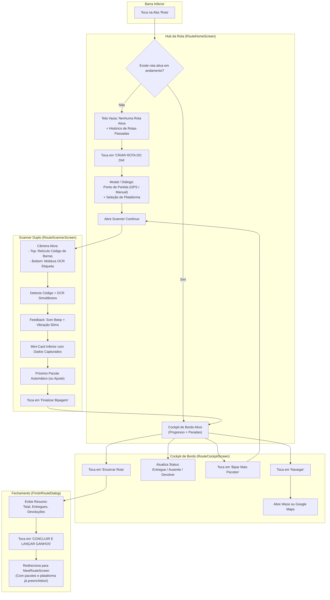

# Especificação Técnica de UI/UX — Aba "Rota", Cockpit de Bordo e Scanner Contínuo OCR

**Documento:** Especificação de Interface e Ergonomia — 5ª Aba de Rota, Scanner Duplo (Barcode + OCR de Etiqueta), Cockpit de Entregas e Fechamento com Ganhos  
**Código da Tarefa:** TASK-DES-06  
**Agente Responsável:** Agente Designer UX/UI — Time Pocket (Central do Motorista)  
**Destinatário:** Subagente Android/Kotlin & Desenvolvedor Master (Fernando)  
**Data:** 28 de Setembro de 2026  
**Status:** Pronto para Implementação (Ready for Dev)  

---

## 1. Visão Geral e Contexto Operacional

### 1.1 O Desafio Real do Usuário Master
O Usuário Master (motorista titular do aplicativo) opera em centros de distribuição e galpões logísticos (Mercado Livre, Shopee, Amazon, Loggi, etc.), carregando dezenas de encomendas diariamente. Todo o processo de expedição baseia-se exclusivamente nas etiquetas adesivadas nas caixas e pacotes.

Atualmente, o motorista enfrenta dois gargalos críticos:
1. **Conferência da própria carga:** Embora o app permita conferir pacotes de terceiros (Entregadores Parceiros), o motorista principal não possui um módulo para registrar e conferir a sua própria carga matinal.
2. **Navegação manual parada a parada:** Sem o cadastro digital dos endereços, o motorista precisa ler repetidamente a etiqueta adesiva no veículo e redigitar manualmente os dados em aplicativos de GPS (Google Maps ou Waze).

### 1.2 A Solução Projetada
Implementar a **5ª Aba "Rota"** na barra de navegação inferior (`BottomNavigationBar`), transformando o smartphone em um terminal de alta produtividade dividido em 3 momentos:
1. **Manhã no Galpão (Operação de Bipagem):** Câmera com **leitor duplo contínuo** (Código de Barras superior + OCR de Nome/Endereço inferior) com confirmação instantânea multissensorial (som + vibração + mini-card inferior).
2. **Durante o Turno (Cockpit de Bordo):** Painel de bordo veicular com lista sequencial de paradas, botão de navegação em 1 toque (disparo direto para Google Maps / Waze) e alternador de status (*Entregue*, *Ausente*, *Devolver*).
3. **Fim do Turno (Fechamento Integrado):** Modal de encerramento que sintetiza o dia e pré-preenche automaticamente a tela *"Lançar Ganhos por Rota"* (`NewRouteScreen`), eliminando duplicidade de trabalho.

---

## 2. Posicionamento e Métricas da 5ª Aba na BottomNavigationBar

### 2.1 Posicionamento Estratégico
A barra inferior passa a comportar **5 abas simétricas**, posicionando a nova aba **"Rota"** estrategicamente no centro entre o gerencial (*Painel*) e a inteligência de dados (*Relatórios*):

```
┌────────────────────────────────────────────────────────────────────────┐
│                   BARRA INFERIOR DE 5 ABAS CONSOLIDADAS                │
├─────────────┬─────────────┬─────────────┬─────────────┬────────────────┤
│   INÍCIO    │   PAINEL    │    ROTA     │ RELATÓRIOS  │   HISTÓRICO    │
│  [ Ícone ]  │  [ Ícone ]  │  [ Ícone ]  │  [ Ícone ]  │   [ Ícone ]    │
│   Início    │   Painel    │    Rota     │ Relatórios  │   Histórico    │
│  (~72.dp)   │  (~72.dp)   │  (~72.dp)   │  (~72.dp)   │   (~72.dp)     │
└─────────────┴─────────────┴─────────────┴─────────────┴────────────────┘
```

A ordem definitiva no `bottomNavItems` de `NavGraph.kt` é:
1. `Screen.Inicio` — Ícone: `Icons.Default.Home` — Rótulo: *"Início"*
2. `Screen.Painel` — Ícone: `Icons.Default.BarChart` — Rótulo: *"Painel"*
3. `Screen.Rota` — Ícone: `Icons.AutoMirrored.Filled.AltRoute` — Rótulo: *"Rota"* 👈 *(NOVA ABA)*
4. `Screen.Relatorios` — Ícone: `Icons.Default.Assessment` — Rótulo: *"Relatórios"*
5. `Screen.Historico` — Ícone: `Icons.Default.History` — Rótulo: *"Histórico"*

### 2.2 Grid, Ergonomia e Áreas de Toque (Touch Targets)

A distribuição é calculada para manter conforto de toque em telas compactas e grandes, atendendo integralmente as diretrizes de acessibilidade WCAG 2.1 (mínimo de 48x48dp):

| Largura de Tela (dp) | Largura Útil por Aba | Altura da Barra | Área de Toque Efetiva | Margem de Segurança |
| :--- | :--- | :--- | :--- | :--- |
| **360.dp** (Compacta) | **72.0.dp** | **80.0.dp** | `72.dp x 64.dp` | +50% acima do mínimo de 48dp |
| **390.dp** (Média / Padrão) | **78.0.dp** | **80.0.dp** | `78.dp x 64.dp` | +62% acima do mínimo de 48dp |
| **412.dp** (Grande / Pixel) | **82.4.dp** | **80.0.dp** | `82.4.dp x 64.dp`| +71% acima do mínimo de 48dp |

### 2.3 Tratamento de Texto e Prevenção de Truncamento
Com 5 itens, o comprimento do rótulo textual é determinante para evitar reticências (`...`) indesejadas:
- *"Início"*: ~30dp
- *"Painel"*: ~32dp
- *"Rota"*: ~24dp
- *"Relatórios"*: ~52dp *(maior texto)*
- *"Histórico"*: ~48dp

**Regra Tipográfica:**  
- Utilizar tamanho de fonte `fontSize = 10.sp` com `letterSpacing = (-0.2).sp`.
- Em `72.dp`, até mesmo a palavra *"Relatórios"* (52dp) conta com margem lateral livre de 20dp, garantindo **zero quebra de linha e zero reticências** em qualquer dispositivo moderno.

### 2.4 Tokens Visuais da Barra Inferior (Tema Dark Neon)

```kotlin
// Configuração de Estilo no NavGraph.kt
NavigationBar(
    containerColor = if (isDarkMode) BottomNavDark else BottomNavLight, // #111111 / #FFFFFF
    contentColor = MaterialTheme.colorScheme.onSurface,
    tonalElevation = 8.dp
) {
    bottomNavItems.forEach { screen ->
        val selected = isCurrentDestination(screen.route)
        NavigationBarItem(
            icon = {
                Icon(
                    imageVector = screen.icon,
                    contentDescription = screen.title,
                    modifier = Modifier.size(24.dp)
                )
            },
            label = {
                Text(
                    text = screen.title,
                    fontSize = 10.sp,
                    letterSpacing = (-0.2).sp,
                    maxLines = 1,
                    fontWeight = if (selected) FontWeight.Bold else FontWeight.Medium
                )
            },
            selected = selected,
            onClick = { /* Navegação single top */ },
            colors = NavigationBarItemDefaults.colors(
                selectedIconColor = OrangeNeon, // #FF5500
                selectedTextColor = OrangeNeon, // #FF5500
                indicatorColor = OrangeNeon.copy(alpha = 0.15f), // Pílula translúcida
                unselectedIconColor = TextSecondaryDark, // #A0A0A0
                unselectedTextColor = TextSecondaryDark  // #A0A0A0
            )
        )
    }
}
```

---

## 3. Fluxo de Navegação e Estados da Aba "Rota"



---

## 4. Wireframes Textuais Estruturados e Componentes Compose

---

### 4.1 Tela 1: Hub de Rota / Início da Rota (`RouteHomeScreen.kt`)

Quando o motorista acessa a aba "Rota", o aplicativo verifica se há uma rota com status `em_andamento`.

#### A. Wireframe Textual — Estado Vazio (Sem Rota no Dia)
```
┌─────────────────────────────────────────────────────────────┐
│ ≡  Central do Motorista                   [🔔] [⚙️]        │
│ ─────────────────────────────────────────────────────────── │
│  ROTA DO DIA                                                │
│  Organize e acompanhe sua operação de entregas              │
│ ─────────────────────────────────────────────────────────── │
│                                                             │
│                    ┌──────────────────┐                     │
│                    │     [🚚 📦]      │  Badge Circular     │
│                    │  Ícone AltRoute  │  Laranja Neon       │
│                    └──────────────────┘                     │
│                                                             │
│                 Nenhuma Rota Ativa Hoje                     │
│    Inicie sua rota no galpão, bipe os pacotes com a câmera   │
│         e tenha sua lista de paradas automatizada.          │
│                                                             │
│       ┌─────────────────────────────────────────────┐       │
│       │        🚀 CRIAR NOVA ROTA DO DIA            │       │
│       │         Fundo #FF5500 • Ícone [+]           │       │
│       └─────────────────────────────────────────────┘       │
│                                                             │
│ ─────────────────────────────────────────────────────────── │
│  ROTAS ANTERIORES                                 Ver Todas │
│ ─────────────────────────────────────────────────────────── │
│ ┌─────────────────────────────────────────────────────────┐ │
│ │ 📅 27/09 • Mercado Livre              Concluída [95%]   │ │
│ │ 📦 48 pacotes (46 entregues • 2 devoluções)             │ │
│ │ 🏁 Cajamar -> Região Pinheiros/Butantã                  │ │
│ └─────────────────────────────────────────────────────────┘ │
│ ┌─────────────────────────────────────────────────────────┐ │
│ │ 📅 26/09 • Shopee Express             Concluída [100%]  │ │
│ │ 📦 35 pacotes (35 entregues • 0 devoluções)             │ │
│ │ 🏁 Barueri -> Região Osasco                             │ │
│ └─────────────────────────────────────────────────────────┘ │
│                                                             │
└─────────────────────────────────────────────────────────────┘
```

#### B. Componentes Compose para o Estado Vazio
- **Card Hero de Criação (`Button`):**
  - Modifier: `fillMaxWidth().height(56.dp)`
  - Cor: `OrangeNeon` (`#FF5500`)
  - Shape: `RoundedCornerShape(14.dp)`
  - Texto: `"CRIAR NOVA ROTA DO DIA"`, `14.sp`, `FontWeight.Bold`, branco `#FFFFFF`
  - Ícone: `Icons.Default.AddCircle`
- **Diálogo Modal de Início de Rota (`StartRouteDialog`):**
  - **Ponto de Partida:**
    - Opção A (Padrão): Chip selecionável *"Usar Localização Atual (GPS)"* com ícone `Icons.Default.MyLocation` (cor `GreenNeon`).
    - Opção B: Campo de texto `OutlinedTextField` *"Digitar Galpão / Origem Manual"* (ex: `"Galpão Cajamar"`).
  - **Plataforma da Rota:**
    - Dropdown ou Carrossel de Chips puxando as plataformas cadastradas (Mercado Livre, Shopee, Amazon, Loggi, etc.).
  - **CTA de Ação:** Botão *"ABRIR SCANNER DE PACOTES"* em Laranja Neon.

---

### 4.2 Tela 2: Scanner Contínuo de Bipagem Dupla (`RouteScannerScreen.kt`)

Ambiente matinal no galpão logístico: esteiras barulhentas, pouca iluminação pontual e alta cadência de leitura. A tela utiliza CameraX em tela cheia com overlay customizado via Canvas.

#### A. Wireframe Textual — Visor da Câmera e Retículos
```
┌─────────────────────────────────────────────────────────────┐
│ [⬅️ Voltar]      📦 14 Pacotes Bipados        [⚡ Flash]   │
│ ─────────────────────────────────────────────────────────── │
│                                                             │
│        Posicione o Código de Barras / QR Code               │
│      ┌──────────────────────────────────────────────┐       │
│      │ ┌──                                      ──┐ │       │
│      │ │   ════════════════════════════════════   │ │ ◄── Linha Laser
│      │ │             CÓDIGO DE BARRAS             │ │     Verde Animada
│      │ └──                                      ──┘ │     Borda #FF5500
│      └──────────────────────────────────────────────┘       │
│                                                             │
│        Enquadre a Etiqueta (Nome, Endereço e CEP)           │
│      ┌ · · · · · · · · · · · · · · · · · · · · · · ·┐       │
│      ·  [ ]                                    [ ]  ·       │
│      ·               ÁREA DE OCR ML KIT             · ◄── Moldura
│      ·          Destinatário, Rua, Nº e CEP         ·     Pontilhada
│      ·  [ ]                                    [ ]  ·     Ampla
│      └ · · · · · · · · · · · · · · · · · · · · · · ·┘       │
│                                                             │
│ ┌─────────────────────────────────────────────────────────┐ │
│ │ 🟢 PACOTE #14 BIPADO COM SUCESSO!            [✏️ Editar] │ │
│ │ 🏷️ Código: BR420918237BR                                │ │
│ │ 👤 Carlos Eduardo Silva                                 │ │
│ │ 📍 Rua das Palmeiras, 120 - Centro • CEP 01001-000      │ │
│ │ ─────────────────────────────────────────────────────── │ │
│ │ [ Bipar Próximo (Auto 2s) ]    [ Concluir Carga (14) ]  │ │
│ └─────────────────────────────────────────────────────────┘ │
└─────────────────────────────────────────────────────────────┘
```

#### B. Componentes Compose e Especificações do Scanner
1. **CameraX Preview (`AndroidView` com `PreviewView`):**
   - Ocupa `Modifier.fillMaxSize()`.
   - Vinculado ao ciclo de vida da Activity com `ProcessCameraProvider`.
   - Analisador de frames `ImageAnalysis` em thread dedicada (`Executors.newSingleThreadExecutor()`).
2. **Camada de Retículo Duplo (`Canvas`):**
   - **Retículo Superior (Código de Barras):**
     - Largura: `size.width * 0.82f` | Altura: `110.dp`
     - Borda: `RoundedCornerShape(16.dp)`, `Stroke(width = 3.5.dp, color = OrangeNeon)`
     - Linha Laser: `GreenNeon` (`#00A152`), varredura vertical contínua com `infiniteRepeatable` de 1200ms.
   - **Retículo Inferior (OCR de Texto):**
     - Largura: `size.width * 0.88f` | Altura: `140.dp`
     - Cantos em L (*Corner Brackets*): Comprimento `24.dp`, espessura `3.dp`, cor `Color.White.copy(alpha = 0.8f)`.
     - Área pontilhada interna em `OrangeNeon.copy(alpha = 0.35f)`.
3. **Feedback Multissensorial de Leitura:**
   - **Áudio (Beep):** `ToneGenerator(AudioManager.STREAM_NOTIFICATION, 100).startTone(ToneGenerator.TONE_PROP_BEEP, 120)`
   - **Vibração Tátil:** `VibrationEffect.createOneShot(50, VibrationEffect.DEFAULT_AMPLITUDE)`
   - **Alerta de Duplicata:** Dois beeps curtos (`TONE_PROP_BEEP2`) + vibração em 150ms com flash vermelho momentâneo no visor.
4. **Mini-Card de Confirmação Inferior (`Surface` flutuante):**
   - Shape: `RoundedCornerShape(18.dp)`
   - Fundo: `SurfaceDark` (`#1E1E1E`) com borda de 1.5dp em `GreenNeon` (`#00A152`)
   - Elevação: `12.dp`
   - Exibe dados lidos com tag `[OCR Detectado]` ou `[Requer Revisão]` caso o CEP não bata com a máscara.

---

### 4.3 Tela 3: Cockpit de Bordo da Rota Ativa (`RouteCockpitScreen.kt`)

Enquanto o motorista está dirigindo e realizando entregas pela cidade, a aba "Rota" se transforma no **Cockpit de Bordo**. O layout prioriza legibilidade máxima, alvos de toque generosos para suporte veicular e agilidade.

#### A. Wireframe Textual — Cockpit de Bordo
```
┌─────────────────────────────────────────────────────────────┐
│ ≡  Rota Ativa: Mercado Livre              [➕ Bipar Mais]   │
│ ─────────────────────────────────────────────────────────── │
│ ┌─────────────────────────────────────────────────────────┐ │
│ │ 🏁 Cajamar • 48 Pacotes no Veículo                      │ │
│ │ Progresso: 32 de 48 Entregues (66%)                     │ │
│ │ ▓▓▓▓▓▓▓▓▓▓▓▓▓▓▓▓▓▓▓▓░░░░░░░░░░                          │ │
│ │                                                         │ │
│ │   [✅ 32 Entregues]   [⏳ 14 Pendentes]   [⚠️ 2 Falhas]   │ │
│ └─────────────────────────────────────────────────────────┘ │
│                                                             │
│ PARADAS ORDENADAS (14 PENDENTES)           [🔍 Filtrar/Buscar]
│ ─────────────────────────────────────────────────────────── │
│ ┌─────────────────────────────────────────────────────────┐ │
│ │ #15 • PRÓXIMA PARADA                       📦 BR42091823│ │
│ │ 👤 CARLOS EDUARDO SILVA                                 │ │
│ │ 📍 Rua das Palmeiras, 120 - Apto 42                     │ │
│ │    Bairro Centro • CEP: 01001-000 • São Paulo           │ │
│ │                                                         │ │
│ │ ┌─────────────────────────────────────────────────────┐ │ │
│ │ │ 🚗 NAVEGAR NO GPS (Waze / Google Maps)              │ │ │ ◄── Botão Primário
│ │ └─────────────────────────────────────────────────────┘ │ │     Laranja Neon
│ │                                                         │ │
│ │ Status da Entrega:                                      │ │
│ │ ┌─────────────┐ ┌──────────────┐ ┌────────────────────┐ │ │
│ │ │ ✅ Entregue │ │ 👤 Ausente   │ │ ↩️ Devolver        │ │ │ ◄── Botões de
│ │ └─────────────┘ └──────────────┘ └────────────────────┘ │ │     Ação Rápida
│ └─────────────────────────────────────────────────────────┘ │
│                                                             │
│ ┌─────────────────────────────────────────────────────────┐ │
│ │ #16 • Mariana Souza                      📦 BR42091899  │ │
│ │ 📍 Alameda Santos, 800 - Cerqueira César                │ │
│ │ [ 🚗 Navegar ]       [ Status: Pendente ⏳ ]             │ │
│ └─────────────────────────────────────────────────────────┘ │
│                                                             │
│ ┌─────────────────────────────────────────────────────────┐ │
│ │       🏁 CONCLUIR ROTA DO DIA (FECHAMENTO)              │ │
│ └─────────────────────────────────────────────────────────┘ │
└─────────────────────────────────────────────────────────────┘
```

#### B. Componentes Compose do Cockpit
1. **Card Hero de Progresso (`ProgressHeroCard`):**
   - Cor de fundo: `SurfaceDark` (`#1E1E1E`)
   - Borda: `BorderStroke(1.dp, OrangeNeon.copy(alpha = 0.3f))`
   - Barra de progresso customizada: `LinearProgressIndicator` com cor `OrangeNeon` e fundo `SurfaceDarkAlt` (`#222222`).
   - 3 Chips informativos:
     - Verde (`GreenNeon`): `32 Entregues`
     - Amarelo (`YellowGold`): `14 Pendentes`
     - Vermelho (`RedAlert`): `2 Falhas/Devoluções`
2. **Cartão de Parada (`StopDeliveryCard`):**
   - Card individual com elevação `4.dp` e cantos `16.dp`.
   - Se for a próxima parada pendente (#15): Borda destacada de 1.5dp em `OrangeNeon` e fundo levemente realçado.
   - **Botão Hero "NAVEGAR NO GPS":**
     - Altura: `48.dp` a `52.dp`
     - Cor: `OrangeNeon` (`#FF5500`)
     - Dispara o `Intent` nativo do Android para Google Maps ou Waze (ver Seção 6).
   - **Linha de Ações de Status (Toggle de 1 Toque):**
     - Botão `Entregue`: Borda/Fundo `GreenNeon.copy(alpha = 0.2f)`, ícone `Icons.Default.CheckCircle`. Ao clicar, marca status e move para o histórico com transição suave.
     - Botão `Ausente`: Cor `YellowGold` (`#B8860B`), ícone `Icons.Default.PersonOff`.
     - Botão `Devolver`: Cor `RedAlert` (`#D32F2F`), ícone `Icons.Default.AssignmentReturn`.
3. **Botão Fixo de Rodapé / Encerramento:**
   - Botão em largura total `"CONCLUIR ROTA DO DIA"`, visível após rolagem ou flutuante.

---

### 4.4 Tela 4: Modal de Fechamento e Transição para Ganhos (`FinishRouteModal.kt`)

Elimina a necessidade de redigitação pelo motorista. Ao finalizar a rota, os números são consolidados e injetados diretamente no fechamento financeiro.

#### A. Wireframe Textual — Modal de Fechamento
```
┌─────────────────────────────────────────────────────────────┐
│                 ENCERRAR ROTA DO DIA                        │
│ ─────────────────────────────────────────────────────────── │
│                                                             │
│   🎉 Parabéns, você concluiu as entregas de hoje!           │
│                                                             │
│   ┌─────────────────────────────────────────────────────┐   │
│   │ RESUMO OPERACIONAL                                  │   │
│   │ • Plataforma: Mercado Livre                         │   │
│   │ • Total de Pacotes Carregados: 48                   │   │
│   │ • ✅ Pacotes Entregues com Sucesso: 46              │   │
│   │ • ⚠️ Pacotes para Devolução: 2                      │   │
│   │ • ⏱️ Tempo de Operação: 6h 15min                     │   │
│   └─────────────────────────────────────────────────────┘   │
│                                                             │
│   [x] Deseja lançar o fechamento financeiro desta rota      │
│       agora na tela de Ganhos?                              │
│                                                             │
│   KM Final Percorrido (Opcional):                           │
│   ┌─────────────────────────────────────────────────────┐   │
│   │ [ 84.5 ] km rodados no dia                          │   │
│   └─────────────────────────────────────────────────────┘   │
│                                                             │
│   ┌─────────────────────────────────────────────────────┐   │
│   │      💰 CONCLUIR E LANÇAR GANHOS                    │   │
│   │      Fundo #FF5500 • Vai para NewRouteScreen        │   │
│   └─────────────────────────────────────────────────────┘   │
│                                                             │
│             [ Salvar Apenas Rota e Fechar ]                 │
│                                                             │
└─────────────────────────────────────────────────────────────┘
```

#### B. Comportamento e Contrato de Transição
Ao acionar `"CONCLUIR E LANÇAR GANHOS"`, o ViewModel:
1. Atualiza `master_delivery_routes.status = 'concluida'` e preenche `finished_at = now()`.
2. Navega via NavController para a rota `Screen.LancarRota.route` repassando parâmetros via Bundle / SavedStateHandle:
   - `prefillPlatformId = route.platform_id`
   - `prefillPackagesCount = route.delivered_packages` (46)
   - `prefillReturnsCount = route.returned_packages` (2)
   - `prefillDate = route.route_date`
3. A tela `NewRouteScreen` abre com esses dados já preenchidos nos campos correspondentes, exigindo apenas que o motorista confira o valor da diária/pacote e salve.

---

## 5. Mapeamento de Tokens Material 3 e Design System

Todos os novos componentes devem utilizar estritamente a paleta existente em `Color.kt` e os estilos de tipografia Material 3 do app:

### 5.1 Tokens de Cores

| Nome do Token | Hexadecimal | Papel Semântico no Fluxo de Rotas |
| :--- | :--- | :--- |
| `BackgroundDark` | `#121212` | Fundo principal de todas as telas no Dark Mode |
| `SurfaceDark` | `#1E1E1E` | Fundo de cards de paradas, resumos e diálogos |
| `SurfaceDarkAlt` | `#222222` | Fundo de inputs, barras de progresso inativas e badges |
| `BottomNavDark` | `#111111` | Fundo da barra de navegação inferior |
| `OrangeNeon` | `#FF5500` | Ação primária (Primary CTA), ícone ativo na BottomBar, retículo de código de barras |
| `OrangeNeonAlt` | `#FF6600` | Tom complementar para gradientes hero |
| `GreenNeon` | `#00A152` | Linha laser animada, status "Entregue", GPS ativo e chips positivos |
| `RedAlert` | `#D32F2F` | Status "Devolver", alerta de código duplicado e erros de leitura |
| `YellowGold` | `#B8860B` | Status "Ausente" e avisos intermediários |
| `TextPrimaryDark` | `#FFFFFF` | Títulos, nomes de destinatários e números de parada |
| `TextSecondaryDark`| `#A0A0A0` | Endereços complementares, CEPs, ícones inativos da BottomBar |

### 5.2 Tipografia e Escalas Textuais

| Estilo Material 3 | Tamanho | Peso | Uso Específico nas Telas de Rota |
| :--- | :--- | :--- | :--- |
| `titleLarge` | `20.sp` | `FontWeight.Bold` | Título da tela ("Rota do Dia"), nomes de clientes em destaque |
| `titleMedium` | `16.sp` | `FontWeight.SemiBold` | Títulos de cards de parada (#15 • Carlos Silva) |
| `bodyLarge` | `14.sp` | `FontWeight.Normal` | Endereço completo para leitura rápida veicular |
| `bodyMedium` | `12.sp` | `FontWeight.Normal` | Bairro, Cidade, CEP e observações |
| `labelLarge` | `14.sp` | `FontWeight.Bold` | Botões de ação ("NAVEGAR NO GPS", "CRIAR ROTA") |
| `labelSmall` | `10.sp` | `FontWeight.Medium` | Rótulo das 5 abas da barra inferior |

---

## 6. Integração Nativa de Navegação GPS (Google Maps & Waze)

Para garantir custo zero de licença e experiência nativa confiável, o disparo de rotas é realizado via `Intent` com fallback inteligente:

```kotlin
/**
 * Abre o endereço da parada no aplicativo de GPS do motorista.
 * Prioriza Google Maps ou Waze conforme o esquema padrão do Android.
 */
fun launchGpsNavigation(context: Context, fullAddress: String) {
    try {
        // Tenta abrir diretamente na navegação do Google Maps
        val gmmIntentUri = Uri.parse("google.navigation:q=${Uri.encode(fullAddress)}")
        val mapIntent = Intent(Intent.ACTION_VIEW, gmmIntentUri).apply {
            setPackage("com.google.android.apps.maps")
        }
        context.startActivity(mapIntent)
    } catch (e: Exception) {
        // Fallback: Dispara seletor genérico do Android (permite escolher Waze ou navegador)
        val genericUri = Uri.parse("geo:0,0?q=${Uri.encode(fullAddress)}")
        val genericIntent = Intent(Intent.ACTION_VIEW, genericUri)
        context.startActivity(Intent.createChooser(genericIntent, "Navegar com:"))
    }
}
```

---

## 7. Especificações em JSON Estruturado (Contratos para Devs)

### 7.1 Bloco JSON: Bottom Navigation Bar com 5 Abas
```json
{
  "component_id": "BOTTOM_NAV_5_TABS",
  "screen_target": "app/src/main/java/com/fernando/centraldomotorista/navigation/NavGraph.kt",
  "total_tabs": 5,
  "metrics": {
    "bar_height_dp": 80,
    "tab_width_360dp": 72.0,
    "tab_width_390dp": 78.0,
    "tab_width_412dp": 82.4,
    "icon_size_dp": 24,
    "font_size_sp": 10.0,
    "letter_spacing_sp": -0.2
  },
  "items": [
    { "order": 1, "route": "inicio", "label": "Início", "icon": "Icons.Default.Home" },
    { "order": 2, "route": "painel", "label": "Painel", "icon": "Icons.Default.BarChart" },
    { "order": 3, "route": "rota_hub", "label": "Rota", "icon": "Icons.AutoMirrored.Filled.AltRoute" },
    { "order": 4, "route": "relatorios", "label": "Relatórios", "icon": "Icons.Default.Assessment" },
    { "order": 5, "route": "historico", "label": "Histórico", "icon": "Icons.Default.History" }
  ],
  "colors": {
    "container_dark": "#111111",
    "active_tint": "#FF5500",
    "active_indicator": "#26FF5500",
    "inactive_tint": "#A0A0A0"
  }
}
```

### 7.2 Bloco JSON: Retículo Duplo do Scanner CameraX
```json
{
  "component_id": "SCANNER_DUAL_VIEWFINDER",
  "screen_target": "app/src/main/java/com/fernando/centraldomotorista/ui/screens/route/RouteScannerScreen.kt",
  "barcode_box": {
    "width_ratio": 0.82,
    "height_dp": 110,
    "border_color": "#FF5500",
    "border_width_dp": 3.5,
    "corner_radius_dp": 16,
    "laser_color": "#00A152",
    "laser_speed_ms": 1200
  },
  "ocr_text_box": {
    "width_ratio": 0.88,
    "height_dp": 140,
    "bracket_color": "#FFFFFFA0",
    "bracket_length_dp": 24,
    "bracket_width_dp": 3.0,
    "fill_hint": "#1AFFFFFF"
  },
  "feedback": {
    "success_tone": "TONE_PROP_BEEP",
    "vibrate_ms": 50,
    "duplicate_tone": "TONE_PROP_BEEP2",
    "duplicate_vibrate_ms": 150
  }
}
```

### 7.3 Bloco JSON: Card de Parada no Cockpit (StopDeliveryCard)
```json
{
  "component_id": "COCKPIT_STOP_CARD",
  "screen_target": "app/src/main/java/com/fernando/centraldomotorista/ui/screens/route/RouteCockpitScreen.kt",
  "surface_tokens": {
    "background": "#1E1E1E",
    "active_border": "#FF5500",
    "default_border": "transparent",
    "corner_radius_dp": 16,
    "padding_dp": 14
  },
  "actions": {
    "primary_button": {
      "label": "NAVEGAR NO GPS",
      "background": "#FF5500",
      "text_color": "#FFFFFF",
      "height_dp": 50,
      "intent_uri": "google.navigation:q={full_address}"
    },
    "status_toggles": [
      { "status": "entregue", "label": "Entregue", "color": "#00A152", "icon": "Icons.Default.CheckCircle" },
      { "status": "ausente", "label": "Ausente", "color": "#B8860B", "icon": "Icons.Default.PersonOff" },
      { "status": "devolver", "label": "Devolver", "color": "#D32F2F", "icon": "Icons.Default.AssignmentReturn" }
    ]
  }
}
```

---

## 8. Guia de Implementação para o Desenvolvedor Android/Kotlin

### 8.1 Estrutura de Arquivos Recomendada
```
app/src/main/java/com/fernando/centraldomotorista/
├── navigation/
│   └── NavGraph.kt                     (Atualizar bottomNavItems com Screen.Rota)
├── ui/screens/route/
│   ├── RouteHomeScreen.kt              (Hub da aba: Vazio vs Cockpit Ativo)
│   ├── RouteViewModel.kt               (Gerenciador de estado da Rota Master)
│   ├── RouteScannerScreen.kt           (CameraX + ML Kit Barcode + OCR)
│   ├── RouteCockpitScreen.kt           (Lista ordenada de paradas e progresso)
│   ├── components/
│   │   ├── DualScannerOverlay.kt       (Canvas com retículo Barcode + OCR)
│   │   ├── StopDeliveryCard.kt         (Card individual de entrega com GPS)
│   │   ├── RouteProgressHero.kt        (Card de progresso com contadores)
│   │   └── FinishRouteDialog.kt        (Modal de encerramento e ponte para Ganhos)
```

### 8.2 Checklist de Aceitação para Implementação Frontend
- [ ] Inclusão da rota `rota_hub` como 3ª aba em `NavGraph.kt` entre `Painel` e `Relatórios`.
- [ ] Área de toque de 72dp a 82dp sem truncamento de texto nas 5 abas.
- [ ] Retículo duplo com animação da linha laser verde sobre o CameraX.
- [ ] Beep sonoro e vibração tátil disparados no momento exato do scan.
- [ ] Botão de navegação veicular acionando o Intent com endereço codificado.
- [ ] Modal de fechamento enviando os totais preenchidos para a tela `NewRouteScreen`.
