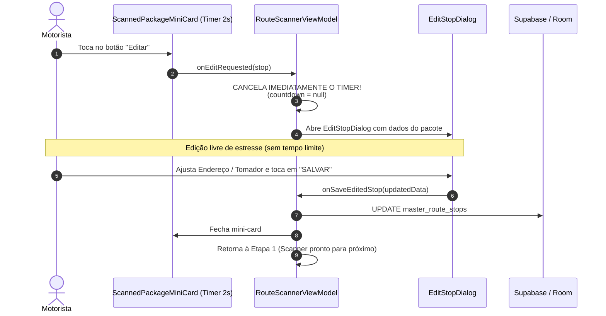

# Especificação Técnica de UI/UX — Botão Editar Pacote, Scanner de Busca, Seletor de Tomador/Marketplace e Edição Pausada

**Documento:** Especificações de Interface, Ergonomia e Microinterações — Edição Rápida de Parada, Busca por Bipagem, Seletor de Tomador/Marketplace, Edição Pós-Bipagem Sem Timer e Correção de Quebra de Linha  
**Código da Tarefa:** TASK-DES-09 (Revisão v2)  
**Agente Responsável:** Agente Designer UX/UI — Time Pocket (Central do Motorista)  
**Destinatário:** Subagente Android/Kotlin & Desenvolvedor Master (Fernando)  
**Data:** 30 de Setembro de 2026  
**Status:** Pronto para Implementação (Ready for Dev)  

---

## 1. Visão Geral e Contexto Operacional

Durante os testes em centros de distribuição e galpões de cross-docking (ex: Total Express, Loggi, Shopee Xpress, Sequoia, Mercado Envios), foram consolidadas necessidades operacionais fundamentais da rotina real do motorista Master:

1. **Distinção Essencial entre Transportadora e Tomador (Marketplace de Origem):**
   - Na logística moderna de última milha (*last mile*), o motorista é contratado por uma **Transportadora / Operador Logístico** (ex: Total Express), mas a sua rota diária carrega pacotes pertencentes a diferentes **Tomadores / Marketplaces de Origem** (ex: TikTok Shop, Kwai, Shopee, Mercado Livre, Amazon, Shein).
   - O aplicativo necessita registrar com clareza **ambas as entidades** no ato da bipagem para apuração precisa de faturamento por marketplace e separação de lotes.
2. **Edição Pós-Bipagem Sem Pressa (Fim do Timer Precipitativo):**
   - O mini-card inferior de feedback possui um contador regressivo de 2 segundos para auto-avanço.
   - Quando o motorista toca em *"Editar"*, esse contador precisa ser **imediatamente interrompido e cancelado**, abrindo o diálogo modal completo de edição (`EditStopDialog`) em primeiro plano, permitindo correções com calma e ergonomia total.
3. **Localização Instantânea de Pacote na Rota:** Bipagem com a câmera para focar e expandir instantaneamente o card da parada correspondente no Cockpit.
4. **Ergonomia e Anti-Truncamento em Telas Compactas (360dp a 390dp):** Linhas de ação, botões de otimização e seletores de volume sem quebra errônea de linha.

---

## 2. Especificação 1 — Botão "Editar Pacote" no `StopDeliveryCard`

### 2.1 Diagnóstico e Posicionamento
No `StopDeliveryCard` expandido, as ações de manutenção do pacote são dispostas em uma **`Row` simétrica balanceada** (`weight(1f)` cada), com linguagem visual Dark Neon harmoniosa e zero truncamento.

### 2.2 Wireframe Textual — Ações do Card Expandido
```
┌─────────────────────────────────────────────────────────────┐
│ #14 • CARLOS EDUARDO SILVA                    📦 BR42091823 │
│ 📍 Rua das Palmeiras, 120 - Centro • CEP 01001-000          │
│ 🏬 Tomador: TikTok Shop • 🚚 Transp: Total Express          │
│ ─────────────────────────────────────────────────────────── │
│ ┌─────────────────────────────────────────────────────────┐ │
│ │ 🚗 NAVEGAR NO GPS (Waze / Maps)                         │ │
│ └─────────────────────────────────────────────────────────┘ │
│                                                             │
│ [ ✅ Entregue ]     [ 👤 Ausente ]     [ ↩️ Devolver ]      │
│ ─────────────────────────────────────────────────────────── │
│                                                             │
│ ┌───────────────────────────┐ ┌───────────────────────────┐ │ ◄── Row Balanceada
│ │  ✏️ Editar Pacote         │ │  🗑️ Remover da Rota       │ │     50% / 50%
│ │  Borda OrangeNeon (0.45f) │ │  Borda RedAlert (0.45f)   │ │     Altura 40.dp
│ └───────────────────────────┘ └───────────────────────────┘ │
└─────────────────────────────────────────────────────────────┘
```

### 2.3 Especificação Compose dos Botões Utilitários

```kotlin
// Em StopDeliveryCard.kt — Rodapé do conteúdo expandido
Row(
    modifier = Modifier
        .fillMaxWidth()
        .padding(top = 10.dp),
    horizontalArrangement = Arrangement.spacedBy(8.dp),
    verticalAlignment = Alignment.CenterVertically
) {
    // 1. Botão Editar Pacote (Dark Neon Laranja)
    OutlinedButton(
        onClick = { onEditStop(stop) },
        border = BorderStroke(1.dp, OrangeNeon.copy(alpha = 0.45f)),
        colors = ButtonDefaults.outlinedButtonColors(
            containerColor = OrangeNeon.copy(alpha = 0.08f),
            contentColor = OrangeNeon
        ),
        shape = RoundedCornerShape(10.dp),
        modifier = Modifier
            .weight(1f)
            .height(40.dp),
        contentPadding = PaddingValues(horizontal = 8.dp, vertical = 0.dp)
    ) {
        Icon(
            imageVector = Icons.Default.Edit,
            contentDescription = "Editar Pacote",
            tint = OrangeNeon,
            modifier = Modifier.size(15.dp)
        )
        Spacer(modifier = Modifier.width(6.dp))
        Text(
            text = "Editar Pacote",
            color = OrangeNeon,
            fontSize = 11.5.sp,
            fontWeight = FontWeight.Bold,
            maxLines = 1,
            softWrap = false
        )
    }

    // 2. Botão Remover Pacote da Rota (Dark Neon Vermelho)
    OutlinedButton(
        onClick = { onDeleteStop(stop) },
        border = BorderStroke(1.dp, RedAlert.copy(alpha = 0.45f)),
        colors = ButtonDefaults.outlinedButtonColors(
            containerColor = RedAlert.copy(alpha = 0.08f),
            contentColor = RedAlert
        ),
        shape = RoundedCornerShape(10.dp),
        modifier = Modifier
            .weight(1f)
            .height(40.dp),
        contentPadding = PaddingValues(horizontal = 8.dp, vertical = 0.dp)
    ) {
        Icon(
            imageVector = Icons.Default.DeleteOutline,
            contentDescription = "Remover Pacote da Rota",
            tint = RedAlert,
            modifier = Modifier.size(15.dp)
        )
        Spacer(modifier = Modifier.width(6.dp))
        Text(
            text = "Remover",
            color = RedAlert,
            fontSize = 11.5.sp,
            fontWeight = FontWeight.Bold,
            maxLines = 1,
            softWrap = false
        )
    }
}
```

---

## 3. Especificação 2 — Diálogo de Edição Completa: `EditStopDialog`

### 3.1 Racional de UX
O `EditStopDialog` é o componente universal de edição rápida de uma parada, utilizado tanto a partir do **Cockpit de Bordo** quanto a partir do **Scanner (após bipar)**. Permite ajustar destinatário, logradouro, CEP, tipo de volume, transportadora e tomador/marketplace de origem.

### 3.2 Wireframe Textual — `EditStopDialog`
```
┌─────────────────────────────────────────────────────────────┐
│ ✏️  EDITAR DADOS DO PACOTE                                  │
│     Código: BR420918237BR (Imutável)                        │
│ ─────────────────────────────────────────────────────────── │
│                                                             │
│ Destinatário / Cliente:                                     │
│ [ CARLOS EDUARDO SILVA                            ]         │
│                                                             │
│ Endereço Completo:                                          │
│ [ Rua das Palmeiras, 120 - Apto 42                          │
│   Bairro Centro - São Paulo / SP                  ]         │
│                                                             │
│ CEP:                                                        │
│ [ 01001-000                                       ]         │
│                                                             │
│ Tipo de Pacote:                                             │
│ ┌───────────────────────────┐ ┌───────────────────────────┐ │
│ │  📦 Pacotinho             │ │  🏋️ Volumoso             │ │
│ └───────────────────────────┘ └───────────────────────────┘ │
│                                                             │
│ 🚚 Transportadora:                                          │
│ [ Total Express                                   ] [▼]     │
│                                                             │
│ 🏬 Tomador / Origem (Marketplace):                          │
│ [ TikTok Shop                                     ] [▼] ◄── Novo Campo!
│                                                             │
│ ┌─────────────────────────────────────────────────────────┐ │
│ │              💾 SALVAR ALTERAÇÕES                       │ │ ◄── Primary CTA #FF5500
│ └─────────────────────────────────────────────────────────┘ │
│                      [ Cancelar ]                           │
└─────────────────────────────────────────────────────────────┘
```

### 3.3 Especificação dos Componentes do Diálogo
- **Contêiner:** `Dialog` com superfície `SurfaceDark` (`#1E1E1E`), borda de 1.5dp em `OrangeNeon.copy(alpha = 0.5f)` e cantos arredondados de `18.dp`.
- **Cabeçalho:** Ícone `Icons.Default.Edit` em badge circular Laranja Neon com o código de barras fixo (`#BR...`).
- **Campos de Entrada:**
  - **Destinatário:** `OutlinedTextField` com `maxLines = 1`, caixa alta automática.
  - **Endereço Completo:** `OutlinedTextField` multiline (`minLines = 2`, `maxLines = 3`).
  - **CEP:** Teclado numérico (`KeyboardType.Number`) com formatação visual `#####-###`.
  - **Tipo de Volume:** Chips `[ 📦 Pacotinho ]` e `[ 🏋️ Volumoso ]`.
  - **Transportadora:** Dropdown com as plataformas de transporte cadastradas.
  - **Tomador / Marketplace:** Dropdown ou seletor com os tomadores cadastrados (TikTok Shop, Kwai, Shopee, Mercado Livre, etc.) com atalho para adicionar novos.
- **Ações:** Botão primário *"SALVAR ALTERAÇÕES"* em `OrangeNeon` (`#FF5500`) e botão neutro *"Cancelar"*.

---

## 4. Especificação 3 — Seletor de Tomador / Marketplace (`MarketplaceSelectorDialog`)

### 4.1 Racional de Negócio
No centro de distribuição, o motorista recebe pacotes de múltiplos marketplaces embarcados em uma mesma transportadora. Ele precisa poder selecionar com 1 toque qual marketplace é a origem do pacote ou adicionar um novo tomador rapidamente sem sair da tela de bipagem.

### 4.2 Wireframe Textual — `MarketplaceSelectorDialog`
```
┌─────────────────────────────────────────────────────────────┐
│ 🏬  SELECIONAR TOMADOR / ORIGEM                             │
│     Selecione o marketplace ou empresa dona da carga        │
│ ─────────────────────────────────────────────────────────── │
│                                                             │
│ ┌─────────────────────────────────────────────────────────┐ │
│ │ 🔍 Filtrar marketplace...                               │ │
│ └─────────────────────────────────────────────────────────┘ │
│                                                             │
│ MARKETPLACES CADASTRADOS:                                   │
│ ┌─────────────────────────────────────────────────────────┐ │
│ │  ✓ 🎵 TikTok Shop                         [Selecionado] │ │
│ ├─────────────────────────────────────────────────────────┤ │
│ │    ⚡ Kwai                                              │ │
│ ├─────────────────────────────────────────────────────────┤ │
│ │    🛍️ Shopee Express                                    │ │
│ ├─────────────────────────────────────────────────────────┤ │
│ │    📦 Mercado Livre                                     │ │
│ ├─────────────────────────────────────────────────────────┤ │
│ │    📦 Amazon Flex                                       │ │
│ ├─────────────────────────────────────────────────────────┤ │
│ │    👗 Shein                                             │ │
│ └─────────────────────────────────────────────────────────┘ │
│                                                             │
│ ┌─────────────────────────────────────────────────────────┐ │
│ │      ➕ CADASTRAR NOVO TOMADOR / ORIGEM                 │ │ ◄── Ação Rápida
│ └─────────────────────────────────────────────────────────┘ │
│                      [ Cancelar ]                           │
└─────────────────────────────────────────────────────────────┘
```

### 4.3 Especificação Compose do Diálogo de Tomador

```kotlin
@Composable
fun MarketplaceSelectorDialog(
    currentMarketplace: String?,
    availableMarketplaces: List<String>,
    onSelectMarketplace: (String) -> Unit,
    onAddNewMarketplace: (String) -> Unit,
    onDismiss: () -> Unit
) {
    var searchQuery by remember { mutableStateOf("") }
    var isAddingNew by remember { mutableStateOf(false) }
    var newMarketplaceName by remember { mutableStateOf("") }

    val filteredList = remember(searchQuery, availableMarketplaces) {
        if (searchQuery.isBlank()) availableMarketplaces
        else availableMarketplaces.filter { it.contains(searchQuery, ignoreCase = true) }
    }

    Dialog(onDismissRequest = onDismiss) {
        Surface(
            shape = RoundedCornerShape(18.dp),
            color = SurfaceDark,
            border = BorderStroke(1.5.dp, OrangeNeon.copy(alpha = 0.5f)),
            modifier = Modifier
                .fillMaxWidth()
                .padding(horizontal = 8.dp)
        ) {
            Column(
                modifier = Modifier
                    .fillMaxWidth()
                    .padding(18.dp),
                verticalArrangement = Arrangement.spacedBy(12.dp)
            ) {
                // Header
                Row(verticalAlignment = Alignment.CenterVertically) {
                    Box(
                        modifier = Modifier
                            .size(38.dp)
                            .background(OrangeNeon.copy(alpha = 0.15f), RoundedCornerShape(8.dp)),
                        contentAlignment = Alignment.Center
                    ) {
                        Icon(Icons.Default.Storefront, contentDescription = null, tint = OrangeNeon, modifier = Modifier.size(20.dp))
                    }
                    Spacer(modifier = Modifier.width(10.dp))
                    Column {
                        Text("Tomador / Origem", fontSize = 16.sp, fontWeight = FontWeight.Bold, color = TextPrimaryDark)
                        Text("Marketplace ou empresa dona da carga", fontSize = 11.sp, color = TextSecondaryDark)
                    }
                }

                if (!isAddingNew) {
                    // Campo de Busca
                    OutlinedTextField(
                        value = searchQuery,
                        onValueChange = { searchQuery = it },
                        placeholder = { Text("Filtrar tomador...", fontSize = 12.sp) },
                        leadingIcon = { Icon(Icons.Default.Search, contentDescription = null, tint = TextSecondaryDark, modifier = Modifier.size(16.dp)) },
                        colors = OutlinedTextFieldDefaults.colors(
                            focusedBorderColor = OrangeNeon,
                            unfocusedBorderColor = Color.White.copy(alpha = 0.15f),
                            focusedContainerColor = SurfaceDarkAlt,
                            unfocusedContainerColor = SurfaceDarkAlt
                        ),
                        singleLine = true,
                        modifier = Modifier.fillMaxWidth()
                    )

                    // Lista com Rolagem
                    LazyColumn(
                        modifier = Modifier
                            .fillMaxWidth()
                            .heightIn(max = 240.dp),
                        verticalArrangement = Arrangement.spacedBy(6.dp)
                    ) {
                        items(filteredList) { marketplace ->
                            val isSelected = marketplace.equals(currentMarketplace, ignoreCase = true)
                            Surface(
                                color = if (isSelected) OrangeNeon.copy(alpha = 0.15f) else SurfaceDarkAlt,
                                shape = RoundedCornerShape(8.dp),
                                border = BorderStroke(1.dp, if (isSelected) OrangeNeon else Color.Transparent),
                                modifier = Modifier
                                    .fillMaxWidth()
                                    .clickable {
                                        onSelectMarketplace(marketplace)
                                        onDismiss()
                                    }
                            ) {
                                Row(
                                    modifier = Modifier.padding(horizontal = 12.dp, vertical = 10.dp),
                                    verticalAlignment = Alignment.CenterVertically,
                                    horizontalArrangement = Arrangement.SpaceBetween
                                ) {
                                    Text(
                                        text = marketplace,
                                        fontSize = 13.sp,
                                        fontWeight = if (isSelected) FontWeight.Bold else FontWeight.Medium,
                                        color = if (isSelected) OrangeNeon else TextPrimaryDark
                                    )
                                    if (isSelected) {
                                        Icon(Icons.Default.Check, contentDescription = null, tint = OrangeNeon, modifier = Modifier.size(16.dp))
                                    }
                                }
                            }
                        }
                    }

                    // Botão Cadastrar Novo
                    OutlinedButton(
                        onClick = { isAddingNew = true },
                        border = BorderStroke(1.dp, OrangeNeon.copy(alpha = 0.4f)),
                        colors = ButtonDefaults.outlinedButtonColors(containerColor = OrangeNeon.copy(alpha = 0.08f)),
                        shape = RoundedCornerShape(10.dp),
                        modifier = Modifier.fillMaxWidth()
                    ) {
                        Icon(Icons.Default.Add, contentDescription = null, tint = OrangeNeon, modifier = Modifier.size(16.dp))
                        Spacer(modifier = Modifier.width(6.dp))
                        Text("Cadastrar Novo Tomador", color = OrangeNeon, fontSize = 12.sp, fontWeight = FontWeight.Bold)
                    }
                } else {
                    // Formulário de Cadastro Rápido de Novo Tomador
                    Column(verticalArrangement = Arrangement.spacedBy(10.dp)) {
                        Text("Nome do Tomador / Marketplace:", fontSize = 12.sp, color = TextSecondaryDark)
                        OutlinedTextField(
                            value = newMarketplaceName,
                            onValueChange = { newMarketplaceName = it },
                            placeholder = { Text("Ex: TikTok Shop, Shein, Kwai...", fontSize = 12.sp) },
                            singleLine = true,
                            colors = OutlinedTextFieldDefaults.colors(
                                focusedBorderColor = OrangeNeon,
                                focusedContainerColor = SurfaceDarkAlt,
                                unfocusedContainerColor = SurfaceDarkAlt
                            ),
                            modifier = Modifier.fillMaxWidth()
                        )
                        Row(horizontalArrangement = Arrangement.spacedBy(8.dp)) {
                            OutlinedButton(
                                onClick = { isAddingNew = false },
                                modifier = Modifier.weight(1f)
                            ) {
                                Text("Voltar", color = TextSecondaryDark, fontSize = 12.sp)
                            }
                            Button(
                                onClick = {
                                    if (newMarketplaceName.isNotBlank()) {
                                        onAddNewMarketplace(newMarketplaceName.trim())
                                        onSelectMarketplace(newMarketplaceName.trim())
                                        onDismiss()
                                    }
                                },
                                enabled = newMarketplaceName.isNotBlank(),
                                colors = ButtonDefaults.buttonColors(containerColor = OrangeNeon),
                                modifier = Modifier.weight(1f)
                            ) {
                                Text("Salvar", color = Color.White, fontSize = 12.sp, fontWeight = FontWeight.Bold)
                            }
                        }
                    }
                }

                TextButton(onClick = onDismiss, modifier = Modifier.align(Alignment.CenterHorizontally)) {
                    Text("Fechar", color = TextSecondaryDark, fontSize = 12.sp)
                }
            }
        }
    }
}
```

---

## 5. Especificação 4 — Atualização do `OcrConfirmationCard` com Seção de Tomador

### 5.1 Racional Visual
No `RouteScannerScreen.kt`, o `OcrConfirmationCard` passa a exibir claramente:
1. **🚚 Transportadora:** Empresa de logística da rota (com botão *"Trocar"*).
2. **🏬 Tomador / Origem:** Marketplace ou cliente dono da encomenda (com botão *"Trocar"*).
3. **📦 Tipo de Volume:** `Pacotinho` vs `Volumoso` (50%/50%).
4. **👤 Atribuição:** Master vs Parceiro selecionado.

### 5.2 Wireframe Textual — `OcrConfirmationCard` Atualizado
```
┌─────────────────────────────────────────────────────────────┐
│ 🏷️ CÓDIGO BIPADO: BR420918237BR             [🔄 Re-bipar]│
│ ─────────────────────────────────────────────────────────── │
│ 👤 CARLOS EDUARDO SILVA                                     │
│ 📍 Rua das Palmeiras, 120 - Centro • CEP 01001-000          │
│ ─────────────────────────────────────────────────────────── │
│ 🚚 TRANSPORTADORA:                                          │
│ ┌─────────────────────────────────────────────────────────┐ │
│ │  Total Express                            [ Trocar ]    │ │
│ └─────────────────────────────────────────────────────────┘ │
│                                                             │
│ 🏬 TOMADOR / ORIGEM:                                        │
│ ┌─────────────────────────────────────────────────────────┐ │
│ │  🎵 TikTok Shop                           [ Trocar ]    │ │ ◄── Seção Clara!
│ └─────────────────────────────────────────────────────────┘ │
│                                                             │
│ TIPO DE VOLUME:                                             │
│ ┌───────────────────────────┐ ┌───────────────────────────┐ │
│ │ 📦 Pacotinho (Ativo)      │ │ 🏋️ Volumoso              │ │
│ └───────────────────────────┘ └───────────────────────────┘ │
│                                                             │
│ 👤 DESTINATÁRIO: [ Atribuir a: Master (Você) ] [Ciclar] [▼] │
│                                                             │
│ ┌─────────────────────────────────────────────────────────┐ │
│ │          ✅ CONFIRMAR PACOTE                            │ │ ◄── Primary CTA
│ └─────────────────────────────────────────────────────────┘ │
│ [ ⏭️ Pular OCR (Salvar Apenas Código) ]                     │
└─────────────────────────────────────────────────────────────┘
```

---

## 6. Especificação 5 — Experiência de Edição Pós-Bipagem Sem Timer Precipitativo

### 6.1 Diagnóstico do Erro Anterior
Após o motorista clicar em *"Confirmar Pacote"*, o aplicativo exibia o `ScannedPackageMiniCard` com um contador de 2 segundos. Ao tocar em *"Editar"*, o contador continuava correndo em segundo plano e fechava a tela na cara do usuário, ou exibia campos comprimidos no mini-card.

### 6.2 O Novo Comportamento de Edição Pausada
Quando o motorista toca em **"Editar"** no `ScannedPackageMiniCard`:
1. **Pausa Absoluta e Cancelamento do Countdown:** O job de contagem regressiva é **imediatamente cancelado** (`countdownJob?.cancel()`, `autoAdvanceCountdown = null`). O mini-card entra em estado congelado.
2. **Disparo do `EditStopDialog` Completo:** O app abre o `EditStopDialog` em tela cheia com todos os dados da parada recém-bipada preenchidos (destinatário, endereço, CEP, tipo de volume, transportadora e tomador).
3. **Edição Sem Pressa:** O motorista digita com conforto e sem pressão de tempo.
4. **Fechamento e Retomada:** Ao salvar no diálogo:
   - Os dados são atualizados no banco de dados (`MasterRouteStop`).
   - O mini-card é dispensado.
   - O scanner retorna suavemente para a **Etapa 1 (Busca de Código de Barras)**, pronto para bipar o próximo pacote!



---

## 7. Especificação 6 — Scanner de Busca Instantânea no Cockpit

### 7.1 Barra de Busca com Botão de Câmera
Ao lado do `OutlinedTextField` de pesquisa, posiciona-se um `IconButton` de 48x48dp com ícone `QrCodeScanner` e borda Laranja Neon.

```
┌─────────────────────────────────────────────────────────────┐
│ ┌───────────────────────────────────────────────┐ ┌───────┐ │
│ │ 🔍 Buscar endereço, cliente ou código...  [X] │ │  📷   │ │ ◄── Botão Scanner
│ │ Fundo SurfaceDark • Borda sutil 1dp           │ │ 48x48 │ │     Dark Neon
│ └─────────────────────────────────────────────────────────┘ │
└─────────────────────────────────────────────────────────────┘
```

Ao bipar o código na câmera, o valor é preenchido em `searchQuery`, o diálogo fecha e o card correspondente na lista é **automaticamente expandido e focado**.

---

## 8. Especificação 7 — Anti-Quebra de Linha em Telas Compactas (360dp)

Na linha de ações da lista de paradas do Cockpit:
- O contador exibe `"$total paradas"` (em vez de `"$total paradas listadas"`, liberando +24dp).
- Todos os botões (*"Otimizar"*, *"Expandir"*, *"Contrair"*) utilizam `softWrap = false`, `maxLines = 1`, fonte `10.5.sp` e padding de 5dp a 6dp.
- Elimina qualquer quebra de linha em telas de 360dp a 390dp.

```
┌─────────────────────────────────────────────────────────────┐
│ 18 paradas         [⚡ Otimizar]   [⤢ Expandir]  [⤡ Contrair]│ ◄── Perfeito em 360dp
└─────────────────────────────────────────────────────────────┘
```

---

## 9. Mapeamento de Tokens Material 3

| Elemento Visual | Token Compose | Hexadecimal | Descrição de Uso |
| :--- | :--- | :--- | :--- |
| **Botão Editar Pacote** | `OrangeNeon.copy(0.08f)` / `OrangeNeon` | `#14FF5500` / `#FF5500` | Fundo translúcido e borda em Laranja Neon |
| **Botão Remover Pacote** | `RedAlert.copy(0.08f)` / `RedAlert` | `#14D32F2F` / `#D32F2F` | Fundo translúcido e borda em Vermelho Alerta |
| **Botão Scanner de Busca** | `SurfaceDark` / `OrangeNeon` | `#1E1E1E` / `#FF5500` | Ícone `QrCodeScanner` destacado ao lado do input |
| **Seletor de Tomador** | `SurfaceDarkAlt` / `OrangeNeon` | `#222222` / `#FF5500` | Card com ícone de loja e botão trocar |
| **Seletor de Volume Ativo**| `OrangeNeon` ou `YellowGold` | `#FF5500` / `#B8860B` | Pacotinho (Laranja) ou Volumoso (Dourado) |

---

## 10. Blocos JSON de Especificação (Contratos para Devs)

### 10.1 Bloco JSON: Seletor de Tomador no Scanner
```json
{
  "component_id": "OCR_CONFIRMATION_MARKETPLACE_SELECTOR",
  "screen_target": "app/src/main/java/com/fernando/centraldomotorista/ui/screens/routes/master/RouteScannerScreen.kt",
  "field": "marketplace_origin",
  "ui": {
    "label": "TOMADOR / ORIGEM",
    "icon": "Icons.Default.Storefront",
    "action_label": "Trocar",
    "dialog": "MarketplaceSelectorDialog"
  },
  "default_marketplaces": [
    "TikTok Shop",
    "Kwai",
    "Shopee Express",
    "Mercado Livre",
    "Amazon Flex",
    "Shein",
    "Magalu"
  ]
}
```

### 10.2 Bloco JSON: Ação de Edição Sem Timer no Mini-Card
```json
{
  "component_id": "MINI_CARD_PAUSE_AND_EDIT",
  "screen_target": "app/src/main/java/com/fernando/centraldomotorista/ui/screens/routes/master/RouteScannerScreen.kt",
  "behavior": {
    "on_edit_click": {
      "cancel_countdown": true,
      "auto_advance": false,
      "open_dialog": "EditStopDialog",
      "resume_action_after_save": "DISMISS_CARD_AND_RETURN_TO_STEP_1"
    }
  }
}
```

---

## 11. Checklist de Implementação para o Agente Android/Kotlin

- [ ] **Criar `MarketplaceSelectorDialog.kt` em `components/`:**
  - Diálogo de seleção com busca rápida, lista de marketplaces e formulário de adição rápida.
- [ ] **Em `RouteScannerScreen.kt` / `OcrConfirmationCard`:**
  - Adicionar o bloco visual `"🏬 Tomador / Origem: [Nome] (Trocar)"` logo abaixo da Transportadora.
  - Conectar o clique ao `MarketplaceSelectorDialog`.
- [ ] **Em `RouteScannerViewModel.kt` e `ScannedPackageMiniCard`:**
  - Ao clicar em *"Editar"*, cancelar imediatamente o countdown (`autoAdvanceCountdown = null`).
  - Abrir o `EditStopDialog` em vez de tentar editar dentro do mini-card.
  - Ao salvar no `EditStopDialog`, dispensar o card e retornar ao estado de busca de código de barras.
- [ ] **Em `StopDeliveryCard.kt`:**
  - Rodapé com `Row` simétrica balanceada (50%/50%) para *"Editar Pacote"* e *"Remover"*.
- [ ] **Em `RouteCockpitScreen.kt`:**
  - Adicionar `IconButton` de scanner ao lado do input de busca.
  - Aplicar `softWrap = false`, `maxLines = 1` e texto enxuto (`$total paradas`) nos botões de cabeçalho da lista.
  - Integrar o `EditStopDialog` para edição a partir do Cockpit.
