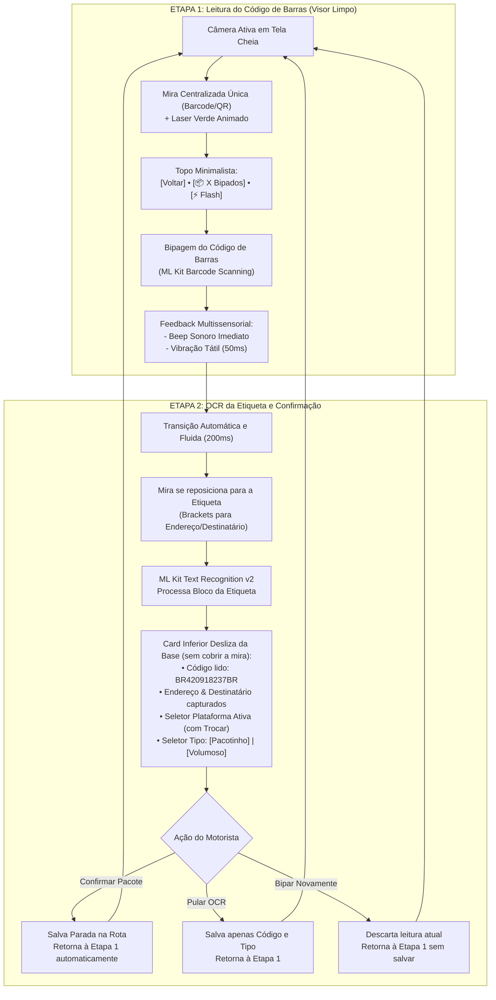

# Especificação Técnica de UI/UX — Leitura Fracionada do Scanner e Exclusão de Pacote Bipado Errado

**Documento:** Especificação de Interface, Ergonomia e Interação — Scanner Fracionado em 2 Etapas (Barcode -> OCR) e Exclusão Limpa de Pacote no Cockpit  
**Código da Tarefa:** TASK-DES-08  
**Agente Responsável:** Agente Designer UX/UI — Time Pocket (Central do Motorista)  
**Destinatário:** Subagente Android/Kotlin & Desenvolvedor Master (Fernando)  
**Data:** 29 de Setembro de 2026  
**Status:** Pronto para Implementação (Ready for Dev)  

---

## 1. Visão Geral e Contexto Operacional

### 1.1 Contexto dos Problemas Identificados em Campo

Durante a operação real com o aplicativo em galpões logísticos e em rota de entrega, foram identificadas duas fricções operacionais graves que comprometem a usabilidade e a precisão das métricas do motorista:

1. **Obstrução do Visor da Câmera no Scanner (`RouteScannerScreen.kt`):**
   - Atualmente, os componentes de parametrização (*Plataforma Ativa Sticky* e os seletores de tipo de pacote *Pacotinho vs Volumoso*) ficam fixos na parte superior da tela.
   - Esses seletores sobrepõem o topo da visualização da câmera e empurram o retículo do código de barras para baixo, cobrindo o campo visual justamente no instante em que o motorista precisa mirar com rapidez e precisão na esteira ou bancada.
   - O retículo duplo simultâneo (código de barras + OCR no mesmo instante) gera confusão visual e sobrecarga de processamento no mesmo frame.

2. **Falta de Ação de Exclusão de Pacote Bipado por Engano no Cockpit (`RouteCockpitScreen.kt`):**
   - É comum no galpão matinal o motorista bipar por acidente um pacote que pertence à rota de outro colega ou que foi cancelado antes do carregamento.
   - Atualmente, o aplicativo só oferece os botões `Entregue`, `Ausente` e `Devolver`.
   - O motorista é forçado a marcar o pacote como **"Devolver"**, o que polui gravemente as métricas de insucesso da rota, distorce o fechamento financeiro com a transportadora e gera falsos relatórios de devolução.

---

## 2. Solução 1: Fluxo de Leitura Fracionada do Scanner (2 Etapas)

A leitura é segregada em um ciclo natural e sequencial em **2 etapas distintas**, liberando 100% da visão durante a mira do código de barras e concentrando as parametrizações apenas no momento de confirmação.



---

### 2.1 Detalhamento da Etapa 1: Leitura de Código de Barras (Visor 100% Limpo)

#### A. Wireframe Textual — Etapa 1
```
┌─────────────────────────────────────────────────────────────┐
│ [⬅️]                  📦 18 Bipados                 [⚡ Flash]│ ◄── TopBar Limpa (60dp)
│ ─────────────────────────────────────────────────────────── │
│                                                             │
│                                                             │
│                                                             │
│             Centralize o Código de Barras                   │
│       ┌─────────────────────────────────────────────┐       │
│       │ ┌──                                     ──┐ │       │
│       │ │   ═══════════════════════════════════   │ │       │ ◄── Linha Laser Verde
│       │ │             CÓDIGO DE BARRAS            │ │       │     Animada (GreenNeon)
│       │ │             OU QR CODE                  │ │       │     Borda OrangeNeon
│       │ └──                                     ──┘ │       │
│       └─────────────────────────────────────────────┘       │
│                                                             │
│                                                             │
│                                                             │
│                                                             │
│               [ 🏁 Concluir Bipagem (18) ]                  │ ◄── Botão Flutuante Inferior
└─────────────────────────────────────────────────────────────┘
```

#### B. Diretrizes de UX e Componentes da Etapa 1
1. **Topo Desobstruído:**
   - Apenas 3 elementos essenciais em linha horizontal translúcida:
     - Botão circular de retorno (`Icons.AutoMirrored.Filled.ArrowBack`).
     - Badge em pílula escura: `"📦 ${totalScannedCount} Bipados"` com borda sutil em `OrangeNeon`.
     - Botão circular de lanterna (`Icons.Default.FlashOn` / `FlashOff`).
   - **Nenhum seletor de plataforma ou tipo de pacote deve aparecer nesta etapa.**
2. **Mira Centralizada de Barcode:**
   - Dimensões: Largura de `84% da tela`, Altura de `130.dp`, posicionada exatamente no centro vertical da tela (`canvasHeight * 0.38f`).
   - Borda: `RoundedCornerShape(16.dp)`, `Stroke(3.5.dp, OrangeNeon)`.
   - Laser animado em `GreenNeon` (`#00A152`) com ciclo contínuo de 1200ms.
   - Fundo escurecido semi-transparente (*scrim*) de 45% de opacidade fora do retângulo de mira.
3. **Disparo da Transição:**
   - Assim que o ML Kit Barcode detecta um código válido e inédito:
     - Dispara `ToneGenerator` (beep sonoro agudo).
     - Dispara `Vibrator` (vibração de 50ms).
     - Congela o código detectado e alterna o estado do scanner para `ScannerStep.OCR_CONFIRMATION`.

---

### 2.2 Detalhamento da Etapa 2: OCR da Etiqueta e Confirmação Não-Bloqueante

#### A. Wireframe Textual — Etapa 2
```
┌─────────────────────────────────────────────────────────────┐
│ [⬅️ Voltar]            📦 Pacote #19                [⚡ Flash]│
│ ─────────────────────────────────────────────────────────── │
│        Enquadre o Destinatário e Endereço da Etiqueta       │
│      ┌ · · · · · · · · · · · · · · · · · · · · · · ·┐       │
│      ·  [ ]                                    [ ]  ·       │ ◄── Brackets de OCR
│      ·              ÁREA DE OCR ML KIT              ·       │     Posicionados
│      ·          Destinatário, Rua, Nº e CEP         ·       │     no terço superior
│      ·  [ ]                                    [ ]  ·       │
│      └ · · · · · · · · · · · · · · · · · · · · · · ·┘       │
│                                                             │
│ ┌─────────────────────────────────────────────────────────┐ │
│ │ 🏷️ CÓDIGO BIPADO: BR420918237BR             [🔄 Re-bipar]│ │ ◄── Card Inferior
│ │ ─────────────────────────────────────────────────────── │ │     (Não cobre a mira!)
│ │ 📍 Carlos Eduardo Silva • Rua das Palmeiras, 120        │ │
│ │    Bairro Centro • CEP: 01001-000 • São Paulo           │ │
│ │                                                         │ │
│ │ PLATAFORMA: [ 📦 Mercado Livre (Trocar) ]               │ │ ◄── Seletores agora
│ │ TIPO:       [ 📦 Pacotinho ]  [ 🏋️ Volumoso ]           │ │     estão aqui!
│ │                                                         │ │
│ │ ┌─────────────────────────────────────────────────────┐ │ │
│ │ │          ✅ CONFIRMAR PACOTE                        │ │ │ ◄── Primary CTA
│ │ └─────────────────────────────────────────────────────┘ │ │     Laranja Neon
│ │ [ ⏭️ Pular OCR (Salvar Apenas Código) ]                 │ │
│ └─────────────────────────────────────────────────────────┘ │
└─────────────────────────────────────────────────────────────┘
```

#### B. Componentes e Comportamento da Etapa 2
1. **Área de Visada de OCR Superior:**
   - A mira se ajusta para o terço superior da tela (`top = 80.dp`, `height = 140.dp`), deixando o espaço inferior completamente livre para o card de confirmação.
   - Moldura pontilhada com cantos em L (*brackets*) em branco translúcido (`Color.White.copy(alpha = 0.85f)`).
2. **Card Inferior Deslizante (`SurfaceDark` #1E1E1E):**
   - Altura contida (~280.dp a 300.dp), ancorado na base da tela (`Alignment.BottomCenter`).
   - Cantos superiores arredondados de `20.dp`.
   - **Linha 1 — Código e Re-bipar:**
     - Exibe o código de barras lido em tipografia mono/bold com badge verde.
     - Botão de texto ou ícone `[ 🔄 Bipar Novamente ]` para descarte imediato se o código estiver incorreto.
   - **Linha 2 — Dados do OCR:**
     - Exibe nome do destinatário e logradouro extraídos pelo `BrazilianLabelParser`.
     - Caso o OCR ainda esteja lendo: indicador de carregamento discreto (`CircularProgressIndicator` de 14dp).
   - **Linha 3 — Parametrização Operacional (Plataforma e Tipo):**
     - **Plataforma:** Chip estilizado exibindo a plataforma ativa com affordance de clique para trocar caso o motorista esteja carregando carga mista.
     - **Tipo de Pacote:** Segmented Button / Chips com opções `[ 📦 Pacotinho ]` e `[ 🏋️ Volumoso ]`. O app lembra a última escolha como padrão.
   - **Linha 4 — Botões de Ação:**
     - **Botão Primário:** `"CONFIRMAR PACOTE"` em Laranja Neon (`#FF5500`), altura `48.dp`, cantos `12.dp`. Salva o pacote com todos os dados e retorna instantaneamente para a Etapa 1.
     - **Botão Secundário:** `"Pular OCR (Salvar Apenas Código)"` para situações onde a etiqueta está rasgada ou manchada e o motorista quer seguir bipando rapidamente.

---

## 3. Solução 2: Exclusão de Pacote Bipado por Engano no Cockpit

### 3.1 Diagnóstico do Impacto Operacional
Quando um motorista bipa 40 pacotes no galpão e percebe que 1 deles foi lido por engano (ex: pacote de outra rota, etiqueta de teste ou conferência duplicada não capturada pelo filtro), **ele não deve ser obrigado a marcar o pacote como "Devolvido"**.
- Marcar como "Devolvido" significa que a mercadoria saiu para a rua e falhou na entrega (destinatário ausente, endereço incorreto, recusa).
- Um pacote bipado errado **deve ser simplesmente removido da lista da rota**, restaurando a contagem original de pacotes carregados.

### 3.2 Posicionamento da Ação no `StopDeliveryCard.kt`

A ação de exclusão deve ser claramente distinguível das ações de entrega, evitando cliques acidentais:

```
┌─────────────────────────────────────────────────────────────┐
│ #14 • CARLOS EDUARDO SILVA                    📦 BR42091823 │
│ 📍 Rua das Palmeiras, 120 - Centro • CEP 01001-000          │
│ ─────────────────────────────────────────────────────────── │
│ ┌─────────────────────────────────────────────────────────┐ │
│ │ 🚗 NAVEGAR NO GPS (Waze / Maps)                         │ │
│ └─────────────────────────────────────────────────────────┘ │
│                                                             │
│ [ ✅ Entregue ]     [ 👤 Ausente ]     [ ↩️ Devolver ]      │
│ ─────────────────────────────────────────────────────────── │
│                                                             │
│ ┌─────────────────────────────────────────────────────────┐ │
│ │ 🗑️ Remover este pacote da rota (Bipado por engano)       │ │ ◄── Ação de Exclusão
│ └─────────────────────────────────────────────────────────┘ │     no Card Expandido
└─────────────────────────────────────────────────────────────┘
```

#### Regras Visuais da Ação no Card:
- **Localização:** Dentro do corpo expandido do `StopDeliveryCard`, na parte inferior após os botões de status.
- **Estilo:** `OutlinedButton` com contorno sutil em `RedAlert.copy(alpha = 0.35f)` e texto em `RedAlert` (`#D32F2F`) ou `TextButton` discreto com ícone `Icons.Default.DeleteOutline`.
- **Texto:** `"Remover Pacote da Rota"` ou `"Excluir Pacote Bipado por Engano"`.
- **Área de Toque:** Altura de `38.dp` a `42.dp`, largura total (`fillMaxWidth`).

---

### 3.3 Diálogo de Confirmação (`RemoveStopConfirmDialog`)

Para garantir segurança operacional absoluta contra toques acidentais, a exclusão sempre exige confirmação em diálogo modal:

#### A. Wireframe Textual — Diálogo de Confirmação
```
┌─────────────────────────────────────────────────────────────┐
│ 🗑️  REMOVER PACOTE DA ROTA?                                 │
│ ─────────────────────────────────────────────────────────── │
│                                                             │
│   Deseja remover este pacote da sua rota atual?             │
│                                                             │
│   📦 Código: BR420918237BR                                  │
│   👤 Destinatário: Carlos Eduardo Silva                     │
│   📍 Endereço: Rua das Palmeiras, 120                       │
│                                                             │
│   ┌─────────────────────────────────────────────────────┐   │
│   │ ℹ️ Esta ação NÃO conta como devolução.              │   │ ◄── Card Informativo
│   │ O pacote será desvinculado e suas métricas de       │   │     Azul/Neutro
│   │ entrega continuarão 100% precisas.                  │   │
│   └─────────────────────────────────────────────────────┘   │
│                                                             │
│   ┌─────────────────────────────────────────────────────┐   │
│   │          🗑️ REMOVER DA ROTA                         │   │ ◄── Botão Primário
│   │          Fundo #D32F2F (RedAlert)                   │   │     em Vermelho
│   └─────────────────────────────────────────────────────┘   │
│                                                             │
│                  [ Cancelar / Manter ]                      │
│                                                             │
└─────────────────────────────────────────────────────────────┘
```

#### B. Componente Compose do Diálogo

```kotlin
@Composable
fun RemoveStopConfirmDialog(
    stop: MasterRouteStop,
    onDismiss: () -> Unit,
    onConfirmRemove: () -> Unit
) {
    AlertDialog(
        onDismissRequest = onDismiss,
        containerColor = SurfaceDark,
        shape = RoundedCornerShape(18.dp),
        icon = {
            Box(
                modifier = Modifier
                    .size(48.dp)
                    .background(RedAlert.copy(alpha = 0.15f), CircleShape),
                contentAlignment = Alignment.Center
            ) {
                Icon(
                    imageVector = Icons.Default.DeleteOutline,
                    contentDescription = null,
                    tint = RedAlert,
                    modifier = Modifier.size(26.dp)
                )
            }
        },
        title = {
            Text(
                text = "Remover Pacote da Rota?",
                fontSize = 17.sp,
                fontWeight = FontWeight.Bold,
                color = TextPrimaryDark,
                textAlign = TextAlign.Center,
                modifier = Modifier.fillMaxWidth()
            )
        },
        text = {
            Column(
                modifier = Modifier.fillMaxWidth(),
                verticalArrangement = Arrangement.spacedBy(10.dp)
            ) {
                Text(
                    text = "Deseja remover o pacote #${stop.stopOrder} da lista de entregas?",
                    fontSize = 13.sp,
                    color = TextPrimaryDark
                )

                // Bloco com dados do pacote a ser removido
                Surface(
                    color = SurfaceDarkAlt,
                    shape = RoundedCornerShape(10.dp),
                    border = BorderStroke(1.dp, Color.White.copy(alpha = 0.08f)),
                    modifier = Modifier.fillMaxWidth()
                ) {
                    Column(
                        modifier = Modifier.padding(12.dp),
                        verticalArrangement = Arrangement.spacedBy(4.dp)
                    ) {
                        Text(
                            text = "📦 Código: ${stop.barcode}",
                            fontSize = 12.sp,
                            fontWeight = FontWeight.Bold,
                            color = OrangeNeon
                        )
                        if (!stop.recipientName.isNullOrBlank()) {
                            Text(
                                text = "👤 Destinatário: ${stop.recipientName}",
                                fontSize = 12.sp,
                                color = TextPrimaryDark
                            )
                        }
                    }
                }

                // Banner informativo de impacto zero nas devoluções
                Surface(
                    color = BlueInfo.copy(alpha = 0.12f),
                    shape = RoundedCornerShape(8.dp),
                    border = BorderStroke(1.dp, BlueInfo.copy(alpha = 0.35f)),
                    modifier = Modifier.fillMaxWidth()
                ) {
                    Row(
                        modifier = Modifier.padding(10.dp),
                        verticalAlignment = Alignment.CenterVertically,
                        horizontalArrangement = Arrangement.spacedBy(8.dp)
                    ) {
                        Icon(
                            imageVector = Icons.Default.Info,
                            contentDescription = null,
                            tint = BlueInfo,
                            modifier = Modifier.size(18.dp)
                        )
                        Text(
                            text = "Esta remoção NÃO será contabilizada como devolução. Suas métricas de entrega permanecerão limpas.",
                            fontSize = 11.sp,
                            color = TextPrimaryDark,
                            lineHeight = 15.sp
                        )
                    }
                }
            }
        },
        confirmButton = {
            Button(
                onClick = onConfirmRemove,
                colors = ButtonDefaults.buttonColors(
                    containerColor = RedAlert,
                    contentColor = Color.White
                ),
                shape = RoundedCornerShape(10.dp),
                modifier = Modifier.fillMaxWidth()
            ) {
                Text("REMOVER PACOTE DA ROTA", fontWeight = FontWeight.Bold, fontSize = 12.sp)
            }
        },
        dismissButton = {
            TextButton(
                onClick = onDismiss,
                modifier = Modifier.fillMaxWidth()
            ) {
                Text("Cancelar", color = TextSecondaryDark, fontSize = 12.sp)
            }
        }
    )
}
```

---

## 4. Mapeamento de Tokens Material 3

| Elemento Visual | Token Compose | Hexadecimal | Papel Semântico nesta Especificação |
| :--- | :--- | :--- | :--- |
| **Borda do Barcode** | `OrangeNeon` | `#FF5500` | Retículo de foco do código de barras na Etapa 1 |
| **Linha Laser Animada**| `GreenNeon` | `#00A152` | Laser de varredura vertical dentro da mira |
| **Borda do OCR** | `Color.White.copy(0.85f)` | `#D9FFFFFF` | Brackets em cantos de enquadramento de texto na Etapa 2 |
| **Ação Primária** | `OrangeNeon` | `#FF5500` | Botão "Confirmar Pacote" e botões principais |
| **Botão de Exclusão** | `RedAlert` | `#D32F2F` | Botão de remover pacote da rota e badge do diálogo |
| **Card Inferior OCR** | `SurfaceDark` | `#1E1E1E` | Contêiner inferior que acomoda seletores e confirmação |
| **Informativo de Rota**| `BlueInfo` | `#1565C0` | Banner explicativo de não-devolução no diálogo |

---

## 5. Blocos JSON de Especificação (Contratos para Devs)

### 5.1 Bloco JSON: Máquina de Estados do Scanner Fracionado
```json
{
  "component_id": "FRACTIONATED_SCANNER_FLOW",
  "screen_target": "app/src/main/java/com/fernando/centraldomotorista/ui/screens/routes/master/RouteScannerScreen.kt",
  "steps": {
    "step_1_barcode": {
      "name": "BARCODE_DETECTION",
      "top_bar": {
        "show_back_button": true,
        "show_counter_badge": true,
        "show_torch_button": true,
        "show_platform_selector": false,
        "show_package_type_selector": false
      },
      "viewfinder": {
        "box_type": "SINGLE_CENTERED_BARCODE",
        "width_ratio": 0.84,
        "height_dp": 130,
        "laser_color": "#00A152",
        "border_color": "#FF5500",
        "scrim_alpha": 0.45
      },
      "trigger_event": "ON_BARCODE_DETECTED",
      "haptic_and_audio": {
        "beep": true,
        "vibrate_ms": 50
      },
      "next_step": "step_2_ocr_confirmation"
    },
    "step_2_ocr_confirmation": {
      "name": "OCR_AND_METADATA_CONFIRMATION",
      "viewfinder": {
        "box_type": "UPPER_LABEL_OCR_BRACKETS",
        "width_ratio": 0.88,
        "top_dp": 80,
        "height_dp": 140
      },
      "bottom_sheet_card": {
        "background": "#1E1E1E",
        "corner_radius_dp": 20,
        "display_scanned_barcode": true,
        "display_parsed_address": true,
        "show_platform_chip": true,
        "show_package_type_chips": true,
        "actions": [
          { "action": "CONFIRM", "label": "CONFIRMAR PACOTE", "color": "#FF5500", "is_primary": true },
          { "action": "SKIP_OCR", "label": "Pular OCR", "color": "transparent" },
          { "action": "RETRY", "label": "Bipar Novamente", "color": "transparent" }
        ]
      }
    }
  }
}
```

### 5.2 Bloco JSON: Ação de Exclusão de Pacote no Cockpit
```json
{
  "component_id": "STOP_CARD_REMOVE_ACTION",
  "screen_target": "app/src/main/java/com/fernando/centraldomotorista/ui/screens/routes/master/components/StopDeliveryCard.kt",
  "action_spec": {
    "button_label": "Remover Pacote da Rota",
    "icon": "Icons.Default.DeleteOutline",
    "color": "#D32F2F",
    "placement": "expanded_card_bottom",
    "requires_confirmation": true
  },
  "dialog_spec": {
    "title": "Remover Pacote da Rota?",
    "message": "Esta remoção NÃO será contabilizada como devolução.",
    "confirm_button_label": "REMOVER PACOTE DA ROTA",
    "confirm_button_color": "#D32F2F",
    "dismiss_button_label": "Cancelar"
  },
  "database_operation": {
    "table": "master_route_stops",
    "action": "DELETE",
    "recalculate_route_totals": true
  }
}
```

---

## 6. Guia de Implementação para o Desenvolvedor Android/Kotlin

### 6.1 Checklist de Tarefas Técnicas

1. **Em `RouteScannerViewModel.kt` e `RouteScannerUiState`:**
   - [ ] Adicionar enum `enum class ScannerStep { BARCODE_SEARCH, OCR_CONFIRMATION }`.
   - [ ] Armazenar em `uiState` o `currentStep: ScannerStep`, `pendingBarcode: String?` e `pendingParsedLabel: BrazilianLabelData?`.
   - [ ] Criar métodos `onBarcodeScannedSuccessfully(barcode: String)`, `confirmPendingPackage()`, `skipOcrAndConfirm()` e `retryScanningCurrentPackage()`.

2. **Em `DualScannerOverlay.kt`:**
   - [ ] Aceitar parâmetro `currentStep: ScannerStep`.
   - [ ] Quando `currentStep == BARCODE_SEARCH`: desenhar apenas o retículo de código de barras amplo no centro da tela.
   - [ ] Quando `currentStep == OCR_CONFIRMATION`: animar ou reposicionar a moldura para o topo (brackets de OCR).

3. **Em `RouteScannerScreen.kt`:**
   - [ ] Remover da área superior do visor os seletores de plataforma e de tipo de pacote.
   - [ ] Inserir os seletores de plataforma e tipo exclusivamente dentro do card inferior que aparece na Etapa 2.
   - [ ] Adicionar o painel deslizante inferior na Etapa 2 com os 3 botões de ação: Confirmar, Pular OCR e Bipar Novamente.

4. **Em `StopDeliveryCard.kt`:**
   - [ ] Adicionar callback `onRemoveStop: (stopId: String) -> Unit` aos parâmetros do composable.
   - [ ] Inserir o botão de exclusão (`Icons.Default.DeleteOutline`) no final do conteúdo expandido.

5. **Em `RouteCockpitScreen.kt` e `RouteCockpitViewModel.kt`:**
   - [ ] Gerenciar o estado do diálogo de exclusão (`stopToRemove: MasterRouteStop?`).
   - [ ] Implementar `viewModel.removeStopFromRoute(stopId: String)`:
     - Deleta o registro de `master_route_stops`.
     - Decrementa `total_packages` de `master_delivery_routes`.
     - Reordena as paradas remanescentes e atualiza a UI em tempo real sem registrar devolução.
