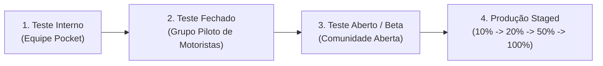

# Checklist de Publicação na Google Play Store & Diretrizes de Segurança

| Metadado | Detalhe |
| :--- | :--- |
| **Documento** | Checklist de Publicação e Boas Práticas de DevOps |
| **Projeto** | Central do Motorista (`logistic-prime`) |
| **Package / ApplicationId** | `com.fernando.centraldomotorista` |
| **Versão Base** | 1.0 (versionCode: 1) |
| **Status** | Aprovado para Ciclo de Release |
| **Data** | 25 de Setembro de 2026 |
| **Autor** | Agente DevOps (Central do Motorista - Pocket) |

---

## 1. Visão Geral e Contexto Operacional

O aplicativo **Central do Motorista** destina-se a entregadores, motoristas agregados e gestores autônomos de frotas para acompanhamento de rotas, controle de combustível/manutenções, conciliação de faturas de plataformas e alertas operacionais.

Para publicação na **Google Play Store**, o aplicativo precisa atender aos rígidos requisitos técnicos da Google Play Console (atualizados para o Android 15 / API 35), assegurar proteção contra engenharia reversa via R8/ProGuard, isolar credenciais sensíveis e adotar uma estratégia de lançamento gradual baseada em métricas de estabilidade (*Android Vitals*).

---

## 2. Requisitos Técnicos do Google Play (Play Policy 2026)

| Requisito | Configuração no Projeto | Status | Observação |
| :--- | :--- | :--- | :--- |
| **Target SDK** | `targetSdk = 35` (Android 15) | :white_check_mark: Conforme | Obrigatório para novos apps e atualizações na Play Store |
| **Compile SDK** | `compileSdk = 35` | :white_check_mark: Conforme | Compilação com as bibliotecas mais recentes da plataforma |
| **Minimum SDK** | `minSdk = 26` (Android 8.0 Oreo) | :white_check_mark: Conforme | Atende a 95%+ da base ativa de dispositivos Android |
| **Formato de Distribuição** | Android App Bundle (`.aab`) | :white_check_mark: Configurado | Distribuição otimizada via *Google Play Feature Delivery* |
| **Suporte a 64-bit** | Nativo (via NDK/JNI libs) | :white_check_mark: Conforme | Libs de CameraX, ML Kit e Barcode possuem binários arm64-v8a e x86_64 |
| **R8 / Minificação** | `isMinifyEnabled = true` | :white_check_mark: Ativado | Redução de tamanho e ofuscação de código |
| **Resource Shrinking** | `isShrinkResources = true` | :white_check_mark: Ativado | Remove drawables e recursos não referenciados |

---

## 3. Gestão Segura de Chaves e Assinatura (Play App Signing & Keystore)

### 3.1. Arquitetura do Google Play App Signing
Adotamos o modelo recomendado pelo Google:
1. **Chave de Upload (Upload Key):** Usada pela equipe de engenharia e pelo pipeline de CI/CD para assinar o `.aab` antes de enviá-lo à Play Console.
2. **Chave de Assinatura do App (App Signing Key):** Gerenciada com segurança pela infraestrutura do Google Cloud KMS para assinar os APKs finais entregues aos dispositivos dos motoristas.

### 3.2. Procedimento de Geração da Chave de Upload
Caso a chave de upload ainda não tenha sido criada, execute o comando abaixo (apenas uma única vez, em ambiente isolado e seguro):

```bash
keytool -genkeypair -v \
  -keystore centraldomotorista-upload.keystore \
  -alias centraldomotorista \
  -keyalg RSA \
  -keysize 2048 \
  -validity 10000 \
  -storetype JKS
```

### 3.3. Configuração de Secrets no GitHub Actions
Para automação no pipeline de CI/CD sem expor credenciais no repositório:
1. Converta o arquivo `.keystore` para string Base64:
   ```bash
   [Convert]::ToBase64String([IO.File]::ReadAllBytes("centraldomotorista-upload.keystore")) | Set-Clipboard
   ```
2. No repositório GitHub, acesse **Settings > Secrets and variables > Actions > New repository secret** e cadastre:
   - `RELEASE_KEYSTORE_BASE64`: Conteúdo do keystore codificado em Base64.
   - `RELEASE_STORE_PASSWORD`: Senha de armazenamento do keystore.
   - `RELEASE_KEY_ALIAS`: Alias configurado na chave (`centraldomotorista`).
   - `RELEASE_KEY_PASSWORD`: Senha da chave específica.
   - `SUPABASE_URL`: Endpoint oficial de produção.
   - `SUPABASE_ANON_KEY`: Token de acesso à API.

> [!WARNING]
> Nunca versione arquivos `.jks`, `.keystore`, `.p12` ou senhas no Git. O arquivo [`.gitignore`](file:///d:/Dev/logistic-prime/logistic-prime/.gitignore) já foi configurado para ignorar extensões de keystore e arquivos `.env`.

---

## 4. Auditoria ProGuard & Otimização R8

### 4.1. Regras Customizadas Aplicadas em [`app/proguard-rules.pro`](file:///d:/Dev/logistic-prime/logistic-prime/app/proguard-rules.pro)
Com a ativação de `isMinifyEnabled = true` em builds de release, o compilador R8 remove código morto e ofusca identificadores. As seguintes regras foram auditadas e garantidas:

1. **DTOs e Serialização Gson:**
   - Prevenção de quebra de deserialização JSON mantendo todos os campos anotados com `@SerializedName`.
   - Classes em `com.fernando.centraldomotorista.data.model.**`, `com.fernando.centraldomotorista.data.remote.dto.**` e `com.fernando.centraldomotorista.data.billing.**` foram blindadas contra renomeação de atributos.
2. **Retrofit 2 & OkHttp 3:**
   - Interfaces sob `com.fernando.centraldomotorista.data.remote.api.**` e anotações `@retrofit2.http.*` preservadas.
   - Desativação de warnings de reflexão do OkHttp (`org.conscrypt`, `org.bouncycastle`).
3. **Supabase Kotlin & Ktor Client:**
   - Preservadas classes do SDK Supabase e engines Ktor Android.
   - Inicialização segura do `SessionManager` com fallback para `MemorySessionManager` em tempo de testes unitários.
4. **AndroidX, Biometria & Credential Manager:**
   - Blindagem dos componentes de autenticação biométrica (`androidx.biometric`) e Google ID (`androidx.credentials`, `googleid`).
5. **CameraX & ML Kit Barcode Scanning:**
   - Preservação dos manipuladores de imagem e decodificadores de código de barras.
6. **Mapeamento de Linhas para Relatório de Falhas (Crashlytics/Play Console):**
   - Configurados `-keepattributes SourceFile,LineNumberTable` e `-renamesourcefileattribute SourceFile` para permitir desobfuscação exata de stack traces.

### 4.2. Upload do Arquivo `mapping.txt`
A cada build de release, o R8 gera o arquivo de mapeamento em:
`app/build/outputs/mapping/release/mapping.txt`

Esse arquivo deve ser enviado na Google Play Console em **Versão do App > Arquivos de desobfuscação (Deobfuscation files)** caso a publicação não seja feita via plugin automatizado do Gradle.

---

## 5. Auditoria de Segurança e Variáveis de Ambiente

### 5.1. Desacoplamento de Segredos via `BuildConfig`
- Anteriormente, o endpoint e a chave de API estavam declarados diretamente em [`SupabaseClient.kt`](file:///d:/Dev/logistic-prime/logistic-prime/app/src/main/java/com/fernando/centraldomotorista/data/remote/SupabaseClient.kt).
- O arquivo [`app/build.gradle.kts`](file:///d:/Dev/logistic-prime/logistic-prime/app/build.gradle.kts) foi parametrizado para expor `BuildConfig.SUPABASE_URL` e `BuildConfig.SUPABASE_ANON_KEY`, permitindo injeção limpa via variáveis de ambiente do sistema (`System.getenv`) ou propriedades do Gradle.

### 5.2. Eliminação de Vazamento de PII em Logs HTTP
- Em builds `release`, o [`RetrofitClient.kt`](file:///d:/Dev/logistic-prime/logistic-prime/app/src/main/java/com/fernando/centraldomotorista/data/remote/RetrofitClient.kt) agora desativa logs com `HttpLoggingInterceptor.Level.NONE`, impedindo que tokens JWT de motoristas, requisições financeiras e dados pessoais sejam expostos no Logcat do dispositivo.

---

## 6. Checklist de Ficha da Google Play Store (Store Listing)

Antes de submeter o app para análise, valide todos os itens da ficha pública:

- [ ] **Título do App:** *Central do Motorista* (máx. 30 caracteres).
- [ ] **Descrição Curta:** Gestão completa de rotas, combustível, manutenções e faturas para motoristas (máx. 80 caracteres).
- [ ] **Descrição Completa:** Apresentação clara das funcionalidades: odômetro, conciliação de faturas, alerta de troca de óleo, parcerias e cálculo de ganhos líquidos (máx. 4000 caracteres).
- [ ] **Ícone do App:** 512 x 512 px, formato PNG de 32 bits com canal alfa, máx. 1 MB.
- [ ] **Gráfico de Recursos (Feature Graphic):** 1024 x 500 px, formato JPEG ou PNG de 24 bits, sem transparência.
- [ ] **Capturas de Tela (Screenshots):**
  - Mínimo de 4 capturas de tela para celular (resoluções recomendadas: 1080 x 1920 ou 1080 x 2340).
  - Telas essenciais a incluir: Início com Metas, Nova Rota com cálculo de frete, Painel Financeiro e Leitor de Notas/Abastecimento.
- [ ] **Política de Privacidade (Privacy Policy):** URL pública ativa detalhando coleta de dados (localização para odômetro, fotos de comprovantes e e-mail de acesso).
- [ ] **Classificação do Conteúdo:** Preenchimento do questionário IARC na Play Console (recomendado: Livre / L).
- [ ] **Declaração de Público-Alvo e Conteúdo:** Declarar que o app não é direcionado a crianças (< 13 anos).
- [ ] **Declaração de Permissões Sensíveis:**
  - `ACCESS_FINE_LOCATION` e `ACCESS_COARSE_LOCATION`: Justificar uso estrito para registro de pontos de partida e postos de combustível mais próximos.
  - `CAMERA`: Justificar uso para leitura de QR Code/código de barras e fotos de comprovantes fiscais.
- [ ] **Acesso ao App para Revisores do Google:** Fornecer credenciais de teste válidas (usuário demo e senha) na aba *Acesso ao App* da Play Console para que a equipe de revisão do Google consiga se autenticar.

---

## 7. Estratégia de Testes e Rollout Gradual (Staged Rollout)

Para mitigar riscos em produção e assegurar estabilidade operacional aos motoristas:



### 7.1. Etapas do Lançamento
1. **Trilha de Teste Interno (Internal Testing):**
   - Disponibilização imediata via Google Play para o time interno (Pocket/QA/DevOps).
   - Validação de fluxo de login Google, biometria e testes de ponta a ponta.
2. **Trilha de Teste Fechado (Closed Testing - Alpha):**
   - Grupo controlado de 20+ motoristas parceiros em operações reais.
   - Coleta de feedbacks de usabilidade e registro de rotas offline/online.
3. **Trilha de Produção com Lançamento Gradual (Staged Rollout):**
   - **Dia 1:** 10% da base ativa.
   - **Dia 2:** 20% da base ativa (após monitoramento de ANR e crash rate).
   - **Dia 4:** 50% da base ativa.
   - **Dia 7:** 100% da base ativa.

---

## 8. Monitoramento Pós-Lançamento e Critérios de Rollback

### 8.1. Limiares Críticos do Android Vitals (Google Play thresholds)
A Play Store penaliza a visibilidade do app ou pode suspender atualizações caso os limiares de vitalidade sejam ultrapassados:

| Métrica Vital | Limite Máximo Tolerado | Ação se Ultrapassado |
| :--- | :--- | :--- |
| **Taxa de Travamentos (Crash Rate)** | `< 1,09%` | **Rollback / Interrupção imediata do rollout** |
| **Taxa de ANR (App Not Responding)** | `< 0,47%` | Investigar bloqueios de thread principal (ex: I/O de rede) |
| **Despertar excessivo (Wake locks)** | `< 0,10%` | Auditar background services e syncs |
| **Renderização lenta (> 16ms por frame)** | `< 5,0%` | Otimizar recomposições em listas Compose |

### 8.2. Protocolo de Rollback
1. Caso o Crash Rate ultrapasse **1,0%** ou ocorra falha crítica impeditiva no registro de rotas durante o Staged Rollout:
   - Acesse **Google Play Console > Produção > Versões**.
   - Clique em **Interromper lançamento (Halt Rollout)** na versão com anomalia.
2. O Google interromperá imediatamente o envio da nova versão aos usuários que ainda não a receberam.
3. A equipe DevOps e de Arquitetura deve inspecionar os logs do Crashlytics e gerar um hotfix incremental incrementando o `versionCode` (ex: `versionCode = 2`, `versionName = "1.0.1"`).
