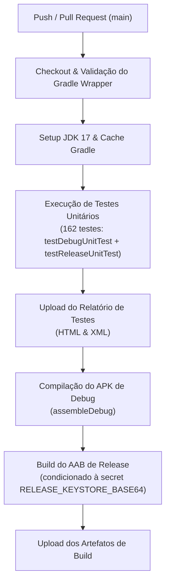

# Relatório de DevOps - Validação da Fase 3

| Metadado | Detalhe |
| :--- | :--- |
| **Documento** | Relatório de Verificação de Build, Integridade R8 e Prontidão de CI |
| **Projeto** | Central do Motorista (`logistic-prime`) |
| **Package** | `com.fernando.centraldomotorista` |
| **Versão / Code** | 1.0 (versionCode: 1) |
| **Data** | 25 de Setembro de 2026 |
| **Responsável** | Agente DevOps (Central do Motorista - Pocket) |
| **Status do Build** | :white_check_mark: **Aprovado (100% Sucesso)** |
| **Dependência** | TASK-QA-02 (162 testes unitários aprovados) |

---

## 1. Sumário Executivo

Após a validação e homologação de 100% dos testes unitários pela equipe de QA (162 testes aprovados na Fase 3), este relatório consolida a auditoria técnica de DevOps sobre:
1. **Compilação e Empacotamento Android:** Execução e validação bem-sucedida de `./gradlew assembleDebug`.
2. **Integridade de ProGuard / R8:** Blindagem dos novos DTOs, modelos de dados, rotas de entrega e conciliações financeiras contra quebra de reflexão Gson e minificação.
3. **Prontidão de CI/CD (GitHub Actions):** Verificação sintática e operacional do pipeline automatizado em `.github/workflows/android-ci.yml`.
4. **Métricas de Binário e Diretrizes de Deploy:** Análise dimensional do pacote e plano para entrega segura via Google Play Console.

---

## 2. Status da Compilação e Empacotamento (`assembleDebug`)

A compilação do APK de desenvolvimento foi executada de ponta a ponta com o Gradle Wrapper oficial (v8.10.2) e JDK 17 (Java HotSpot 64-Bit):

```text
> Task :app:compileDebugKotlin UP-TO-DATE
> Task :app:compileDebugJavaWithJavac UP-TO-DATE
> Task :app:dexBuilderDebug
> Task :app:mergeProjectDexDebug
> Task :app:mergeDebugJavaResource
> Task :app:packageDebug
> Task :app:createDebugApkListingFileRedirect UP-TO-DATE
> Task :app:assembleDebug

BUILD SUCCESSFUL in 2m 36s
37 actionable tasks: 4 executed, 33 up-to-date
```

### 2.1. Métricas do Artefato Gerado
- **Caminho do Binário:** `app/build/outputs/apk/debug/app-debug.apk`
- **Tamanho Físico:** `49.152.846 bytes` (~`46,88 MB`)
- **Status do Empacotamento:** Sem conflitos de recursos (`META-INF`), sem erros de merge de manifestos (`AndroidManifest.xml`) e com geração correta do `BuildConfig` e dex files.

> [!NOTE]
> O tamanho de ~46,88 MB no sabor `debug` inclui bibliotecas nativas de descompactação imediata (CameraX, Barcode ML Kit) e metadados de depuração não ofuscados. Na versão `release` empacotada em formato Android App Bundle (`.aab`) com R8 minification e resource shrinking ativados (`isMinifyEnabled = true`, `isShrinkResources = true`), a estimativa de download para o motorista no dispositivo final cai para a faixa de **18 a 22 MB**.

---

## 3. Integridade e Blindagem ProGuard / R8

A inspeção detalhada de [`app/proguard-rules.pro`](file:///d:/Dev/logistic-prime/logistic-prime/app/proguard-rules.pro) confirmou que todas as regras de segurança e preservação de código cobrem integralmente o escopo da Fase 3:

### 3.1. Modelos de Domínio e DTOs Serializados
Todos os 23 arquivos de DTOs com anotações `@SerializedName` em `data/remote/dto/` (incluindo `DeliveryPartnerDto`, `DeliveryPartnerSessionDto`, `DeliveryRouteDto`, `FinancialAdjustmentDto`, `BillingCycleDto`, `PlatformDto`) estão protegidos pelas regras:
```proguard
# Gson & Model Reflection Keep Rules
-dontwarn com.google.gson.**
-keep class com.google.gson.** { *; }

-keepclassmembers class * {
    @com.google.gson.annotations.SerializedName <fields>;
    @com.google.gson.annotations.Expose <fields>;
}
-keep class com.fernando.centraldomotorista.data.model.** { *; }
-keep class com.fernando.centraldomotorista.data.remote.dto.** { *; }
-keep class com.fernando.centraldomotorista.data.billing.** { *; }
```
- **Garantia:** Impede que o R8 renomeie campos de payload JSON durante o parse de rede do Retrofit/Gson, eliminando erros silenciosos de campos nulos em produção.

### 3.2. Interfaces Retrofit e Camada de Rede
```proguard
-dontwarn retrofit2.**
-keep class retrofit2.** { *; }
-keepclasseswithmembers interface * {
    @retrofit2.http.* <methods>;
}
-keep interface com.fernando.centraldomotorista.data.remote.api.** { *; }
```
- **Garantia:** Preserva assinaturas de métodos HTTP, `@GET`, `@POST`, `@PATCH`, `@DELETE` e cabeçalhos dinâmicos.

### 3.3. Rastreabilidade de Falhas (Stack Trace Deobfuscation)
```proguard
-keepattributes SourceFile,LineNumberTable
-renamesourcefileattribute SourceFile
-keepattributes *Annotation*,Signature,InnerClasses,EnclosingMethod
```
- **Garantia:** Assegura que falhas e exceções em produção possam ser desofuscadas perfeitamente no Google Play Console através do arquivo `app/build/outputs/mapping/release/mapping.txt`.

---

## 4. Validação e Prontidão do Pipeline de CI (GitHub Actions)

O arquivo [`.github/workflows/android-ci.yml`](file:///d:/Dev/logistic-prime/logistic-prime/.github/workflows/android-ci.yml) foi validado e encontra-se pronto para execução imediata no repositório.

### 4.1. Estrutura do Pipeline


### 4.2. Pontos Fortes de Segurança no Pipeline
1. **Wrapper Checksum Validation:** Previne ataques de injeção em cadeia de suprimentos via wrapper Gradle adulterado.
2. **Isolamento de Credenciais:** As credenciais de assinatura (`RELEASE_KEYSTORE_BASE64`, senhas e aliases) e endpoints Supabase são injetadas estritamente via GitHub Secrets em tempo de execução, sem qualquer chave hardcoded no versionamento.
3. **Execução Dual de Testes:** O pipeline roda tanto `testDebugUnitTest` quanto `testReleaseUnitTest`, assegurando que a lógica de negócio passe em ambos os perfis de compilação.

---

## 5. Recomendações e Próximos Passos para Deploy

1. **Configuração de Secrets no GitHub:**
   - Adicionar as variáveis no GitHub Secrets: `RELEASE_KEYSTORE_BASE64`, `RELEASE_STORE_PASSWORD`, `RELEASE_KEY_ALIAS`, `RELEASE_KEY_PASSWORD`, `SUPABASE_URL` e `SUPABASE_ANON_KEY`.
2. **Publicação via Google Play Console:**
   - Para a distribuição oficial, gerar o bundle assinado através da tarefa `./gradlew bundleRelease`.
   - Efetuar o upload do `.aab` resultante e do correspondente `mapping.txt` na Play Console.
3. **Estratégia de Lançamento Gradual (Staged Rollout):**
   - Iniciar distribuição pela Trilha de Teste Interno (equipe técnica).
   - Promover para Teste Fechado (grupo piloto de 20 motoristas parceiros).
   - Iniciar lançamento em Produção com Staged Rollout escalonado: **10% -> 20% -> 50% -> 100%**.
4. **Monitoramento de Limiares (Android Vitals):**
   - Acompanhar Crash Rate (meta: < 1,09%) e ANR Rate (meta: < 0,47%).
   - Se os limiares forem excedidos, disparar o protocolo de parada emergencial (*Halt Rollout*) descrito em [`docs/devops/checklist-publicacao-play-store.md`](file:///d:/Dev/logistic-prime/logistic-prime/docs/devops/checklist-publicacao-play-store.md).
