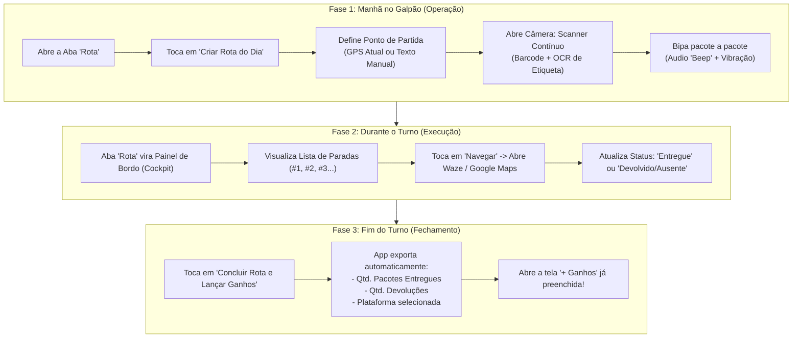

# 📋 Plano de Ação e Implementação: Bipagem de Pacotes e Rota do Dia (RD) para o Usuário Master

> **Projeto:** Pocket / Central do Motorista  
> **Papel:** Agente Orquestrador (PO & Scrum Master)  
> **Destinatário:** Fernando (Usuário Master & Desenvolvedor)  
> **Status:** Em Análise / Aguardando Aprovação  
> **Data:** 28 de Setembro de 2026  

---

## 1. Visão Geral e Contexto Operacional

### 1.1 O Cenário Real
No dia a dia logístico, o **Usuário Master** (o motorista principal autenticado no aplicativo) chega ao centro de distribuição / galpão logístico (ex: Mercado Livre, Shopee, Amazon, Loggi, etc.) onde recebe dezenas de pacotes físicos. 

Como o aplicativo não possui integração de API direta com os servidores dessas plataformas, **todas as informações de entrega residem exclusivamente na etiqueta física adesivada em cada pacote**.

### 1.2 O Problema Atual
1. **Separação Manual Incompleta:** Hoje, o app já possui suporte para conferência e bipagem de pacotes destinados a **Entregadores Parceiros** (na tela de parceiros). No entanto, o Usuário Master **não possui nenhum módulo para registrar e conferir a sua própria carga**.
2. **Falta de Associação e Rastreabilidade:** Não há como saber quais pacotes específicos ficaram com o motorista principal e quais foram repassados para terceiros.
3. **Inexistência de Roteirização Digital Automatizada:** Sem o registro estruturado dos endereços e CEPs das entregas, o motorista precisa ler a etiqueta de papel repetidamente ao longo do dia e digitar manualmente cada endereço no aplicativo de GPS (Waze / Google Maps).

### 1.3 O Objetivo da Solução
Permitir que o Usuário Master, em menos de 10 minutos no galpão:
1. Crie uma **Rota do Dia (RD)** com ponto de partida configurável (Localização GPS atual ou digitação manual, ex: "Galpão Cajamar").
2. Bipe em alta velocidade a etiqueta de cada pacote via câmera, capturando:
   - **Código de Barras / QR Code** (código de rastreio/pacote).
   - **OCR (Leitura Óptica de Caracteres):** Nome do destinatário, Endereço completo e CEP.
3. Obtenha uma **lista ordenada de paradas** integrada diretamente com apps de navegação (Google Maps e Waze) em 1 clique.
4. Conclua o dia integrando automaticamente os dados de entregas com o fechamento financeiro de ganhos, eliminando qualquer redigitação.

---

## 2. Diagnóstico de UI/UX: Onde e Quando Bipar?

Uma das dúvidas centrais apresentadas é o momento e o local ideal na interface para realizar esse cadastro:

### 2.1 Análise da Opção A: Dentro de "+ Ganhos" / "Lançar Ganhos por Rotas"
* **Por que NÃO recomendamos esta opção:**
  * A tela `NewRouteScreen` ("Lançar Ganhos por Rota") é um **formulário de fechamento financeiro**. Nela constam valores unitários, pacotes grandes (volumosos), descontos previdenciários/multas, KM final, combustível e cálculo de valor líquido a receber.
  * No galpão pela manhã (ambiente barulhento, esteiras em movimento e pressa para carregar o veículo), o motorista precisa de **foco operacional puro** (separar e bipar com rapidez).
  * Exigir que o motorista abra uma tela financeira antes mesmo de rodar gera fricção, lentidão e risco de salvar dados financeiros parciais ou inconsistentes.

---

### 2.2 Análise da Opção B: Nova 5ª Aba Dedicada "Rota" (Solução Recomendada)
* **Posicionamento na Barra Inferior (BottomNavigationBar):**
  ```
  [ Início ]  |  [ Painel ]  |  👉 [ ROTA ] 👈  |  [ Relatórios ]  |  [ Histórico ]
  ```
* **Por que esta é a solução ideal:**
  * Segue o padrão de mercado dos grandes aplicativos de logística (Amazon Flex, Mercado Envios Extra, Loggi).
  * Separa claramente a **Operação Logística (Aba Rota)** do **Fechamento Financeiro (Painel / + Ganhos)**.
  * Cria um ciclo de vida natural dividido em 3 fases:



---

## 3. Arquitetura de Tecnologias (100% Gratuitas & Offline-First)

Para garantir máxima sustentabilidade e evitar qualquer cobrança de nuvem para o Fernando, todas as tecnologias escolhidas são **100% gratuitas, de código aberto ou nativas do Android**:

| Componente | Tecnologia Escolhida | Custo | Vantagens Técnicas |
| :--- | :--- | :--- | :--- |
| **Leitura de Código de Barras / QR Code** | **Google ML Kit Barcode Scanning** (`com.google.mlkit:barcode-scanning`) | **R$ 0,00** (Totalmente Grátis) | Já está presente no app. Roda no dispositivo (*on-device*), sem necessidade de internet, com latência inferior a 50ms. |
| **Leitura de Texto da Etiqueta (OCR)** | **Google ML Kit Text Recognition v2** (`com.google.mlkit:text-recognition`) | **R$ 0,00** (Totalmente Grátis) | Biblioteca oficial do Google que roda localmente no smartphone. Não consome cota de Google Cloud Vision, é ilimitada e funciona offline. |
| **Reconhecimento de CEP e Endereço** | **Regex Nativo + BrasilAPI / ViaCEP** | **R$ 0,00** (Totalmente Grátis) | Algoritmo local em Kotlin para identificar o padrão de CEP (`\d{5}-?\d{3}`) e palavras-chave ("Destinatário", "Rua", "Av"). Se houver conexão de internet, consulta a API pública gratuita da BrasilAPI para validar logradouro/bairro. |
| **Despacho para Navegação (GPS)** | **Android Native Intents (Deep Linking)** | **R$ 0,00** (Totalmente Grátis) | Dispara diretamente os apps instalados no aparelho do motorista (Google Maps ou Waze) usando URIs nativas (`google.navigation:q=...` ou `waze://?q=...`), sem gastar com chaves de API do Google Maps SDK. |
| **Banco de Dados** | **Supabase (PostgreSQL)** | **Já existente no projeto** | Modelagem relacional com tabelas isoladas para o Usuário Master, contando com políticas RLS (*Row Level Security*) para proteção dos dados. |

---

## 4. O Fluxo de Bipagem Inteligente (Barcode + OCR)

### 4.1 Como a Câmera irá Capturar os Dados
Na tela de leitura contínua:
1. **Área de Foco Superior:** Mira retangular para o Código de Barras / QR Code.
2. **Área de Foco Inferior:** Enquadramento amplo para o bloco de texto da etiqueta (Destinatário e Endereço).
3. **Detecção Simultânea:**
   * O ML Kit Barcode extrai o código de rastreamento (ex: `BR123456789BR`).
   * No mesmo frame da imagem, o ML Kit Text Recognition analisa os blocos de texto e extrai:
     * **Nome do Destinatário:** Encontra linhas próximas a "Destinatário:", "Recebedor:" ou nomes próprios identificados.
     * **CEP:** Captura o padrão `^\d{5}-?\d{3}$`.
     * **Endereço Completo:** Captura logradouro, número, complemento, bairro e cidade.
4. **Feedback Imediato:**
   * Som de "beep" sonoro curto (via `ToneGenerator`).
   * Vibração rápida do aparelho (via `VibratorManager`).
   * Mini-card na parte inferior da tela confirmando os dados lidos:
     ```
     ┌─────────────────────────────────────────────────────────┐
     │ 📦 Pacote #12 Bipado com Sucesso!                       │
     │ Código: BR987654321BR                                   │
     │ Destinatário: Carlos Eduardo Silva                      │
     │ Endereço: Rua das Palmeiras, 120 - Centro (01001-000)   │
     │                                                         │
     │ [ Editar Dados ]                [ Bipar Próximo (Auto) ] │
     └─────────────────────────────────────────────────────────┘
     ```

---

## 5. Modelagem do Banco de Dados (Supabase)

Para armazenar as rotas e pacotes do Usuário Master de forma independente das sessões de parceiros, criaremos duas tabelas dedicadas:

### 5.1 Tabela `master_delivery_routes` (Rota do Dia)
Armazena o cabeçalho da rota diária realizada pelo usuário principal:
* `id` (UUID, Primary Key)
* `user_id` (UUID, FK -> `auth.users`)
* `platform_id` (UUID, FK -> `platforms`, opcional)
* `route_date` (DATE, padrão `CURRENT_DATE`)
* `start_location` (TEXT - ex: "Galpão Cajamar" ou "Localização Atual")
* `start_latitude` / `start_longitude` (NUMERIC, opcionais)
* `status` (TEXT: `'em_andamento'`, `'concluida'`, `'cancelada'`)
* `total_packages` (INT, default 0)
* `delivered_packages` (INT, default 0)
* `returned_packages` (INT, default 0)
* `created_at` / `finished_at` (TIMESTAMPTZ)

### 5.2 Tabela `master_route_stops` (Paradas / Pacotes da Rota)
Armazena cada pacote/parada pertencente à rota:
* `id` (UUID, Primary Key)
* `route_id` (UUID, FK -> `master_delivery_routes`)
* `barcode` (TEXT, código lido)
* `recipient_name` (TEXT, nome do cliente via OCR)
* `full_address` (TEXT, endereço completo via OCR)
* `cep` (TEXT, CEP extraído)
* `stop_order` (INT, ordem sequencial da parada: 1, 2, 3...)
* `status` (TEXT: `'pendente'`, `'entregue'`, `'ausente'`, `'devolvido'`)
* `latitude` / `longitude` (NUMERIC, para plotagem no mapa)
* `notes` (TEXT, observações do motorista)
* `scanned_at` / `delivered_at` (TIMESTAMPTZ)

---

## 6. Integração com Navegação (Google Maps & Waze)

Para enviar o motorista ao destino sem custos de licença:
1. **Navegação Parada por Parada (Mais usada no dia a dia):**
   * Ao lado de cada pacote na lista, haverá o botão **"Navegar"**.
   * Ao clicar, o app dispara um `Intent` Android nativo:
     ```kotlin
     // Exemplo conceitual para acionar navegação no endereço exato
     val uri = Uri.parse("google.navigation:q=${Uri.encode(stop.fullAddress)}")
     val mapIntent = Intent(Intent.ACTION_VIEW, uri)
     context.startActivity(mapIntent)
     ```
   * O Android perguntará se deseja abrir no **Waze** ou no **Google Maps** (ou abrirá o app padrão selecionado pelo motorista).
2. **Visualização de Rota Multi-pontos:**
   * Botão "Ver Rota Completa no Maps", gerando a URL Universal com até 9 waypoints intermediários.

---

## 7. Divisão de Tarefas por Subagente (Estrutura Scrum)

Abaixo estão as ordens de serviço atômicas que serão delegadas aos especialistas assim que o plano for aprovado:

### 📐 Subagente Arquiteto
```json
{
  "to_agent": "Arquiteto",
  "task_type": "ADR & Arquitetura Técnica",
  "title": "ADR-002: Arquitetura da Bipagem com OCR, Rota Master e Deep Links de Navegação",
  "context": "Especificar o design arquitetural da biblioteca ML Kit Text Recognition v2, modelagem relacional de master_delivery_routes/stops e regras de deep linking para navegação sem custos de API externa.",
  "acceptance_criteria": [
    "ADR-002 documentado em docs/architecture/",
    "Definição do contrato de dados entre OCR, Barcode e Room/Supabase",
    "Especificação da estratégia de Deep Linking com fallback para navegador caso o Waze/Maps não esteja instalado"
  ],
  "depends_on": []
}
```

### 🎨 Subagente Designer (UX/UI)
```json
{
  "to_agent": "Designer",
  "task_type": "Especificação Material 3",
  "title": "Especificação de UI/UX da Aba 'Rota', Cockpit de Bordo e Scanner OCR",
  "context": "Desenhar os layouts em Material 3 para a nova 5ª aba da barra inferior, a tela de scanner contínuo de alta velocidade com overlays de enquadramento, e o card de cada parada no cockpit de bordo.",
  "acceptance_criteria": [
    "Definição do ícone e estados na BottomNavigationBar para a aba 'Rota'",
    "Layout da tela de Scanner com visor duplo (Barcode superior + OCR inferior)",
    "Layout do Cockpit de Paradas com botões de ação rápida (Navegar, Entregue, Devolvido)",
    "Modal de encerramento da rota direcionando para a tela de Ganhos"
  ],
  "depends_on": ["ADR-002"]
}
```

### 🗄️ Subagente Backend
```json
{
  "to_agent": "Backend",
  "task_type": "Schema Supabase & Repositórios",
  "title": "Criação de Migrations, Políticas RLS e Repositórios para Rota Master",
  "context": "Criar as tabelas master_delivery_routes e master_route_stops no Supabase com chaves estrangeiras, índices e políticas de segurança RLS para o usuário logado.",
  "acceptance_criteria": [
    "Migration SQL criada e documentada em docs/backend/",
    "Políticas RLS aplicadas para isolar as rotas por auth.uid()",
    "Modelos de dados DTOs e Repositório Supabase integrados no código Kotlin"
  ],
  "depends_on": ["ADR-002"]
}
```

### 📱 Subagente Android/Kotlin
```json
{
  "to_agent": "Android/Kotlin",
  "task_type": "Desenvolvimento Frontend & Câmera",
  "title": "Implementação da Aba 'Rota', Câmera ML Kit OCR/Barcode e Navegação GPS",
  "context": "Integrar a 5ª aba no NavGraph, implementar a tela de Scanner contínuo com CameraX e ML Kit, criar a lista de paradas com ViewModels e o Intent de navegação para Maps/Waze.",
  "acceptance_criteria": [
    "Aba 'Rota' posicionada entre Painel e Relatórios no NavGraph.kt",
    "Scanner operacional bipando código de barras e preenchendo endereço/CEP via OCR",
    "Cockpit de paradas com atualização de status em tempo real",
    "Botão 'Navegar' acionando Waze ou Google Maps com o endereço da parada",
    "Exportação com 1 clique para a tela 'Lançar Ganhos por Rota' ao concluir"
  ],
  "depends_on": ["Especificação Material 3", "Criação de Migrations, Políticas RLS e Repositórios"]
}
```

### 🧪 Subagente QA
```json
{
  "to_agent": "QA",
  "task_type": "Qualidade & Testes Automatizados",
  "title": "Validação de Testes do Parser de OCR, Ciclo da Rota e Navegação",
  "context": "Criar testes unitários para o analisador de texto de etiquetas brasileiras, validar a integridade dos status dos pacotes e garantir que a navegação com 5 abas não quebre telas existentes.",
  "acceptance_criteria": [
    "Testes unitários cobrindo variações de formatos de etiquetas e CEPs brasileiros",
    "Testes de cálculo do resumo de pacotes entregues vs devolvidos",
    "Validação do fluxo da BottomBar com 5 abas sem regressão visual ou quebra de navegação"
  ],
  "depends_on": ["Implementação da Aba 'Rota'"]
}
```

### 🚀 Subagente DevOps
```json
{
  "to_agent": "DevOps",
  "task_type": "Configuração Gradle & Permissões",
  "title": "Adição de Dependência do ML Kit Text Recognition e Permissões de Câmera/GPS",
  "context": "Configurar o libs.versions.toml com a biblioteca com.google.mlkit:text-recognition e validar as permissões necessárias no AndroidManifest.xml.",
  "acceptance_criteria": [
    "Entradas adicionadas em gradle/libs.versions.toml",
    "Build Gradle finalizado com sucesso sem conflitos de dependências nativas (NDK/JNI)"
  ],
  "depends_on": []
}
```

---

## 8. Como Avaliar e Aprovar

Este documento foi salvo no repositório do projeto no caminho:  
👉 **`docs/plano-implementacao-bipagem-e-rotas.md`**

Você pode abri-lo localmente em seu editor de texto ou visualizador de Markdown preferido, lê-lo com calma e avaliar todos os pontos propostos.

Quando estiver pronto e de acordo com a estratégia, basta me responder aqui no chat com:  
**"Plano aprovado, pode iniciar a execução!"** ou enviar seus ajustes e sugestões de mudança.
