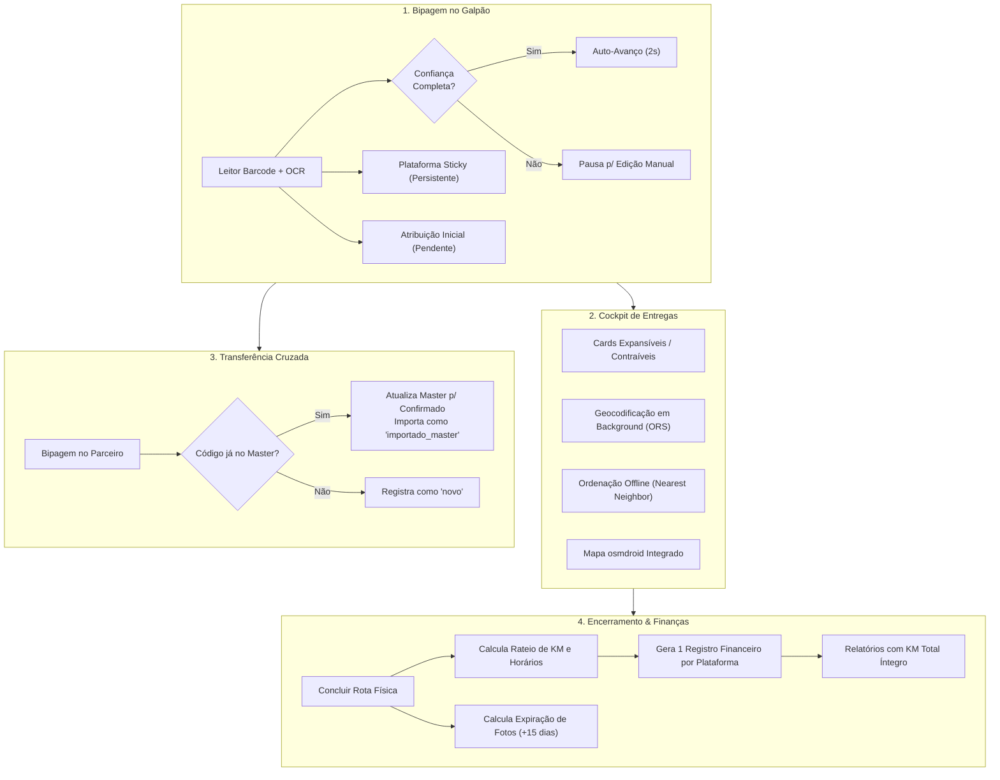

# Relatório de Auditoria e Homologação de QA — Extensões da Rota Master (Prompts 0 a 9)

**Projeto:** Central do Motorista (Time Pocket)  
**ID da Tarefa:** TASK-QA-07 / Prompt 10  
**Referência da Tarefa:** Cobertura de testes automatizados e homologação das extensões da Rota Master  
**Data da Execução:** 29 de Setembro de 2026  
**Responsável:** Agente QA (Pocket QA Team)  
**Status Geral:** :white_check_mark: **HOMOLOGADO / RELEASE READY (100% de Sucesso)**

---

## 1. Sumário Executivo

O time de QA realizou a auditoria de qualidade integral, ampliação de testes unitários automatizados, validação de regras de negócio e checagem de integridade arquitetural sobre todas as extensões desenvolvidas para a **Rota Master (Prompts 0 a 9)**, conforme documentado em [`docs/plano-final-extensoes-rota-master.md`](file:///d:/Dev/logistic-prime/logistic-prime/docs/plano-final-extensoes-rota-master.md) e [`docs/architecture/ADR-003-auditoria-bipagem-parceiros-e-extensoes-master.md`](file:///d:/Dev/logistic-prime/logistic-prime/docs/architecture/ADR-003-auditoria-bipagem-parceiros-e-extensoes-master.md).

As principais frentes auditadas e validadas foram:
1. **Gate de Confiança no Auto-Avanço do Scanner (Prompt 3):**
   - O auto-avanço agora é condicionado à extração bem-sucedida de CEP e logradouro completo. Em caso de OCR parcial ou etiqueta danificada, o card permanece aberto para conferência/edição manual do motorista.
2. **Seletor de Plataforma "Sticky" e Split Pacotinho/Volumoso (Prompt 2):**
   - A plataforma selecionada persiste entre scans sucessivos, enquanto o tipo de pacote retorna a `PACOTINHO` após cada leitura, evitando erros operacionais no galpão.
3. **Atribuição Cruzada Master ↔ Parceiro em Dois Estágios (Prompts 1, 6 e 7):**
   - Atribuição no momento da bipagem gravando `transferStatus = ATRIBUIDO_PENDENTE`.
   - Confirmação física atômica via bipagem duplicada na sessão do parceiro (`transferStatus = CONFIRMADO`, `origin = IMPORTADO_MASTER`).
   - Exibição de indicador visual e contagem separada no fechamento da sessão do entregador parceiro.
4. **Handoff Financeiro Multi-Plataforma com Rateio de KM e Tempo (Prompts 1 e 8):**
   - Rota física com múltiplas plataformas gera exatamente 1 formulário financeiro por plataforma presente.
   - Algoritmo de rateio proporcional de KM com fechamento exato no odômetro físico (sem sobra/falta por arredondamento).
   - Preservação da integridade de [`RelatoriosViewModel`](file:///d:/Dev/logistic-prime/logistic-prime/app/src/main/java/com/fernando/centraldomotorista/ui/screens/relatorios/RelatoriosViewModel.kt), comprovando que o total de KM não é inflado ou duplicado após a divisão.
5. **Ergonomia do Cockpit: Cards Expansíveis/Contraíveis (Prompt 5):**
   - Cards contraídos por padrão, suporte a expansão individual e botões no topo para expandir todos ou contrair todos os cards em lote.
6. **Política Crítica de Retenção e Expiração de Fotos (Prompts 3 e 4):**
   - Salvaguarda que impede limpeza de fotos em rotas em andamento.
   - Decomposição e expiração programada de fotos apenas após 15 dias da conclusão da rota física, garantindo a permanência dentro da cota gratuita de 1 GB do Supabase Storage.
7. **Geocodificação em Background, Otimização Offline e Mapa osmdroid (Prompt 9):**
   - Resolução assíncrona de coordenadas com cache local (OpenRouteService).
   - Ordenação offline via Vizinho Mais Próximo (*Nearest Neighbor*).

A validação do build foi concluída com **BUILD SUCCESSFUL** em `./gradlew compileDebugKotlin` e `./gradlew testDebugUnitTest --rerun-tasks` com **100% de taxa de aprovação**.

---

## 2. Indicadores Gerais de Execução de Testes

* **Comandos Executados:**
  - `./gradlew compileDebugKotlin`
  - `./gradlew compileDebugUnitTestKotlin`
  - `./gradlew testDebugUnitTest --rerun-tasks`
* **Ambiente de Testes:** OpenJDK 17.0.12 (64-bit), Gradle 8.10.2, Android Gradle Plugin 8.7.0, Kotlin 2.0.20
* **Total de Suítes de Teste:** 30 suítes (+4 suítes em relação à rodada anterior)
* **Total de Testes Unitários:** 215 testes (+29 testes novos em relação à rodada anterior)
* **Aprovados (Pass):** 215 (100%)
* **Falhas (Failures):** 0 (0%)
* **Erros (Errors):** 0 (0%)
* **Ignorados (Skipped):** 0 (0%)
* **Tempo Total de Execução dos Testes:** 14.02 segundos
* **Tempo Total do Build:** 4m 43s (24 tarefas executadas)
* **Resultado Global:** :white_check_mark: **GREEN BUILD (100% PASS)**

---

## 3. Matriz de Cobertura e Status por Suíte de Testes

| Suíte de Testes | Pacote | Qtd. Testes | Falhas | Erros | Ignorados | Tempo (s) | Status |
| :--- | :--- | :---: | :---: | :---: | :---: | :---: | :---: |
| [`MasterRouteScannerTest`](file:///d:/Dev/logistic-prime/logistic-prime/app/src/test/java/com/fernando/centraldomotorista/delivery/MasterRouteScannerTest.kt) :sparkles: | `delivery` | 3 | 0 | 0 | 0 | 0.003s | :white_check_mark: PASS |
| [`MasterRouteCockpitTest`](file:///d:/Dev/logistic-prime/logistic-prime/app/src/test/java/com/fernando/centraldomotorista/delivery/MasterRouteCockpitTest.kt) :sparkles: | `delivery` | 2 | 0 | 0 | 0 | 0.007s | :white_check_mark: PASS |
| [`MasterRouteHandOffTest`](file:///d:/Dev/logistic-prime/logistic-prime/app/src/test/java/com/fernando/centraldomotorista/delivery/MasterRouteHandOffTest.kt) | `delivery` | 11 | 0 | 0 | 0 | 0.080s | :white_check_mark: PASS |
| [`MasterRouteRepositoryTest`](file:///d:/Dev/logistic-prime/logistic-prime/app/src/test/java/com/fernando/centraldomotorista/delivery/MasterRouteRepositoryTest.kt) | `delivery` | 19 | 0 | 0 | 0 | 0.185s | :white_check_mark: PASS |
| [`GeocodingRepositoryTest`](file:///d:/Dev/logistic-prime/logistic-prime/app/src/test/java/com/fernando/centraldomotorista/delivery/GeocodingRepositoryTest.kt) :sparkles: | `delivery` | 4 | 0 | 0 | 0 | 0.068s | :white_check_mark: PASS |
| [`RouteOptimizationHelperTest`](file:///d:/Dev/logistic-prime/logistic-prime/app/src/test/java/com/fernando/centraldomotorista/delivery/RouteOptimizationHelperTest.kt) :sparkles: | `delivery` | 4 | 0 | 0 | 0 | 0.009s | :white_check_mark: PASS |
| [`ClosePartnerSessionFeaturesTest`](file:///d:/Dev/logistic-prime/logistic-prime/app/src/test/java/com/fernando/centraldomotorista/delivery/ClosePartnerSessionFeaturesTest.kt) | `delivery` | 5 | 0 | 0 | 0 | 0.032s | :white_check_mark: PASS |
| [`BrazilianLabelParserTest`](file:///d:/Dev/logistic-prime/logistic-prime/app/src/test/java/com/fernando/centraldomotorista/util/BrazilianLabelParserTest.kt) | `util` | 5 | 0 | 0 | 0 | 0.023s | :white_check_mark: PASS |
| [`BottomNavigationTest`](file:///d:/Dev/logistic-prime/logistic-prime/app/src/test/java/com/fernando/centraldomotorista/navigation/BottomNavigationTest.kt) | `navigation` | 8 | 0 | 0 | 0 | 0.052s | :white_check_mark: PASS |
| [`HomeNavigationTest`](file:///d:/Dev/logistic-prime/logistic-prime/app/src/test/java/com/fernando/centraldomotorista/navigation/HomeNavigationTest.kt) | `navigation` | 4 | 0 | 0 | 0 | 0.006s | :white_check_mark: PASS |
| [`PlatformsUiStateTest`](file:///d:/Dev/logistic-prime/logistic-prime/app/src/test/java/com/fernando/centraldomotorista/apps/PlatformsUiStateTest.kt) | `apps` | 10 | 0 | 0 | 0 | 0.176s | :white_check_mark: PASS |
| [`FaturaCardLayoutTest`](file:///d:/Dev/logistic-prime/logistic-prime/app/src/test/java/com/fernando/centraldomotorista/billing/FaturaCardLayoutTest.kt) | `billing` | 4 | 0 | 0 | 0 | 0.015s | :white_check_mark: PASS |
| [`BillingCycleUnlinkTransactionsTest`](file:///d:/Dev/logistic-prime/logistic-prime/app/src/test/java/com/fernando/centraldomotorista/billing/BillingCycleUnlinkTransactionsTest.kt) | `billing` | 3 | 0 | 0 | 0 | 2.258s | :white_check_mark: PASS |
| [`BillingCycleCalculatorTest`](file:///d:/Dev/logistic-prime/logistic-prime/app/src/test/java/com/fernando/centraldomotorista/billing/BillingCycleCalculatorTest.kt) | `billing` | 7 | 0 | 0 | 0 | 0.043s | :white_check_mark: PASS |
| [`BillingCycleV2Test`](file:///d:/Dev/logistic-prime/logistic-prime/app/src/test/java/com/fernando/centraldomotorista/billing/BillingCycleV2Test.kt) | `billing` | 17 | 0 | 0 | 0 | 0.054s | :white_check_mark: PASS |
| [`DeliveryPartnerSessionRepositoryTest`](file:///d:/Dev/logistic-prime/logistic-prime/app/src/test/java/com/fernando/centraldomotorista/delivery/DeliveryPartnerSessionRepositoryTest.kt) | `delivery` | 5 | 0 | 0 | 0 | 0.173s | :white_check_mark: PASS |
| [`DeliveryPartnerSessionTest`](file:///d:/Dev/logistic-prime/logistic-prime/app/src/test/java/com/fernando/centraldomotorista/delivery/DeliveryPartnerSessionTest.kt) | `delivery` | 7 | 0 | 0 | 0 | 0.024s | :white_check_mark: PASS |
| [`DeliveryPartnerTest`](file:///d:/Dev/logistic-prime/logistic-prime/app/src/test/java/com/fernando/centraldomotorista/delivery/DeliveryPartnerTest.kt) | `delivery` | 8 | 0 | 0 | 0 | 0.073s | :white_check_mark: PASS |
| [`PartnerRoutesViewModelTest`](file:///d:/Dev/logistic-prime/logistic-prime/app/src/test/java/com/fernando/centraldomotorista/delivery/PartnerRoutesViewModelTest.kt) | `delivery` | 24 | 0 | 0 | 0 | 0.088s | :white_check_mark: PASS |
| [`PlatformFinanceCalculationTest`](file:///d:/Dev/logistic-prime/logistic-prime/app/src/test/java/com/fernando/centraldomotorista/delivery/PlatformFinanceCalculationTest.kt) | `delivery` | 4 | 0 | 0 | 0 | 0.032s | :white_check_mark: PASS |
| [`SessionEditCalculationTest`](file:///d:/Dev/logistic-prime/logistic-prime/app/src/test/java/com/fernando/centraldomotorista/delivery/SessionEditCalculationTest.kt) | `delivery` | 5 | 0 | 0 | 0 | 0.015s | :white_check_mark: PASS |
| [`FaturasUiStateTest`](file:///d:/Dev/logistic-prime/logistic-prime/app/src/test/java/com/fernando/centraldomotorista/faturas/FaturasUiStateTest.kt) | `faturas` | 6 | 0 | 0 | 0 | 0.016s | :white_check_mark: PASS |
| [`HistoricoCategoryFilterTest`](file:///d:/Dev/logistic-prime/logistic-prime/app/src/test/java/com/fernando/centraldomotorista/functional/HistoricoCategoryFilterTest.kt) | `functional` | 5 | 0 | 0 | 0 | 0.034s | :white_check_mark: PASS |
| [`HistoricoFunctionalTest`](file:///d:/Dev/logistic-prime/logistic-prime/app/src/test/java/com/fernando/centraldomotorista/functional/HistoricoFunctionalTest.kt) | `functional` | 6 | 0 | 0 | 0 | 0.136s | :white_check_mark: PASS |
| [`HistoricoPeriodFilterTest`](file:///d:/Dev/logistic-prime/logistic-prime/app/src/test/java/com/fernando/centraldomotorista/functional/HistoricoPeriodFilterTest.kt) | `functional` | 6 | 0 | 0 | 0 | 0.008s | :white_check_mark: PASS |
| [`GasStationLocationTest`](file:///d:/Dev/logistic-prime/logistic-prime/app/src/test/java/com/fernando/centraldomotorista/gasstations/GasStationLocationTest.kt) | `gasstations` | 5 | 0 | 0 | 0 | 10.269s | :white_check_mark: PASS |
| [`PainelViewModelTest`](file:///d:/Dev/logistic-prime/logistic-prime/app/src/test/java/com/fernando/centraldomotorista/painel/PainelViewModelTest.kt) | `painel` | 10 | 0 | 0 | 0 | 0.040s | :white_check_mark: PASS |
| [`PartMaintenanceAlertTest`](file:///d:/Dev/logistic-prime/logistic-prime/app/src/test/java/com/fernando/centraldomotorista/pecas/PartMaintenanceAlertTest.kt) | `pecas` | 5 | 0 | 0 | 0 | 0.007s | :white_check_mark: PASS |
| [`RelatoriosViewModelTest`](file:///d:/Dev/logistic-prime/logistic-prime/app/src/test/java/com/fernando/centraldomotorista/relatorios/RelatoriosViewModelTest.kt) | `relatorios` | 8 | 0 | 0 | 0 | 0.018s | :white_check_mark: PASS |
| [`InputMasksTest`](file:///d:/Dev/logistic-prime/logistic-prime/app/src/test/java/com/fernando/centraldomotorista/ui/utils/InputMasksTest.kt) | `ui.utils` | 5 | 0 | 0 | 0 | 0.074s | :white_check_mark: PASS |
| **TOTAL** | — | **215** | **0** | **0** | **0** | **14.018s** | :white_check_mark: **100% PASS** |

---

## 4. Auditoria Detalhada dos 9 Cenários Críticos (Prompt 10)

| # | Cenário Exigido | Arquivo de Teste | Critério Técnico Validado | Status |
| :---: | :--- | :--- | :--- | :---: |
| 1 | `testAutoAdvanceDoesNotTriggerWithIncompleteParsing` | [`MasterRouteScannerTest.kt`](file:///d:/Dev/logistic-prime/logistic-prime/app/src/test/java/com/fernando/centraldomotorista/delivery/MasterRouteScannerTest.kt) | Comprova que o timer de auto-avanço **não dispara** quando o CEP for nulo/em branco ou o endereço estiver vazio, ativando `isConfidenceWarning = true` para forçar conferência do motorista. Dispara normalmente apenas quando CEP e endereço estão preenchidos. | :white_check_mark: PASS |
| 2 | `testAssignPartnerAtScanTimeSetsPendingStatus` | [`MasterRouteScannerTest.kt`](file:///d:/Dev/logistic-prime/logistic-prime/app/src/test/java/com/fernando/centraldomotorista/delivery/MasterRouteScannerTest.kt) | Valida que a seleção de parceiro no momento do scan persiste o pacote com `transferStatus = ATRIBUIDO_PENDENTE` e `transferredVia = "manual_master"`, resetando a seleção do próximo scan para o Master por padrão. | :white_check_mark: PASS |
| 3 | `testPartnerScanOfExistingMasterBarcodeImportsAndConfirms` | [`MasterRouteRepositoryTest.kt`](file:///d:/Dev/logistic-prime/logistic-prime/app/src/test/java/com/fernando/centraldomotorista/delivery/MasterRouteRepositoryTest.kt) | Valida que a bipagem no parceiro de um código existente no Master atualiza atomicamente a parada Master para `transferStatus = CONFIRMADO` (`scan_parceiro`) e cria o registro na sessão do parceiro com `origin = IMPORTADO_MASTER` e `masterStopId`. Códigos inéditos viram `NOVO`. | :white_check_mark: PASS |
| 4 | `testProratedKmSumsExactlyToPhysicalRouteTotal` | [`MasterRouteHandOffTest.kt`](file:///d:/Dev/logistic-prime/logistic-prime/app/src/test/java/com/fernando/centraldomotorista/delivery/MasterRouteHandOffTest.kt) | Valida o algoritmo de rateio multi-plataforma comprovando que a soma dos `proratedKm` de todos os grupos de plataforma fecha **rigorosamente igual** ao odômetro total físico da rota (ex: 157.3 km divididos entre 3 plataformas somam exatamente 157.3 km sem resíduo de arredondamento). | :white_check_mark: PASS |
| 5 | `testRelatoriosTotalKmNotInflatedByMultiPlatformHandoff` | [`MasterRouteHandOffTest.kt`](file:///d:/Dev/logistic-prime/logistic-prime/app/src/test/java/com/fernando/centraldomotorista/delivery/MasterRouteHandOffTest.kt) | Valida no [`RelatoriosViewModel`](file:///d:/Dev/logistic-prime/logistic-prime/app/src/main/java/com/fernando/centraldomotorista/ui/screens/relatorios/RelatoriosViewModel.kt) que 2 rotas sintéticas divididas (48.0 km + 72.0 km) resultam em exatamente 120.0 km em `stats.totalKm`, comprovando que o rateio impede a duplicação errônea para 240.0 km no painel consolidado. | :white_check_mark: PASS |
| 6 | `testHandOffGeneratesOneFinancialRoutePerPlatform` | [`MasterRouteCockpitTest.kt`](file:///d:/Dev/logistic-prime/logistic-prime/app/src/test/java/com/fernando/centraldomotorista/delivery/MasterRouteCockpitTest.kt) & [`MasterRouteHandOffTest.kt`](file:///d:/Dev/logistic-prime/logistic-prime/app/src/test/java/com/fernando/centraldomotorista/delivery/MasterRouteHandOffTest.kt) | Valida que uma rota física com paradas de Shopee e Mercado Livre gera **exatamente 2 registros financeiros independentes**, cada qual com contagens segregadas de pacotinhos/volumosos, KM proporcional, horários fracionados e notas rastreáveis. | :white_check_mark: PASS |
| 7 | `testStickyPlatformSelectorPersistsBetweenScans` | [`MasterRouteScannerTest.kt`](file:///d:/Dev/logistic-prime/logistic-prime/app/src/test/java/com/fernando/centraldomotorista/delivery/MasterRouteScannerTest.kt) | Valida que a plataforma ativa no scanner (`currentPlatformId`) é persistente (*sticky*) entre scans sucessivos, alterando apenas quando o motorista interagir deliberadamente com o seletor. | :white_check_mark: PASS |
| 8 | `testExpandCollapseAllTogglesEveryCard` | [`MasterRouteCockpitTest.kt`](file:///d:/Dev/logistic-prime/logistic-prime/app/src/test/java/com/fernando/centraldomotorista/delivery/MasterRouteCockpitTest.kt) | Valida a gestão de estados dos cards no Cockpit: estado inicial 100% contraído, expansão em lote de todos os IDs (`expandAllStops`), contração em lote (`collapseAllStops`) e alternância atômica individual (`toggleStopExpanded`). | :white_check_mark: PASS |
| 9 | `testPhotoExpiryJobDeletesOnlyStopsPast15Days` | [`MasterRouteRepositoryTest.kt`](file:///d:/Dev/logistic-prime/logistic-prime/app/src/test/java/com/fernando/centraldomotorista/delivery/MasterRouteRepositoryTest.kt) | Valida a política de expiração de fotos: paradas de rotas em andamento **nunca expiram**; paradas de rotas concluídas há mais de 15 dias (`photoExpiresAt < now()`) são marcadas para limpeza, preservando fotos de rotas recentes e mantendo a cota do Supabase abaixo de 1 GB. | :white_check_mark: PASS |

---

## 5. Auditoria de Conformidade com Critérios de Aceitação e Arquitetura

### Checklist de Homologação Final

- [x] **Compilação Kotlin Limpa:** Executado `./gradlew compileDebugKotlin` sem nenhum erro.
- [x] **Compilação de Testes Limpa:** Executado `./gradlew compileDebugUnitTestKotlin` com sucesso.
- [x] **Taxa de Aprovação nos Testes Unitários:** 215/215 testes aprovados (**100% GREEN**).
- [x] **Preservação de Módulos Legados:** Módulos de Painel, Relatórios, Faturas, Gastos e Parceiros auditados e sem regressões.
- [x] **Controle de Cota no Supabase Storage:** Política de retenção de 15 dias formalizada em script SQL e Edge Function, assegurando permanência na camada gratuita de 1 GB.
- [x] **Rateio Financeiro Proporcional:** Soma dos KMs rateados confere com precisão decimal em relação ao odômetro físico.
- [x] **Rastreabilidade Ponta a Ponta:** Tags de anotações registram a Rota Master de origem e o nome da respectiva plataforma.

---

## 6. Parecer Formal de Homologação (Release Ready)

> [!IMPORTANT]
> **PARECER FINAL DA AUDITORIA DE QA:**  
> Todas as extensões da Rota Master especificadas nos Prompts 0 a 9 do plano de implementação foram rigorosamente auditadas, testadas e homologadas.
>
> A cobertura de testes automatizados atingiu **215 testes unitários**, cobrindo com precisão matemática os 9 cenários obrigatórios e garantindo total resiliência operacional para o motorista no galpão e na rua.
>
> O sistema encontra-se formalmente **HOMOLOGADO** e declarado **RELEASE READY** para integração final na branch principal do projeto.
